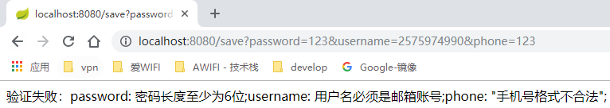

# Spring Boot Validator 笔记

[TOC]

## 1 背景

开发过程中，后台的参数校验是必不可少的，所以经常会看到类似下面这样的代码


这样写并没有什么错，看起来似乎还挺工整的，但是代码高度耦合，代码的可阅读性非常差，错误信息也不能很轻松的国际化.  
接下来，用Validation来改写这段

### Spring Boot 中的 spring-boot-starter-validation

在Spring Boot的官网中，关于Validation只是简单的提了一句，我也就不多作介绍了。  
其实，Spring Validator和Hibernate Validator是两套Validator，可以混着用。

## 2 示例

### 2.1 如何在pom.xml中引用

```xml
<?xml version="1.0" encoding="UTF-8"?>
<project xmlns="http://maven.apache.org/POM/4.0.0"
         xmlns:xsi="http://www.w3.org/2001/XMLSchema-instance"
         xsi:schemaLocation="http://maven.apache.org/POM/4.0.0 http://maven.apache.org/xsd/maven-4.0.0.xsd">
    <modelVersion>4.0.0</modelVersion>

    <groupId>com.littlefxc</groupId>
    <artifactId>personal</artifactId>
    <version>1.0-snapshot</version>
    <packaging>jar</packaging>

    <properties>
        <project.build.sourceEncoding>UTF-8</project.build.sourceEncoding>
        <project.reporting.outputEncoding>UTF-8</project.reporting.outputEncoding>
        <java.version>1.8</java.version>
    </properties>

    <parent>
        <groupId>org.springframework.boot</groupId>
        <artifactId>spring-boot-starter-parent</artifactId>
        <version>1.5.16.RELEASE</version>
    </parent>

    <dependencies>
        <dependency>
            <groupId>org.projectlombok</groupId>
            <artifactId>lombok</artifactId>
        </dependency>
        <!-- 热部署 -->
        <dependency>
            <groupId>org.springframework.boot</groupId>
            <artifactId>spring-boot-devtools</artifactId>
        </dependency>
        <!-- web -->
        <dependency>
            <groupId>org.springframework.boot</groupId>
            <artifactId>spring-boot-starter-web</artifactId>
        </dependency>
        <!-- 校验框架 -->
        <dependency>
            <groupId>org.springframework.boot</groupId>
            <artifactId>spring-boot-starter-validation</artifactId>
        </dependency>
    </dependencies>

    <repositories>
        <repository>
            <id>central</id>
            <name>central</name>
            <url>http://maven.aliyun.com/nexus/content/groups/public/</url>
            <layout>default</layout>
            <releases>
                <enabled>true</enabled>
            </releases>
            <snapshots>
                <enabled>false</enabled>
            </snapshots>
        </repository>
    </repositories>
</project>
```

### 2.2 Hibernate Validator 常用注解


## 2.3 创建自定义校验器

### 2.3.1 创建自定义注解

```Java
package com.littlefxc.examples.validation;

import javax.validation.Constraint;
import javax.validation.Payload;
import javax.validation.ReportAsSingleViolation;
import javax.validation.constraints.Pattern;
import java.lang.annotation.Documented;
import java.lang.annotation.Retention;
import java.lang.annotation.Target;
import static java.lang.annotation.ElementType.*;
import static java.lang.annotation.ElementType.PARAMETER;
import static java.lang.annotation.RetentionPolicy.RUNTIME;

/**
 * @author fengxuechao
 */
@Documented
@Constraint(validatedBy = { })
@Target({ METHOD, FIELD, ANNOTATION_TYPE, CONSTRUCTOR, PARAMETER })
@Retention(RUNTIME)
@ReportAsSingleViolation
@Pattern(regexp = "")
public @interface IsPhone {

    /**
     * 错误提示
     * @return
     */
    String message() default "{login.phone.invalid}";

    Class<?>[] groups() default {};

    Class<? extends Payload>[] payload() default {};

}
```

### 2.3.2 实现ConstraintValidator

仅仅创建注解是没有任何意义的，必须与`ConstraintValidator`这个接口配合，才能使自定义注解生效

```Java
package com.littlefxc.examples.validation;

import javax.validation.ConstraintValidator;
import javax.validation.ConstraintValidatorContext;
import java.util.regex.Pattern;

/**
 * @author fengxuechao
 */
public class IsPhoneConstraintValidator implements ConstraintValidator<IsPhone, String> {

    private Pattern pattern = Pattern.compile("^(13[0-9]|14[579]|15[0-3,5-9]|16[6]|17[0135678]|18[0-9]|19[89])\\d{8}$");

    @Override
    public void initialize(IsPhone constraintAnnotation) {
        //启动时执行
    }

    /**
     * 自定义校验逻辑
     * @param value CharSequence为校验的类型
     * @param context
     * @return
     */
    @Override
    public boolean isValid(String value, ConstraintValidatorContext context) {
        if (value == null || value.length() == 0) {
            return true;
        }
        return pattern.matcher(value).matches();
    }
}
```

### 2.3.3 组合验证：创建两个接口表示添加时和编辑时

```Java
package com.littlefxc.examples.validation;

/**
 * 添加时
 * @author fengxuechao
 */
public interface ValidatorAdd {
}
```

```Java
package com.littlefxc.examples.validation;

/**
 * 编辑时
 * @author fengxuechao
 */
public interface ValidatorEdit {
}
```

### 2.3.4 定义错误信息

Spring Boot Validation约定错误信息放在resources文件夹下的`ValidationMessages.properties`。  
文件中`key`代表的是校验框架注解中的message属性。

```yml
login.id.NotNull=id不能为空
login.username.NotBlank=用户名不能为空
login.username.Email=用户名必须是邮箱账号
login.password.NotBlank=密码不能为空
login.password.Length=密码长度至少为6位
login.phone.invalid="手机号格式不合法"
```

### 2.3.5 创建实体类

```Java
package com.littlefxc.examples.model;

import com.littlefxc.examples.validation.IsPhone;
import com.littlefxc.examples.validation.ValidatorAdd;
import com.littlefxc.examples.validation.ValidatorEdit;
import lombok.Data;
import org.hibernate.validator.constraints.Email;
import org.hibernate.validator.constraints.Length;
import org.hibernate.validator.constraints.NotBlank;

import javax.validation.constraints.NotNull;

/**
 * @author fengxuechao
 */
@Data
public class LoginVo {

    /**
     * 编辑时：不能为null
     */
    @NotNull(message = "{login.id.NotNull}", groups = {ValidatorEdit.class})
    private String id;

    /**
     * 添加时：不能为空，符合邮箱格式
     * 编辑时：符合邮箱格式
     */
    @NotBlank(message = "{login.username.NotBlank}", groups = {ValidatorAdd.class})
    @Email(message = "{login.username.Email}", groups = {ValidatorAdd.class, ValidatorEdit.class})
    private String username;

    /**
     * 添加时：不能为空，密码长度至少为6位
     * 编辑时：密码长度至少为6位
     */
    @NotBlank(message = "{login.password.NotBlank}", groups = {ValidatorAdd.class})
    @Length(min = 6, message = "{login.password.Length}", groups = {ValidatorAdd.class, ValidatorEdit.class})
    private String password;

    /**
     * 添加时：符合手机格式
     * 编辑时：符合手机格式
     */
    @IsPhone(groups = {ValidatorAdd.class, ValidatorEdit.class})
    private String phone;
}
```

### 2.3.6 定义控制器

```Java
package com.littlefxc.examples.controller;

import com.littlefxc.examples.model.LoginVo;
import com.littlefxc.examples.validation.ValidatorAdd;
import com.littlefxc.examples.validation.ValidatorEdit;
import org.springframework.validation.BindException;
import org.springframework.validation.FieldError;
import org.springframework.validation.annotation.Validated;
import org.springframework.web.bind.annotation.ExceptionHandler;
import org.springframework.web.bind.annotation.RequestMapping;
import org.springframework.web.bind.annotation.RestController;

import java.util.HashMap;
import java.util.UUID;

/**
 * @author fengxuechao
 */
@RestController
public class ValidatorController {

    /**
     * 持久化
     */
    private static final HashMap<String, LoginVo> map = new HashMap<>();

    /**
     * 添加时
     *
     * @param loginVo
     * @return
     */
    @RequestMapping(value = "/save")
    public String save(@Validated({ValidatorAdd.class}) LoginVo loginVo) {
        loginVo.setId(UUID.randomUUID().toString().replace("-", ""));
        map.put(loginVo.getId(), loginVo);
        return "添加通过：" + loginVo.toString();
    }

    /**
     * 编辑时
     *
     * @param loginVo
     * @return
     */
    @RequestMapping(value = "/edit")
    public String edit(@Validated({ValidatorEdit.class}) LoginVo loginVo) {
        map.replace(loginVo.getId(), map.get(loginVo.getId()), loginVo);
        return "编辑通过：" + loginVo.toString();
    }

    /**
     * 列表
     *
     * @return
     */
    @RequestMapping(value = "/list")
    public HashMap<String, LoginVo> edit() {
        return map;
    }

    /**
     * 统一异常处理
     *
     * @param ex
     * @return
     */
    @ExceptionHandler(BindException.class)
    public String handleBindException(BindException ex) {
        StringBuilder sb = new StringBuilder();
        for (FieldError fieldError : ex.getFieldErrors()) {
            sb.append(fieldError.getField()).append(": ").append(fieldError.getDefaultMessage()).append(";");
        }
        return "验证失败：" + sb.toString();
    }
}
```

### 2.3.7 结果

验证成功
  

验证失败


## 3 引用

1. [http://docs.jboss.org/hibernate/validator/5.2/reference/en-US/html_single/#preface](http://docs.jboss.org/hibernate/validator/5.2/reference/en-US/html_single/#preface)
2. [https://blog.csdn.net/dh554112075/article/details/80790464](https://blog.csdn.net/dh554112075/article/details/80790464)