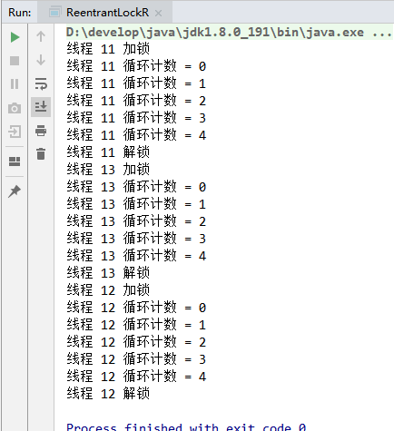
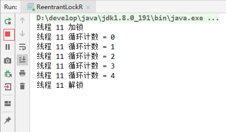
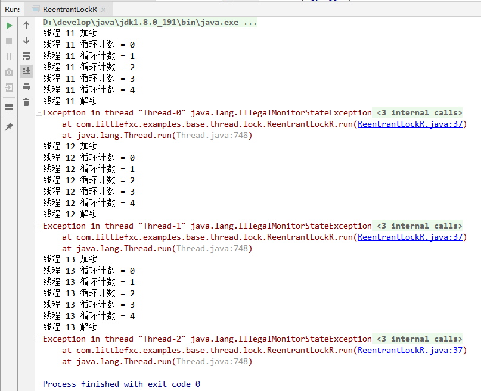

# Java 并发学习记录之 Lock 锁

[TOC]

## Lock 接口

锁是用于通过多个线程控制对共享资源的访问的工具。一般来说，锁提供对共享资源的独占访问：一次只能有一个线程可以获取锁，并且对共享资源的所有访问都要求首先获取锁。 但是，一些锁可能允许并发访问共享资源，如ReadWriteLock的读写锁。

在Lock接口出现之前，Java程序是靠synchronized关键字实现锁功能的。JDK1.5之后并发包中新增了Lock接口以及相关实现类来实现锁功能。虽然缺少了隐式获取释放锁的便捷性，但是却拥有了锁获取与释放的可操作性、可中断的获取锁以及超时获取锁等多种 synchronized 关键字所不具备的同步特性。

### 简单用法

```java
Lock lock=new ReentrantLock();
lock.lock();
try{
  
} finally {
  lock.unlock();
}
```

因为 Lock 是接口所以使用时要结合它的实现类，另外在 finall 语句块中释放锁的目的是保证获取到锁之后，最终能够被释放。同时注意最好不要把获取锁的过程写在 try 语句块中，因为如果在获取锁时发生了异常，异常抛出的同时也会导致锁无故释放。

### Lock接口提供的synchronized关键字不具备的主要特性：

| 特性 | 描述 |
| --- | --- |
| 尝试非阻塞地获取锁 | 当前线程尝试获取锁，如果这一时刻锁没有被其他线程获取到，则成功获取并持有锁 |
| 能被中断地获取锁 | 获取到锁的线程能够响应中断，当获取到锁的线程被中断时，中断异常将会被抛出，同时锁会被释放 |
| 超时获取锁 | 在指定的截止时间之前获取锁， 超过截止时间后仍旧无法获取则返回 |

### Lock接口基本的方法：

| 方法名称 | 描述 |
| --- | --- |
| void lock() | 获得锁。如果锁不可用，则当前线程将被禁用以进行线程调度，并处于休眠状态，直到获取锁。 |
| void lockInterruptibly() | 获取锁，如果可用并立即返回。如果锁不可用，那么当前线程将被禁用以进行线程调度，并且处于休眠状态，和lock()方法不同的是在锁的获取中可以中断当前线程（相应中断）。 |
| Condition newCondition() | 获取等待通知组件，该组件和当前的锁绑定，当前线程只有获得了锁，才能调用该组件的wait()方法，而调用后，当前线程将释放锁。 |
| boolean tryLock() | 只有在调用时才可以获得锁。如果可用，则获取锁定，并立即返回值为true；如果锁不可用，则此方法将立即返回值为false 。 |
| boolean tryLock(long time, TimeUnit unit) | 超时获取锁，当前线程在一下三种情况下会返回：<br/>1. 当前线程在超时时间内获得了锁；<br/>2.当前线程在超时时间内被中断；<br/>3.超时时间结束，返回false. |
| void unlock() | 释放锁。 |

## Lock 实现类：ReentrantLock

重入锁 ReentrantLock，顾名思义，就是支持重进入的锁，它表示该锁能够支持一个线程对资源的重复加锁。除此之外，还支持获取锁时的公平和非公平锁选择。

### 加锁2次释放2次

```java
package com.littlefxc.examples.base.thread.lock;

import java.util.concurrent.locks.Lock;
import java.util.concurrent.locks.ReentrantLock;

/**
 * @author fengxuechao
 * @date 2019/2/28
 **/
public class ReentrantLockR implements Runnable {

    Lock lock = new ReentrantLock();

    @Override
    public void run() {
        lock.lock();
        System.out.println("线程 " + Thread.currentThread().getId() + " 加锁");
        try {
            lock.lock();// 重进入验证
            for (int i = 0; i < 5; i++) {
                System.out.println("线程 " + Thread.currentThread().getId() + " 循环计数 = " + i);
            }
        } finally {
            lock.unlock();// 锁的释放
            System.out.println("线程 " + Thread.currentThread().getId() + " 解锁");
            lock.unlock();
        }
    }

    public static void main(String[] args) {
        ReentrantLockR lockR = new ReentrantLockR();
        Thread t1 = new Thread(lockR);
        Thread t2 = new Thread(lockR);
        Thread t3 = new Thread(lockR);
        t1.start();
        t2.start();
        t3.start();
    }
}
```

运行结果：



可以看到，运行结果是只有当线程运行完毕后才会释放锁，其它线程才能获得锁->执行业务代码->释放锁。**其他线程的执行顺序是不确定的**（为了这个图运行了很多遍）。

仔细观察代码，可以我加了两遍锁，同时也释放了两遍锁。

### 如果，加锁两次释放一次：

```java
@Override
public void run() {
    lock.lock();
    lock.lock();// 重进入验证
    System.out.println("线程 " + Thread.currentThread().getId() + " 加锁");
    try {
        for (int i = 0; i < 5; i++) {
            System.out.println("线程 " + Thread.currentThread().getId() + " 循环计数 = " + i);
        }
    } finally {
//      lock.unlock();// 锁的释放
        System.out.println("线程 " + Thread.currentThread().getId() + " 解锁");
        lock.unlock();
    }
}
```

运行结果：



### 又如果，加锁1次却释放锁两次，就会抛异常：

```java
@Override
public void run() {
    lock.lock();
    //lock.lock();// 重进入验证
    System.out.println("线程 " + Thread.currentThread().getId() + " 加锁");
    try {
        for (int i = 0; i < 5; i++) {
            System.out.println("线程 " + Thread.currentThread().getId() + " 循环计数 = " + i);
        }
    } finally {
        lock.unlock();// 锁的释放
        System.out.println("线程 " + Thread.currentThread().getId() + " 解锁");
        lock.unlock();
    }
}
```

运行结果：



### 公平与非公平获取锁的区别

如果一个锁是公平的，那么锁的获取顺序就应该符合请求的绝对时间顺序，也就是 FIFO。

ReentrantLock 的 非公平锁的获取（源码）：

```java
final boolean nonfairTryAcquire(int acquires) {
    final Thread current = Thread.currentThread();
    int c = getState();
    if (c == 0) {
        if (compareAndSetState(0, acquires)) {
            setExclusiveOwnerThread(current);
            return true;
        }
    }
    else if (current == getExclusiveOwnerThread()) {
        int nextc = c + acquires;
        if (nextc < 0) // overflow
            throw new Error("Maximum lock count exceeded");
        setState(nextc);
        return true;
    }
    return false;
}
```

ReentrantLock 的 公平锁的获取（源码）：

```java
/**
 * Fair version of tryAcquire.  Don't grant access unless
 * recursive call or no waiters or is first.
 */
protected final boolean tryAcquire(int acquires) {
    final Thread current = Thread.currentThread();
    int c = getState();
    if (c == 0) {
        if (!hasQueuedPredecessors() &&
            compareAndSetState(0, acquires)) {
            setExclusiveOwnerThread(current);
            return true;
        }
    }
    else if (current == getExclusiveOwnerThread()) {
        int nextc = c + acquires;
        if (nextc < 0)
            throw new Error("Maximum lock count exceeded");
        setState(nextc);
        return true;
    }
    return false;
}
```

对比两个方法的不同点只是获取公平锁判断条件多了 `hasQueuedPredecessors()` 方法，即加入了同步队列中当前是否有前驱结点的判断，如果该方法返回 true，则表示当前线程需要等待前驱线程获取锁并释放锁之后才能继续获取锁。

当你看到 ReentrantLock 的构造函数，为什么非公平锁会被设定为默认的实现呢？

要知道一个刚释放锁的线程再次获取锁的几率会非常大，使得其他线程只能在同步队列中等待，从而让非公平锁使线程“饥饿”， 这是因为虽然公平锁保证了锁的获取按照 FIFO 原则，但代价是进行了大量的线程切换。非公平锁虽然可能会造成线程“饥饿”，但极少的线程切换，保证了更大的吞吐量。