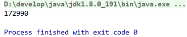

# java 并发学习记录之synchronized

## 简介

现在学习的是关于如何使用 `synchronized` 关键词，关于它的原理不再此次学习范围内。

## 实例变量的安全问题

如何变量是一个**方法内部的私有变量**，那么这个变量是安全的。

但是如果这个变量是**实例变量**，那么多个线程操作这个变量就会变得不安全（如果不使用 `synchronized` 的话）

## 关键词 synchronized 的多种用法

- 指定加锁对象：对给定对象加锁，进入同步代码前要获得给定对象的锁
- 直接作用于实例方法：相当于对当前实例加锁，进入同步代码前要获得当前实例的锁
- 直接作用于静态方法：相当于对当前类加锁，进入同步代码前要获得当前类的锁

### 直接作用于实例方法的错误示范

```java
package com.littlefxc.examples.base.thread.sync;

/**
 * 指定加锁对象的错误示例：两个线程访问的不是同一个对象
 *
 * @author fengxuechao
 * @date 2019/2/20
 **/
public class AccountSync1 implements Runnable {

    static volatile int money = 0;

    public static void main(String[] args) {
        AccountSync1 account1 = new AccountSync1();
        AccountSync1 account2 = new AccountSync1();
        Thread t1 = new Thread(account1);
        Thread t2 = new Thread(account2);
        t1.start();
        t2.start();
        try {
            t1.join();
            t2.join();
        } catch (InterruptedException e) {
            e.printStackTrace();
        }
        System.out.println(money);
    }

    @Override
    public void run() {
        for (int i = 0; i < 100000; i++) {
            money++;
        }
    }
}
```

结果



结果与我们的期望结果(200000)显然不同。

**为什么会这样呢？**

仔细查看代码，我们的 `money++` 这个操作做实际上有两步操作，为这段代码加锁，我们为 `run()` 方法添加 `synchronized`，
变为

```java
@Override
public synchronized void run() {
    for (int i = 0; i < 100000; i++) {
        money++;
    }
}
```

然后在运行代码，仍然报错。（**我都已经加锁了???**）

在仔细查看一下代码，可以发现我们的代码中有两个线程，但这两个线程访问的是不同的实例，这就是得不到期望结果的原因了。
修改一下代码是两个线程访问同一个实例。代码如下：

```java
package com.littlefxc.examples.base.thread.sync;

/**
 * 指定加锁对象的错误示例：两个线程访问的不是同一个对象
 *
 * @author fengxuechao
 * @date 2019/2/20
 **/
public class AccountSync1 implements Runnable {

    static volatile int money = 0;

    public static void main(String[] args) {
        AccountSync1 account1 = new AccountSync1();
//        AccountSync1 account2 = new AccountSync1();
        // 使两个线程访问同一实例
        Thread t1 = new Thread(account1);
        Thread t2 = new Thread(account1);
        t1.start();
        t2.start();
        try {
            t1.join();
            t2.join();
        } catch (InterruptedException e) {
            e.printStackTrace();
        }
        System.out.println(money);
    }

    @Override
    public synchronized void run() {
        for (int i = 0; i < 100000; i++) {
            money++;
        }
    }
}
```

现在运行代码可以得到期望的结果 200000 了。

总之， 上述代码中关键词 `synchronized` 作用于一个实例方法，也就是说在进入被 `synchronized` 修饰的方法前，
多个线程必须获得同一个对象实例的锁，也就是访问同一个对象实例，这样才能保证线程的安全。

### 指定加锁对象的错误示范

我们将上面的代码稍许修改一下，将 synchronized 作用于指定的实例对象，例如 `this`.

```java
package com.littlefxc.examples.base.thread.sync;

/**
 * @author fengxuechao
 * @date 2019/2/21
 **/
public class AccountSync2 implements Runnable {

    static volatile int money = 0;

    @Override
    public void run() {
        synchronized (this) {
            for (int i = 0; i < 100000; i++) {
                money++;
            }
        }
    }

    public static void main(String[] args) {
        AccountSync2 account1 = new AccountSync2();
        AccountSync2 account2 = new AccountSync2();
        Thread t1 = new Thread(account1);
        Thread t2 = new Thread(account2);
        t1.start();
        t2.start();
        try {
            t1.join();
            t2.join();
        } catch (InterruptedException e) {
            e.printStackTrace();
        }
        System.out.println(money);
    }
}
```

结果


可以看到这个错误示例中的改动仅仅只是将 `synchronized` 关键词放到方法内部，并作用于 `this`，
这个 `this` 表示当前实例对象。从这个分析我们就可以假设这段代码出错的原因是两个线程访问的不是同一个实例对象。

修改代码：

```java
package com.littlefxc.examples.base.thread.sync;

/**
 * @author fengxuechao
 * @date 2019/2/21
 **/
public class AccountSync2 implements Runnable {

    static volatile int money = 0;

    @Override
    public void run() {
        synchronized (this) {
            for (int i = 0; i < 100000; i++) {
                money++;
            }
        }
    }

    public static void main(String[] args) {
        AccountSync2 account1 = new AccountSync2();
//        AccountSync2 account2 = new AccountSync2();
        Thread t1 = new Thread(account1);
        Thread t2 = new Thread(account1);
        t1.start();
        t2.start();
        try {
            t1.join();
            t2.join();
        } catch (InterruptedException e) {
            e.printStackTrace();
        }
        System.out.println(money);
    }
}
```

总之， 上述代码中关键词 `synchronized` 作用于一个对象实例，也就是说在进入被 `synchronized` 修饰的代码块前，
多个线程必须获得同一个对象实例的锁，也就是访问同一个对象实例，这样才能保证线程的安全。

### 直接作用于静态方法

但是，还有一种方法可以保证多个线程访问多个对象实例却仍然保证线程安全的办法。就是对静态方法添加 `synchronized` 。

```java
package com.littlefxc.examples.base.thread.sync;

/**
 * @author fengxuechao
 * @date 2019/2/21
 **/
public class AccountSync3 implements Runnable {

    static volatile int money = 0;

    @Override
    public void run() {
        for (int i = 0; i < 100000; i++) {
            increase();
        }
    }

    private synchronized static void increase() {
        money++;
    }

    public static void main(String[] args) {
        AccountSync3 account1 = new AccountSync3();
        AccountSync3 account2 = new AccountSync3();
        Thread t1 = new Thread(account1);
        Thread t2 = new Thread(account2);
        t1.start();
        t2.start();
        try {
            t1.join();
            t2.join();
        } catch (InterruptedException e) {
            e.printStackTrace();
        }
        System.out.println(money);
    }
}
```

分析上面代码，首先我们要知道在Java中一切都是对象，所以在Java中类本身也是一个对象。
在JVM初始化Java的时候是有一个顺序的：  
1. 先初始化父类的静态代码
2. 初始化子类的静态代码
3. (创建实例时,如果不创建实例,则后面的不执行)初始化父类的非静态代码（变量定义等）
4. 初始化父类构造函数
5. 初始化子类非静态代码（变量定义等）
6. 初始化子类构造函数

简而言之，`synchronized` 修饰静态方法，加锁的是当前类本身。
验证我的想法，改造它为如下代码:

```java
package com.littlefxc.examples.base.thread.sync;

/**
 * @author fengxuechao
 * @date 2019/2/21
 **/
public class AccountSync4 implements Runnable {

    static volatile int money = 0;

    @Override
    public void run() {
        synchronized (AccountSync4.class) {
            for (int i = 0; i < 100000; i++) {
                money++;
            }
        }
    }

    public static void main(String[] args) {
        AccountSync4 account1 = new AccountSync4();
        AccountSync4 account2 = new AccountSync4();
        Thread t1 = new Thread(account1);
        Thread t2 = new Thread(account2);
        t1.start();
        t2.start();
        try {
            t1.join();
            t2.join();
        } catch (InterruptedException e) {
            e.printStackTrace();
        }
        System.out.println(money);
    }
}
```

经过测试，我的想法是对的。同时，在本文开头指出 `synchronized` 的多种用法其实基于同一原理的不同表现形式。
要想操作加锁的内存空间，需要的是能够匹配这把锁的钥匙，
从而使得在某一时间内只有获得这把锁的线程才可以访问这把锁锁住的空间
例如，还可以进行这种改造 synchronized 修饰不可变对象如字符串。

```java
synchronized ("abc") {
    ...
}
``` 


