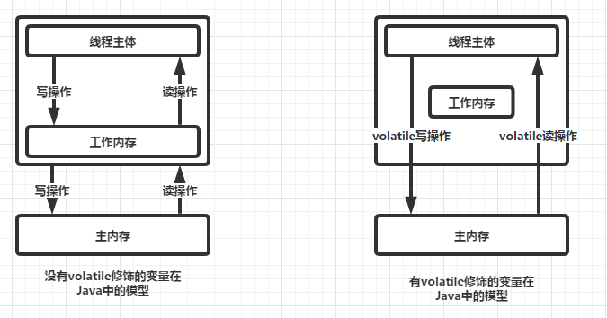
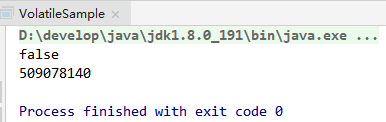

# Java并发学习记录之volatile

首先来个感性认识：
- `volatile` 关键字仅能实现对原始变量(如boolen、short、int、long等)赋值操作的原子性，
但是复合操作如 `i++`则不保证。

## volatile 和 synchronized 的区别

`volatile` 关键字解决的是内存可见性的问题，会使得所有对volatile变量的读写都会直接刷到主存，
即保证了变量的可见性。
这样就能满足一些对变量可见性有要求而对读取顺序没有要求的需求。

`synchronized` 关键字解决的是执行控制的问题，它会阻止其它线程获取当前对象的监控锁，
这样就使得当前对象中被synchronized关键字保护的代码块无法被其它线程访问，也就无法并发执行。
更重要的是，`synchronized` 还会创建一个内存屏障，内存屏障指令保证了所有CPU操作结果都会直接刷到主存中，
从而保证了操作的内存可见性，同时也使得先获得这个锁的线程的所有操作，
都 happens-before 于随后获得这个锁的线程的操作。

### 区别点

1. `volatile` 本质是在告诉 JVM 当前变量在寄存器（工作内存）中的值是不确定的，需要从主存中读取； 
`synchronized` 则是锁定当前变量，只有当前线程可以访问该变量，其他线程被阻塞住。

2. `volatile` 仅能使用在变量级别；`synchronized` 则可以使用在变量、方法、和类级别的。

3. `volatile` 仅能实现变量的修改可见性，不能保证原子性；
而 `synchronized` 则可以保证变量的修改可见性和原子性。

4. `volatile` 不会造成线程的阻塞；`synchronized` 可能会造成线程的阻塞。

5. `volatile` 标记的变量不会被编译器优化；`synchronized` 标记的变量可以被编译器优化

6. `volatile` 关键字用于解决变量在多个线程之间的可见性，而 `synchronized` 关键字解决的是多个线程之间访问资源的同步性。

## volatile 的可见性

下面是加了 `volatile` 关键字 和不加 `volatile` 关键字的区别，作图演示：



区别在于，volatile 修饰的成员变量在每次被线程访问时，
都强迫从主存（共享内存）中重读该成员变量的值。
而且，当成员变量发生变化时，强迫线程将变化值回写到主内存（共享内存）。
这样在任何时刻，两个不同的线程总是看到某个成员变量的同一个值，这样也就保证了同步数据的可见性。

### 验证 volatile 的可见性

```java
package com.littlefxc.examples.base.thread;

/**
 * @author fengxuechao
 * @date 2019/2/21
 **/
public class VolatileSample extends Thread {

    private int number;

    static boolean ready = true;

    @Override
    public void run() {
        while (ready) {
            number++;
        }
        System.out.println(ready);
        System.out.println(number);
    }

    public static void main(String[] args) throws InterruptedException {
        Thread t1 = new VolatileSample();
        t1.start();
        Thread.sleep(1000);
        ready = false;
    }
}
```

上面这段代码，我没有为 `ready` 变量添加 `volatile` 关键字，程序运行后陷入死循环。

为 `ready` 变量添加关键字 `volatile` 修饰后再次运行程序，及时停止，没有死循环。

验证结果：




 