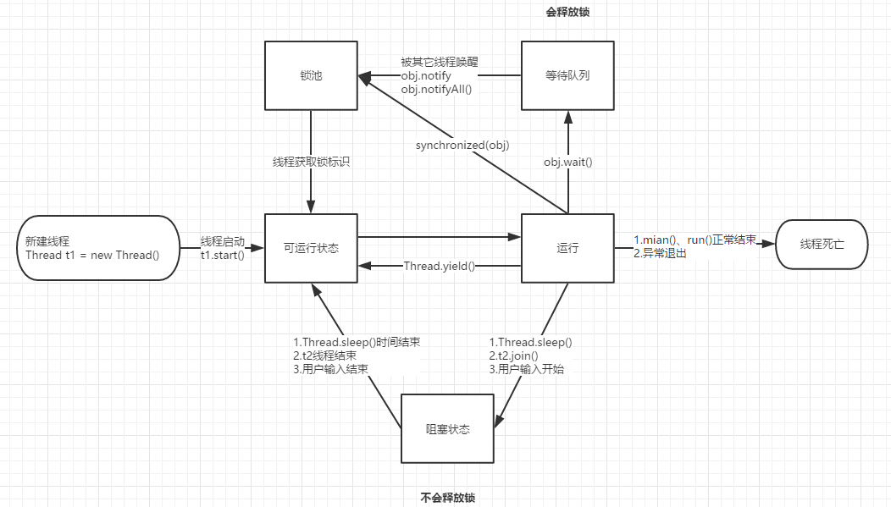
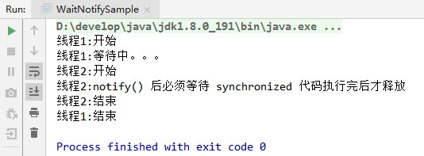

# Java 并发学习记录之 wait/notify 机制

为了支持多线程之间的协作，JDK提供了两个非常重要的接口线程等待 `wait()` 方法和
通知 `notify()` 方法。

- `wait()`: 使调用该方法的线程释放共享资源锁，然后从运行状态退出，进入等待队列，直到被再次唤醒
- `notify()`: 随机唤醒等待队列中等待同一共享资源的 “一个线程”，
并使该线程退出等待队列，进入可运行状态，也就是 `notify()` 方法仅通知“一个线程”
- `wait(long)`: 超时等待一段时间，这里的参数时间是毫秒，也就是等待长达n毫秒，
如果没有通知就超时返回
- `wait(long, int)`: 对于超时时间更细力度的控制，可以达到纳秒
- `notifyAll()`: 使所有正在等待队列中等待同一共享资源的 “全部线程” 退出等待队列，
进入可运行状态。此时，优先级最高的那个线程最先执行，但也有可能是随机执行，
这取决于JVM虚拟机的实现

文字表达太枯燥了，作图演示有关线程状态的变化：



## 简单实例演示

```java
package com.littlefxc.examples.base.thread;

/**
 * @author fengxuechao
 * @date 2019/2/22
 **/
public class WaitNotifySample {

    public static void main(String[] args) {
        Thread t1 = new WaitThread();
        Thread t2 = new NotifyThread();
        t1.start();
        t2.start();
    }

    private static class WaitThread extends Thread {
        @Override
        public void run() {
            synchronized (WaitNotifySample.class) {
                System.out.println("线程1:开始");
                try {
                    System.out.println("线程1:等待中。。。");
                    WaitNotifySample.class.wait();
                } catch (InterruptedException e) {
                    e.printStackTrace();
                }
                System.out.println("线程1:结束");
            }
        }
    }

    private static class NotifyThread extends Thread {
        @Override
        public void run() {
            synchronized (WaitNotifySample.class) {
                System.out.println("线程2:开始");
                WaitNotifySample.class.notify();
                System.out.println("线程2:notify() 后必须等待 synchronized 代码执行完后才释放");
                try {
                    Thread.sleep(2000);
                } catch (InterruptedException e) {
                    e.printStackTrace();
                }
                System.out.println("线程2:结束");
            }
        }
    }
}
```

执行结果：



### 代码分析：

开启了两个线程 t1, t2。

1. t1首先获得锁，在执行 `wait()` 方法前先要申请锁，
其中 `synchronized(WaitNotifySample.class)` 这样写不要觉得奇怪(Java编程思想：一切都是对象)
我只是图方便而已，
2. 所以在执行 `wait()` 方法时，它是持有 `WaitNotifySample.class` 的锁的。
3. `wait()` 方法后，t1 会进行等待，并释放 `WaitNotifySample.class` 的锁。
4. t2 线程在执行 `notify()` 前也会申请 `WaitNotifySample.class` 的锁.
5. **`notify()` 方法后并不会立即释放锁, 而是必须执行完notify()方法所在的synchronized代码块后才释放。**
我在这里让 t2 睡眠两秒使得效果更加明显.

### wait() 与 sleep() 的区别

从上面的执行结果也可以看出来, `wait()` 方法后当前线程是会释放目标对象的锁, 而 `sleep()` 仍然是阻塞的说明线程没有释放任何资源.
