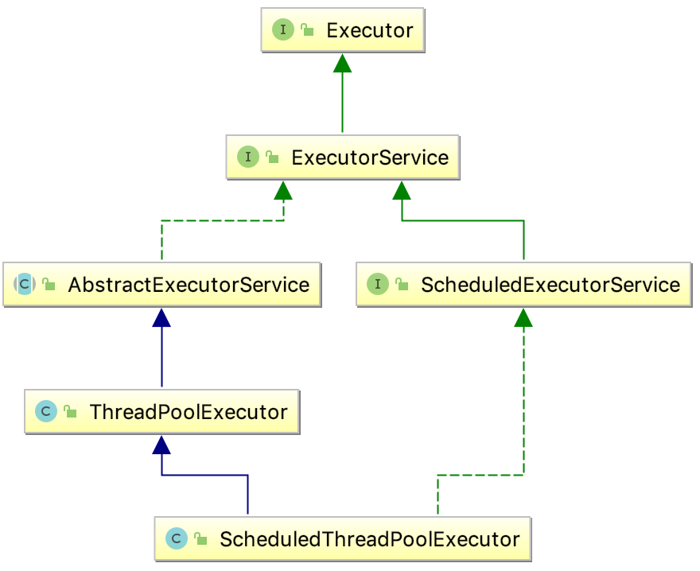

# Java并发学习记录之线程池

[TOC]

## Callable 接口

- [ ] [Java并发学习记录之Callable](Java并发学习记录之Callable.md)

## Future 接口

- [ ] [Java并发学习记录之Future](Java并发学习记录之Future.md)

## 线程池的优势

- **降低资源消耗**。通过重复利用已创建的线程降低线程创建和销毁造成的消耗。
- **提高响应速度**。当任务到达时，任务可以不需要的等到线程创建就能立即执行。
- **提高线程的可管理性**。线程是稀缺资源，如果无限制的创建，不仅会消耗系统资源，还会降低系统的稳定性，使用线程池可以进行统一的分配，调优和监控。

## Executor

