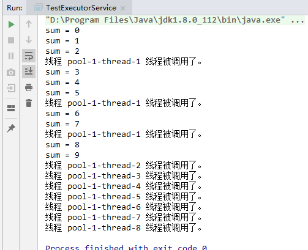

# Java并发学习记录之线程池

[TOC]

## 线程池的优势

- **降低资源消耗**。通过重复利用已创建的线程降低线程创建和销毁造成的消耗。
- **提高响应速度**。当任务到达时，任务可以不需要的等到线程创建就能立即执行。
- **提高线程的可管理性**。线程是稀缺资源，如果无限制的创建，不仅会消耗系统资源，还会降低系统的稳定性，使用线程池可以进行统一的分配，调优和监控。

## Executor 框架


### Executor 接口

Executor 接口中之定义了一个方法 execute（Runnable command），该方法接收一个 Runable 实例，它用来执行一个任务，
任务即一个实现了 Runnable 接口的类。

### ExecutorService 接口

ExecutorService 接口继承自 Executor 接口，它提供了更丰富的实现多线程的方法，比如，ExecutorService 提供了关闭自己的方法，
以及可为跟踪一个或多个异步任务执行状况而生成 Future 的方法。 
可以调用 ExecutorService 的 shutdown（）方法来平滑地关闭 ExecutorService，
调用该方法后，将导致 ExecutorService 停止接受任何新的任务且等待已经提交的任务执行完成
(已经提交的任务会分两类：一类是已经在执行的，另一类是还没有开始执行的)，
当所有已经提交的任务执行完毕后将会关闭 ExecutorService。因此我们一般用该接口来实现和管理多线程。

ExecutorService 的生命周期包括三种状态：运行、关闭、终止。

创建后便进入运行状态，当调用了 shutdown（）方法时，便进入关闭状态，此时意味着 ExecutorService 不再接受新的任务，
但它还在执行已经提交了的任务，仅当已经提交了的任务执行完后，便到达终止状态。
如果不调用 shutdown（）方法，ExecutorService 会一直处在运行状态，不断接收新的任务，执行新的任务，
服务器端一般不需要关闭它，保持一直运行即可。

### Executors 工具类

Executors 提供了一系列工厂方法用于创先线程池，返回的线程池都实现了 ExecutorService 接口。

- public static ExecutorService newFixedThreadPool(int nThreads)

    创建固定数目线程的线程池。
    
    - newFixedThreadPool 与 cacheThreadPool 差不多，也是能 reuse 就用，但不能随时建新的线程。
    - 其独特之处:任意时间点，最多只能有固定数目的活动线程存在，此时如果有新的线程要建立，只能放在另外的队列中等待，直到当前的线程中某个线程终止直接被移出池子。
    - 和 cacheThreadPool 不同，FixedThreadPool 没有 IDLE 机制（可能也有，但既然文档没提，肯定非常长，
    类似依赖上层的 TCP 或 UDP IDLE 机制之类的），所以 FixedThreadPool 多数针对一些很稳定很固定的正规并发线程，多用于服务器。
    - 从方法的源代码看，cache池和fixed 池调用的是同一个底层池，只不过参数不同:
        - fixed 池线程数固定，并且是0秒IDLE（无IDLE）。
        - cache 池线程数支持 0-Integer.MAX_VALUE(显然完全没考虑主机的资源承受能力），60 秒 IDLE 。
    
- public static ExecutorService newCachedThreadPool()

    创建一个可缓存的线程池，调用execute将重用以前构造的线程（如果线程可用）。如果现有线程没有可用的，则创建一个新线 程并添加到池中。
    终止并从缓存中移除那些已有 60 秒钟未被使用的线程。
    
    - 缓存型池子，先查看池中有没有以前建立的线程，如果有，就 reuse 如果没有，就建一个新的线程加入池中
    - 缓存型池子通常用于执行一些生存期很短的异步型任务 因此在一些面向连接的 daemon 型 SERVER 中用得不多。但对于生存期短的异步任务，它是 Executor 的首选。
    - 能 reuse 的线程，必须是 timeout IDLE 内的池中线程，缺省 timeout 是 60s,超过这个 IDLE 时长，线程实例将被终止及移出池。
    
    > 注意，放入 CachedThreadPool 的线程不必担心其结束，超过 TIMEOUT 不活动，其会自动被终止。

- public static ExecutorService newSingleThreadExecutor()

    创建一个单线程化的Executor。
    
    - 单例线程，任意时间池中只能有一个线程
    - 用的是和 cache 池和 fixed 池相同的底层池，但线程数目是 1-1,0 秒 IDLE（无 IDLE）
    
    一般来说，CachedTheadPool 在程序执行过程中通常会创建与所需数量相同的线程，然后在它回收旧线程时停止创建新线程，
    因此它是合理的 Executor 的首选，只有当这种方式会引发问题时（比如需要大量长时间面向连接的线程时），
    才需要考虑用 FixedThreadPool。（该段话摘自《Thinking in Java》第四版）

- public static ScheduledExecutorService newScheduledThreadPool(int corePoolSize)

    创建一个支持定时及周期性的任务执行的线程池，多数情况下可用来替代Timer类。
    
    - 调度型线程池
    - 这个池子里的线程可以按 schedule 依次 delay 执行，或周期执行
    
### Executor 执行 Runnable 任务

```java
public class TestExecutorService {
    public static void main(String[] args){
        ExecutorService executorService = Executors.newCachedThreadPool();
//      ExecutorService executorService = Executors.newFixedThreadPool(5);
//      ExecutorService executorService = Executors.newSingleThreadExecutor();
        TestRunnable runnable = new TestRunnable();
        for (int i = 0; i < 10; i++){
            executorService.execute(runnable);
            System.out.println("sum = " + i);
        }
        executorService.shutdown();
    }

    static class TestRunnable implements Runnable{
        @Override
        public void run(){
            System.out.println("线程 " + Thread.currentThread().getName() + " 线程被调用了。");
        }
    }
}
```

运行结果：



从结果中可以看出，线程池创建了8个线程，其中 pool-1-thread-1 被调用了3次，
这是随机的，execute 会首先在线程池中选择一个已有空闲线程来执行任务，如果线程池中没有空闲线程，它便会创建一个新的线程来执行任务。

### Executor 执行 Callable 任务


