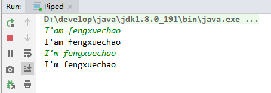
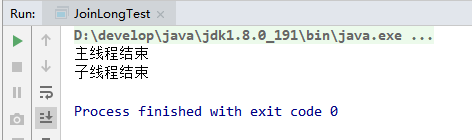
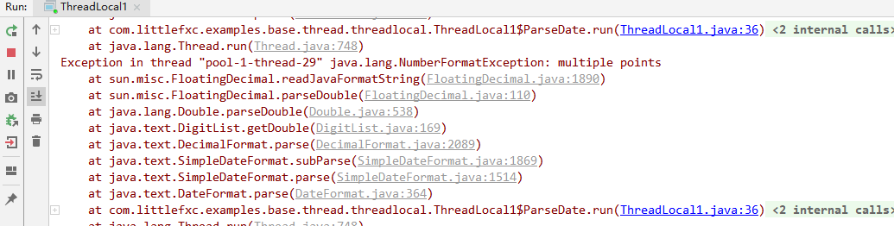

# Java 并发学习记录之线程间通信

## volatile 和 synchronized 关键字

[Java并发学习记录之volatile.md](Java并发学习记录之volatile.md)

[Java并发学习记录之synchronized.md](Java并发学习记录之synchronized.md)

## 等待/通知机制

[Java并发学习记录之wait-notify机制.md](Java并发学习记录之wait-notify机制.md)

## 管道输入/输出流

管道输入/输出流和普通文件的输入/输出流或者网络输入、输出流不同之处在于管道输入/输出流主要用于线程之间的数据传输，
而且传输的媒介为内存。

管道输入/输出流主要包括下列两类的实现：

- 面向字节： PipedOutputStream、 PipedInputStream
- 面向字符: PipedWriter、 PipedReader

```java
package com.littlefxc.examples.base.thread.pipe;

import java.io.IOException;
import java.io.PipedReader;
import java.io.PipedWriter;

/**
 * 管道输入/输出主要用于线程间的数据传输，传输的媒介是内存。具体实现：
 * <br>面向字节:
 * <ul>
 * <li>PipedWriter</li>
 * <li>PipedReader</li>
 * </ul>
 * <br>面向字符:
 * <ul>
 * <li>PipedOutputStream</li>
 * <li>PipedInputStream</li>
 * </ul>
 *
 * @author fengxuechao
 * @date 2019/2/26
 **/
public class Piped {

    public static void main(String[] args) throws IOException {
        PipedWriter writer = new PipedWriter();
        PipedReader reader = new PipedReader();
        // 将输出流和输入流进行必要的连接
        writer.connect(reader);
        Thread printThread = new Thread(new Print(reader), "PrintThread");
        printThread.start();
        int receive = 0;
        try {
            while ((receive = System.in.read()) != -1) {
                writer.write(receive);
            }
        } catch (IOException e) {
            e.printStackTrace();
        } finally {
            writer.close();
        }
    }

    static class Print implements Runnable {

        private PipedReader reader;

        public Print(PipedReader reader) {
            this.reader = reader;
        }

        @Override
        public void run() {
            int receive = 0;
            try {
                while ((receive = reader.read()) != -1) {
                    System.out.print((char) receive);
                }
            } catch (IOException e) {
                e.printStackTrace();
            }
        }
    }
}
```

运行该示例，输入一组字符串，可以看到 printThread 进行了原样输出。



Tips：
对于 Piped 类型的流，必须要进行绑定，也就是调用 `connect()`，否则会抛异常。

## Thread.join() 的使用

在很多情况下，主线程生成并起动了子线程，如果子线程里要进行大量的耗时的运算，
主线程往往将于子线程之前结束，但是如果主线程处理完其他的事务后，需要用到子线程的处理结果，
也就是主线程需要等待子线程执行完成之后再结束，这个时候就要用到join()方法了。另外，
一个线程需要等待另一个线程也需要用到join()方法。

Thread类除了提供 `join()` 方法之外，还提供了 `join(long millis)`、`join(long millis, int nanos)`
两个具有超时特性的方法。这两个超时方法表示，如果线程thread在指定的超时时间没有终止，
那么将会从该超时方法中返回。

重点看一下 `join(long millis)` 的示例：

```java
package com.littlefxc.examples.base.thread;

/**
 * @author fengxuechao
 */
public class JoinLongTest {

    public static void main(String[] args) {
        try {
            MyThread threadTest = new MyThread();
            threadTest.start();

            threadTest.join(1000);// 主线成等待子线程1秒
//            Thread.sleep(1000);
            System.out.println("主线程结束");
        } catch (InterruptedException e) {
            e.printStackTrace();
        }
    }

    static public class MyThread extends Thread {

        @Override
        public void run() {
            try {
                Thread.sleep(2000);
                System.out.println("子线程结束");
            } catch (InterruptedException e) {
                e.printStackTrace();
            }
        }

    }
}
```

运行结果：



## ThreadLocal

之前我们讲保证线程资源安全问题时，使用**同步**加锁的方式保证线程安全。还有一种办法就是**隔离**资源的做法。

所谓的**隔离**，即每个线程使用自己的局部资源。将资源隔离不让其它线程访问，
从被隔离资源的角度来说，能够访问它的只有当前线程。既然只有当前线程可以访问的数据，自然是线程安全的。
一个典型的例子就是 `Servlet`。

### ThreadLocal 的简单使用

首先来一个不使用 ThreadLocal 的类，然后在逐渐对其改造。

```java
package com.littlefxc.examples.base.thread.threadlocal;

import java.text.ParseException;
import java.text.SimpleDateFormat;
import java.util.Date;
import java.util.concurrent.ExecutorService;
import java.util.concurrent.Executors;

/**
 * @author fengxuechao
 * @date 2019/2/26
 **/
public class ThreadLocal1 {

    private static final SimpleDateFormat SDF = new SimpleDateFormat("yyyy-MM-dd HH:mm:ss");

    public static void main(String[] args) {
        ExecutorService es = Executors.newFixedThreadPool(10);
        for (int i = 0; i < 1000; i++) {
            es.execute(new ParseDate(i));
        }
        es.shutdown();
    }

    private static class ParseDate implements Runnable {

        int i = 0;

        public ParseDate(int i) {
            this.i = i;
        }

        @Override
        public void run() {
            try {
ParseDateWithSync
                    Date date = SDF.parse("2019-02-26 16:23:" + i % 60);
                    System.out.println(i + ":" + date);
//                }
            } catch (ParseException e) {
                e.printStackTrace();
            }
        }
    }
}
```

运行结果：



一般这种问题主要是因为 SimpleDateFormat 在多线程环境下，是线程不安全的，所以如果你在多线程环境中共享了SimpleDateFormat的实例，
比如你在类似日期类中定义了一个全局的 SimpleDateFormat 对象，这样子肯定会出现上述的报错

一种解决办法就是加锁，在上面代码中可以将注释去掉后再次运行，也就不会出现这个问题了。

但是我现在要使用保存线程局部变量的ThreadLocal对象来保存每一个线程的SimpleDateFormat对象，针对上述代码做出改变：

```java
package com.littlefxc.examples.base.thread.threadlocal;

import java.text.ParseException;
import java.text.SimpleDateFormat;
import java.util.Date;
import java.util.concurrent.ExecutorService;
import java.util.concurrent.Executors;

/**
 * @author fengxuechao
 * @date 2019/2/26
 **/
public class ParseDateWithThreadLocal {

    static final String pattern = "yyyy-MM-dd HH:mm:ss";
    private static final ThreadLocal<SimpleDateFormat> threadLocal = new ThreadLocal<SimpleDateFormat>();

    public static void main(String[] args) {
        ExecutorService es = Executors.newFixedThreadPool(10);
        for (int i = 0; i < 1000; i++) {
            es.execute(new ParseDate(i));
        }
        es.shutdown();
    }

    private static class ParseDate implements Runnable {

        int i = 0;

        public ParseDate(int i) {
            this.i = i;
        }

        @Override
        public void run() {
            try {
                // 如果当前线程不持有 SimpleDateFormat 对象。那就新建并保存设置在当前线程中，如果已持有，则直接使用。
                if (threadLocal.get()==null) {
                    threadLocal.set(new SimpleDateFormat(pattern));
                }
                Date date = threadLocal.get().parse("2019-02-26 16:23:" + i % 60);
                System.out.println(i + ":" + date);
            } catch (ParseException e) {
                e.printStackTrace();
            }
        }
    }
}
```

注意：从上面代码中也可以看出，为每一个线程分配一个对象的工作并不是由 ThreadLocal 来完成的，
而是需要开发人员在应用层面保证的。ThreadLocal 只是起到了一个容器的作用。


