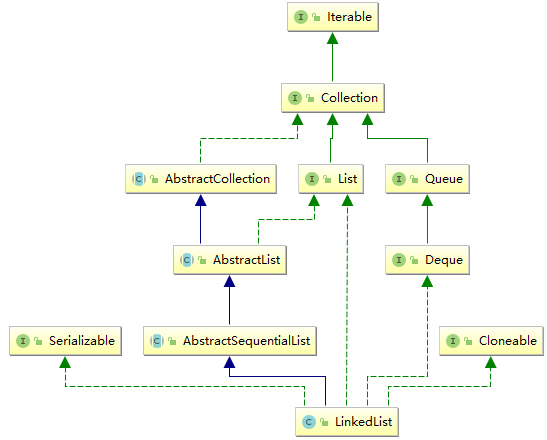

## 概述

双链表实现了List和Deque接口。 实现所有可选列表操作，并允许所有元素（包括null ）。

所有的操作都能像双向列表一样预期。 索引到列表中的操作将从开始或结束遍历列表，以更接近指定的索引为准。

**请注意，此实现不同步。** 如果多个线程同时访问链接列表，并且至少有一个线程在结构上修改列表，则必须在外部进行同步。 （结构修改是添加或删除一个或多个元素的任何操作;仅设置元素的值不是结构修改。）
这通常通过在自然封装列表的对象上进行同步来实现。 如果没有这样的对象存在，列表应该使用 Collections.synchronizedList 方法“包装”。 这最好在创建时完成，以防止意外的不同步访问列表：

    List list = Collections.synchronizedList(new LinkedList(...)); 
  
这个类的 iterator 和 listIterator 方法返回的迭代器是故障快速的 ：如果列表在迭代器创建之后的任何时间被结构化地修改，除了通过迭代器自己的remove或add方法之外，
迭代器将会抛出一个ConcurrentModificationException 。 因此，面对并发修改，迭代器将快速而干净地失败，而不是在未来未确定的时间冒着任意的非确定性行为。

请注意，迭代器的故障快速行为无法保证，因为一般来说，在不同步并发修改的情况下，无法做出任何硬性保证。 
失败快速迭代器尽力投入ConcurrentModificationException 。 因此，编写依赖于此异常的程序的正确性将是错误的：迭代器的故障快速行为应仅用于检测错误。

（以上来自 Java8 api）

## 分析

首先看一下 LinkedList 的继承关系：



### 定义

```java
public class LinkedList<E>
    extends AbstractSequentialList<E>
    implements List<E>, Deque<E>, Cloneable, java.io.Serializable{}
```

1. LinkedList 是一个继承于 AbstractSequentialList 的双向链表。它也可以被当作堆栈、队列或双端队列进行操作。
最大限度地减少了实现受“连续访问”数据存储（如链接列表）支持的此接口所需的工作,从而以减少实现 List 接口的复杂度。
2. LinkedList 实现 List 接口，能对它进行序列（有序集合）操作。
3. LinkedList 实现 Deque 接口，即能将LinkedList当作双端队列使用。
4. LinkedList 实现了 Cloneable 接口，即覆盖了函数 clone()，能克隆。
5. LinkedList 实现 java.io.Serializable 接口，这意味着 LinkedList 支持序列化，能通过序列化去传输。
6. LinkedList 是非同步的。

### 属性

```java
public class LinkedList<E> extends AbstractSequentialList<E> implements List<E>, Deque<E>, Cloneable, java.io.Serializable{

    transient int size = 0;// list中的元素个数
    
    /**
     * 链表头节点
     * 不变式: (first == null && last == null) || (first.prev == null && first.item != null)
     */
    transient Node<E> first;
    
    /**
     * 链表尾节点
     * 不变式: (first == null && last == null) || (last.next == null && last.item != null)
     */
    transient Node<E> last;
    
    private static class Node<E> {
        E item;// 实际存放的元素
        Node<E> next;// 后一个节点
        Node<E> prev;// 前一个节点
        
        // 构造函数元素顺序分别为前，自己，后。就像排队一样
        Node(Node<E> prev, E element, Node<E> next) {
            this.item = element;
            this.next = next;
            this.prev = prev;
        }
    }        
}
```

### 构造方法

由于采用的是链表结构，所以不像 ArrayList 一样，有指定容量的构造方法

```java
public class LinkedList<E> extends AbstractSequentialList<E> implements List<E>, Deque<E>, Cloneable, java.io.Serializable{
     
    /**
      * 构造一个空列表.
      */
     public LinkedList() {
     }
    
     /**
      * 构造一个包含指定 collection 中的元素的列表，这些元素按其 collection 的迭代器返回的顺序排列
      */
     public LinkedList(Collection<? extends E> c) {
         this();// 什么都不做
         addAll(c);// 将 c 集合里的元素添加进链表
     }
     
     /**
       * 按照指定集合的迭代器返回的顺序将指定集合中的所有元素追加到此列表的末尾。
       */
      public boolean addAll(Collection<? extends E> c) {
          return addAll(size, c);
      }
      
      private void checkPositionIndex(int index) {
          if (!isPositionIndex(index))
              throw new IndexOutOfBoundsException(outOfBoundsMsg(index));
      }
      
      /**
        * 判断参数是迭代器或添加操作的有效位置的索引。
        */
       private boolean isPositionIndex(int index) {
           return index >= 0 && index <= size;
       }
  
      /**
       * 从指定位置开始，将指定集合中的所有元素插入此列表。 
       * 将当前位置的元素（如果有）和任何后续元素向右移动（增加其索引）。 
       * 新元素将按照指定集合的迭代器返回的顺序出现在列表中。
       */
      public boolean addAll(int index, Collection<? extends E> c) {
          checkPositionIndex(index);// 检查索引是否正确，即在 0 <= index <= size
  
          Object[] a = c.toArray();// 将 collection 转为数组
          int numNew = a.length;
          if (numNew == 0)
              return false;
  
          Node<E> pred, succ;// 声明 pred 为"当前要插入节点的前一个节点"，succ 为"当前要插入节点的后一个节点"
          if (index == size) {// 说明要插入元素的位置就在链表的末尾，后置元素为null，前一个元素就是last
              succ = null;
              pred = last;
          } else { // 说明在链表的中间插入，这时 pred 为原来 index 的 prev，succ 为原来的元素
              succ = node(index);// 利用双向链表的特性，进行更快的遍历
              pred = succ.prev;
          }
  
          for (Object o : a) {// 遍历数组，逐个添加
              @SuppressWarnings("unchecked") E e = (E) o;
              Node<E> newNode = new Node<>(pred, e, null);
              if (pred == null)
                  first = newNode;
              else
                  pred.next = newNode;
              pred = newNode;// 将新节点作为pred，为下一个元素插入做准备

          }
  
          if (succ == null) {// 如果后继元素为空，那么插入完后的最后一个元素，就 pred 就是 last
              last = pred;
          } else {// 否则就维护最后一个元素和之前的元素之间的关系
              pred.next = succ;
              succ.prev = pred;
          }
  
          size += numNew;
          modCount++;// 链表结构发生改动
          return true;
      }
      
      /**
       * 返回指定元素索引处的(非空)节点
       * 利用双向链表的特性，进行更快的遍历
       * 双向链表和索引值联系起来：通过一个计数索引值来实现
       *    当我们调用get(int index)时，首先会比较“index”和“双向链表长度的1/2”；
       *    若前者大，则从链表头开始往后查找，直到 index 位置；
       *    否则，从链表末尾开始先前查找，直到 index 位置.
       */
      Node<E> node(int index) {
          // assert isElementIndex(index);
      
          if (index < (size >> 1)) {// 如果index在链表的前半部分，则从头部节点开始遍历
              Node<E> x = first;
              for (int i = 0; i < index; i++)
                  x = x.next;
              return x;
          } else {// 如果index在链表的后半部分，则从尾部节点开始遍历
              Node<E> x = last;
              for (int i = size - 1; i > index; i--)
                  x = x.prev;
              return x;
          }
      }
}
```

### 增加 add(E e)

作为链表，添加新元素就是在链表的末尾插入新元素。

注意，如果末尾元素是 null ，又该如何处理？

```java
public class LinkedList<E> extends AbstractSequentialList<E> implements List<E>, Deque<E>, Cloneable, java.io.Serializable{
    /**
     * 将指定的元素追加到此列表的末尾。
     */
    public boolean add(E e) {
         linkLast(e);
         return true;
    }
    
    /**
     * 链接 e 作为最后一个元素。
     */
    void linkLast(E e) {
        final Node<E> l = last;// 记录last节点
        final Node<E> newNode = new Node<>(l, e, null);// 初始化新的节点

        last = newNode;
        if (l == null)// 末尾元素是 null,是个空列表
            first = newNode;
        else
            l.next = newNode;
        size++;
        modCount++;// 链表结构发生改动
    }
}
```

LinkedList 还有其他的增加方法：

- add(int index, E element)：在此列表中指定的位置插入指定的元素。
- addAll(Collection<? extends E> c)：添加指定 collection 中的所有元素到此列表的结尾，顺序是指定 collection 的迭代器返回这些元素的顺序。
- addAll(int index, Collection<? extends E> c)：将指定 collection 中的所有元素从指定位置开始插入此列表。
- AddFirst(E e): 将指定元素插入此列表的开头。
- addLast(E e): 将指定元素添加到此列表的结尾。

### 移除

处理思路：

1. 由于插入的元素可能为null，所以要对o进行判断，否则不论是o为null还是遍历的时候元素为null，都会导致报空指针异常
2. 找到元素后，对前后的元素关系重新维护，要考虑到元素是否在头尾的情况

```java
public class LinkedList<E> extends AbstractSequentialList<E> implements List<E>, Deque<E>, Cloneable, java.io.Serializable{
    
    public boolean remove(Object o) {
        if (o == null) {// 是否为 null 的判断
            // 从头节点遍历链表寻找第一个 x(null) 元素
            for (Node<E> x = first; x != null; x = x.next) {
                if (x.item == null) {
                    unlink(x);// 取消链接 x(null) 元素，重新维护删除元素后的前后关系
                    return true;
                }
            }
        } else {// 与上面的逻辑相同
            for (Node<E> x = first; x != null; x = x.next) {
                if (o.equals(x.item)) {
                    unlink(x);
                    return true;
                }
            }
        }
        return false;
    }
    
    /**
     * Unlinks non-null node x.
     */
    E unlink(Node<E> x) {
        // assert x != null;
        final E element = x.item;
        // 局部保存被删除节点的前后节点
        final Node<E> next = x.next;
        final Node<E> prev = x.prev;
    
        if (prev == null) {// prev 为 null 说明 x 节点为 first 节点，则删除后，next 为 first
            first = next;
        } else {// 否则 prev的下一个元素为x的next
            prev.next = next;
            x.prev = null;// 设为 null，方便GC
        }
    
        if (next == null) {// next 为null说明x节点为 last 节点，则删除后，next 为 prev
            last = prev;
        } else {// 否则 next 的上一个元素为x的prev
            next.prev = prev;
            x.next = null;// 设为 null，方便GC
        }
    
        x.item = null;// 设为 null，方便GC
        size--;
        modCount++;// 链表结构发生改变
        return element;//返回被删除节点的数据体
    }
}
```

其他的移除方法：

- clear()： 从此列表中移除所有元素。
- remove()：获取并移除此列表的头（第一个元素）。
- remove(int index)：移除此列表中指定位置处的元素。
- remove(Objec o)：从此列表中移除首次出现的指定元素（如果存在）。
- removeFirst()：移除并返回此列表的第一个元素。
- removeFirstOccurrence(Object o)：从此列表中移除第一次出现的指定元素（从头部到尾部遍历列表时）。
- removeLast()：移除并返回此列表的最后一个元素。
- removeLastOccurrence(Object o)：从此列表中移除最后一次出现的指定元素（从头部到尾部遍历列表时）。


### 查询

查询的方法非常简单，

```java
public class LinkedList<E> extends AbstractSequentialList<E> implements List<E>, Deque<E>, Cloneable, java.io.Serializable{
    
    public E get(int index) {
        checkElementIndex(index);// 检查索引index 是否在 [0,size] 区间内
        return node(index).item;//利用双向链表的特性，进行更快的遍历
    }
}
```

其它的查询方法：

- getFirst()：返回此列表的第一个元素。
- getLast()：返回此列表的最后一个元素。
- indexOf(Object o)：返回此列表中首次出现的指定元素的索引，如果此列表中不包含该元素，则返回 -1。
- lastIndexOf(Object o)：返回此列表中最后出现的指定元素的索引，如果此列表中不包含该元素，则返回 -1。

### 迭代器 listIterator

关于集合的快速失败机制的详细了解可以[看这里](Java集合学习之fail-fast.md)

iterator() 调用的其实是 listIterator() 方法，对于不同的实现类，都会实现不同的方法，但是其原理是一致的，
都是为了防止多线程操作同一个集合而出现的问题


```java
public class LinkedList<E> extends AbstractSequentialList<E> implements List<E>, Deque<E>, Cloneable, java.io.Serializable{
    
    public ListIterator<E> listIterator(int index) {
        checkPositionIndex(index);// 检查索引的正确性[0, size]
        return new ListItr(index);
    }
    
    private class ListItr implements ListIterator<E> {
        private Node<E> lastReturned;// 记录上次返回的元素
        private Node<E> next;// 记录下一个元素
        private int nextIndex;
        private int expectedModCount = modCount;// 用来判断迭代过程中，是否有对元素的改动(fail-fast)
    
        ListItr(int index) {
            // assert isPositionIndex(index);
            next = (index == size) ? null : node(index);//初始化next，以便在next方法中返回
            nextIndex = index;
        }
    
        public boolean hasNext() {
            return nextIndex < size;
        }
    
        public E next() {
            checkForComodification();// 判断是否有对元素的改动，有则抛出异常
            if (!hasNext())
                throw new NoSuchElementException();
    
            lastReturned = next;// next()当中的next元素就是要返回的结果
            next = next.next;
            nextIndex++;
            return lastReturned.item;
        }
    
        // 省略其它代码。。。
    
        final void checkForComodification() {
            if (modCount != expectedModCount)
                throw new ConcurrentModificationException();
        }
    }
}
```

### 有关队列、栈的方法

// TODO 队列方法、栈方法分类

- peek():返回第一个节点,若LinkedList的大小为0,则返回null
- peekFirst():返回第一个节点,若LinkedList的大小为0,则返回null
- peekLast():返回最后一个节点,若LinkedList的大小为0,则返回null
- element():返回第一个节点,若LinkedList的大小为0,则抛出异常
- poll():删除并返回第一个节点,若LinkedList的大小为0,则返回null
- pollFirst():删除并返回第一个节点,若LinkedList的大小为0,则返回null
- pollLast():删除并返回最后一个节点,若LinkedList的大小为0,则返回null
- offer(E e):将e添加双向链表末尾
- offerFirst(E e):将e添加双向链表开头
- offerLast(E e):将e添加双向链表末尾
- push(E e):将e插入到双向链表开头
- pop():删除并返回第一个节点

### 使用示例

### LinkedList 的遍历方法和性能比较

## 总结

1. LinkedList 实际上是通过双向链表去实现的。它包含一个非常重要的内部类：`Node`。`Node` 是双向链表节点所对应的数据结构，
它包括的属性有：当前节点所包含的值，上一个节点，下一个节点。
2. 从 LinkedList 的实现方式中可以发现，它不存在LinkedList容量不足的问题。
3. LinkedList 的克隆函数，即是将全部元素克隆到一个新的LinkedList对象中。
4. LinkedList 实现java.io.Serializable。当写入到输出流时，先写入“容量”，再依次写入“每一个节点保护的值”；
当读出输入流时，先读取“容量”，再依次读取“每一个元素”。
5. 由于 LinkedList 实现了Deque，而 Deque 接口定义了在双端队列两端访问元素的方法。提供插入、移除和检查元素的方法。
每种方法都存在两种形式：一种形式在操作失败时抛出异常，另一种形式返回一个特殊值（null 或 false，具体取决于操作）。

