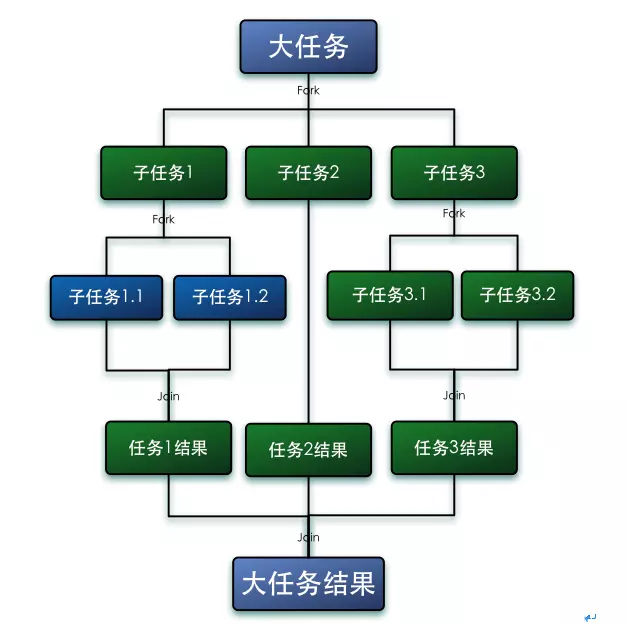
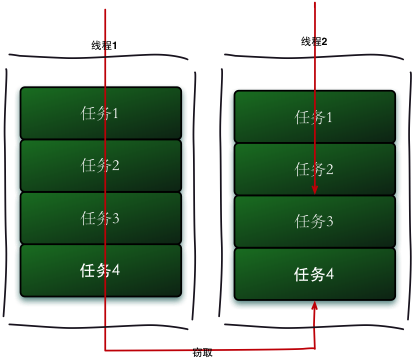
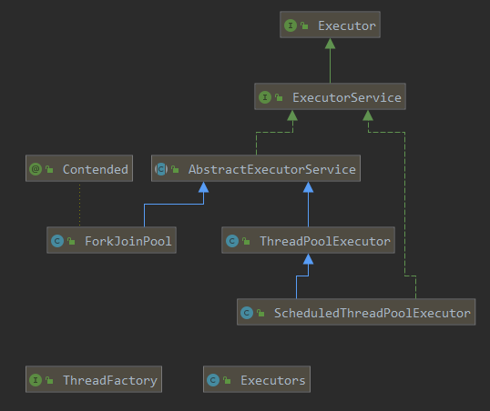
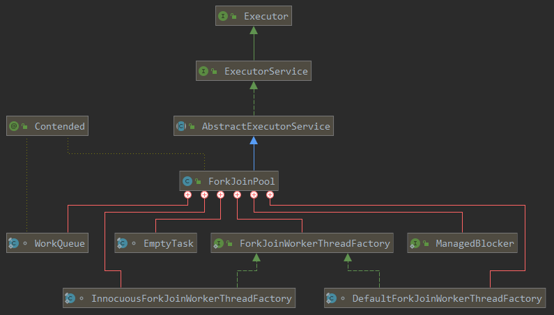
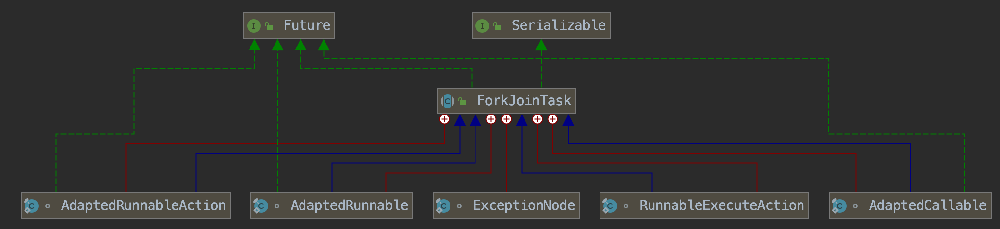
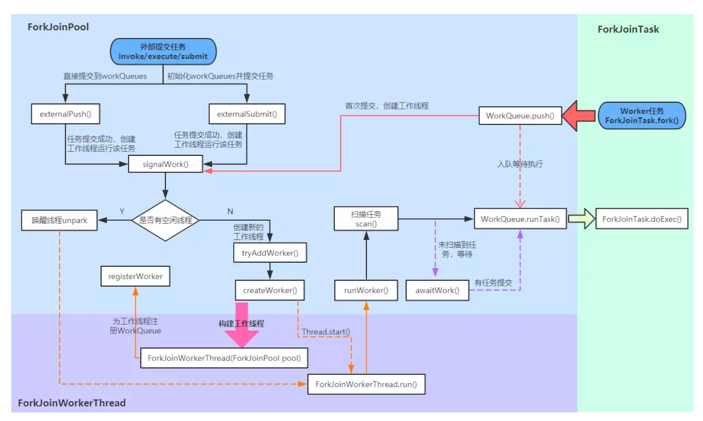
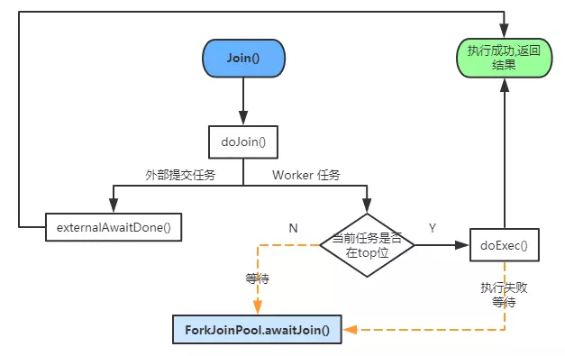

# 1 前言

---

ForkJoinPool 是JDK 7加入的一个线程池类。Fork/Join 技术是分治算法（Divide-and-Conquer）的并行实现，它是一项可以获得良好的并行性能的简单且高效的设计技术。目的是为了帮助我们更好地利用多处理器带来的好处，使用所有可用的运算能力来提升应用的性能。我们常用的数组工具类 Arrays 在JDK 8之后新增的并行排序方法（parallelSort）就运用了 ForkJoinPool 的特性，还有 ConcurrentHashMap 在JDK 8之后添加的函数式方法（如forEach等）也有运用。

# 2 介绍

---

在 java.util.concurrent 包中，Fork/Join 框架主要由 ForkJoinPool、ForkJoinWorkerThread 和 ForkJoinTask 来实现，它们之间有着很复杂的联系。ForkJoinPool 中只可以运行 ForkJoinTask 类型的任务（在实际使用中，也可以接收 Runnable/Callable 任务，但在真正运行时，也会把这些任务封装成 ForkJoinTask 类型的任务）；而 ForkJoinWorkerThread 是运行 ForkJoinTask 任务的工作线程。

# 3 概念

---

作为线程池的一种，ForkJoinPool 并行的实现了**分治算法**（Divide-and-Conquer）：把任务递归的拆分为各个子任务，这样可以更好的利用系统资源，尽可能的使用所有可用的计算能力来提升应用性能。

基于“分治”的思想，J.U.C在JDK1.7时引入了一套Fork/Join框架。Fork/Join框架的基本思想就是将一个大任务分解（Fork）成一系列子任务，子任务可以继续往下分解，当多个不同的子任务都执行完成后，可以将它们各自的结果合并（Join）成一个大结果，最终合并成大任务的结果

从上述Fork/Join框架的描述可以看出，我们需要一些线程来执行Fork出的任务，在实际中，如果每次都创建新的线程执行任务，对系统资源的开销会很大，所以Fork/Join框架利用了线程池来调度任务。

同时也可以联想到，既然由线程池调度，根据我们之前学习[Java8 ThreadPoolExecutor 源码解析](https://www.notion.so/Java8-ThreadPoolExecutor-0284f2c55d814fdc9450efd8a41cc974) 和[Java8 ScheduledThreadPoolExecutor 详解](https://www.notion.so/Java8-ScheduledThreadPoolExecutor-102670ddec0f42bdb9d01a23125f5974) 的经验，必然存在两个要素：

- 工作线程
- 任务队列

一般的线程池只有一个任务队列，但是对于Fork/Join框架来说，由于Fork出的各个子任务其实是平行关系，为了提高效率，减少线程竞争，应该将这些平行的任务放到不同的队列中去，如上图中，大任务分解成三个子任务：子任务1、子任务2、子任务3，那么就创建三个任务队列，然后再创建3个工作线程与队列一一对应。

由于线程处理不同任务的速度不同，这样就可能存在某个线程先执行完了自己队列中的任务的情况，这时为了提升效率，我们可以让该线程去“窃取”其它任务队列中的任务，这就是所谓的**工作窃取算法**。

“工作窃取”的示意图如下，当线程1执行完自身任务队列中的任务后，尝试从线程2的任务队列中“窃取”任务：

对于一般的队列来说，入队元素都是在“队尾”，出队元素在“队首”，要满足“工作窃取”的需求，任务队列应该支持从“队尾”出队元素，这样可以减少与其它工作线程的冲突（因为正常情况下，其它工作线程从“队首”获取自己任务队列中的任务)，满足这一需求的任务队列其实就[LinkedBlockingDeque](https://segmentfault.com/a/1190000016398508)。当然，出于性能考虑，J.U.C中的Fork/Join框架并没有直接利用LinkedBlockingDeque作为任务队列，而是自己重新实现了一个。

# 4 核心组件

---

首先参考 Doug Lea的这篇论文[《A Java Fork/Join Framework》](http://gee.cs.oswego.edu/dl/papers/fj.pdf) （[译文](https://github.com/oldratlee/translations/tree/master/a-java-fork-join-framework)），从宏观上分析Fork/Join框架，然后分析整个框架的调度流程，最后在分析源码的时候会轻松很多。

Fork/Join框架的实现非常复杂，内部大量运用了位操作和无锁算法，撇开这些实现细节不谈，该框架主要涉及三大核心组件：ForkJoinPool（线程池）、ForkJoinTask（任务）、ForkJoinWorkerThread（工作线程），外加WorkQueue（任务队列）：

ForkJoinPool 作为 Executors 框架的一员，从外部看与其它线程池并没有什么区别，仅仅是ExecutorService的一个实现类

- **ForkJoinPool**：ExecutorService的实现类，负责工作线程的管理、任务队列的维护，以及控制整个任务调度流程；
- **ForkJoinTask**：Future接口的实现类，fork是其核心方法，用于分解任务并异步执行；而join方法在任务结果计算完毕之后才会运行，用来合并或返回计算结果；
- **ForkJoinWorkerThread**：Thread的子类，作为线程池中的工作线程（Worker）执行任务；
- **WorkQueue**：任务队列，用于保存任务；

## 4.1 **ForkJoinPool**

**ForkJoinPool的主要工作**如下：

1. 接受外部任务的提交（外部调用ForkJoinPool的`invoke`/`execute`/`submit`方法提交任务）；
2. 接受ForkJoinTask自身**fork**出的子任务的提交；
3. 任务队列数组（`WorkQueue[]`）的初始化和管理；
4. 工作线程（Worker）的创建/管理。

注意：ForkJoinPool提供了3类外部提交任务的方法：invoke、execute、submit，它们的主要区别在于任务的执行方式上。

- 通过**invoke**方法提交的任务，调用线程直到任务执行完成才会返回，也就是说这是一个**同步**方法，且**有返回结果**；
- 通过**execute**方法提交的任务，调用线程会立即返回，也就是说这是一个**异步**方法，且**没有返回结果**；
- 通过**submit**方法提交的任务，调用线程会立即返回，也就是说这是一个**异步**方法，且**有返回结果**（返回Future实现类，可以通过get获取结果）。

**ForkJoinPool 对象的构建**有两种方式：

1. 通过3种构造器的任意一种进行构造；
2. 通过`ForkJoinPool.commonPool()`静态方法构造。

JDK8以后，ForkJoinPool又提供了一个静态方法commonPool()，这个方法返回一个ForkJoinPool内部声明的静态ForkJoinPool实例，主要是为了简化线程池的构建，这个ForkJoinPool实例可以满足大多数的使用场景

    private static ForkJoinPool makeCommonPool() {
        int parallelism = -1;
        ForkJoinWorkerThreadFactory factory = null;
        UncaughtExceptionHandler handler = null;
        try {  // ignore exceptions in accessing/parsing
            String pp = System.getProperty
                    ("java.util.concurrent.ForkJoinPool.common.parallelism");//并行度
            String fp = System.getProperty
                    ("java.util.concurrent.ForkJoinPool.common.threadFactory");//线程工厂
            String hp = System.getProperty
                    ("java.util.concurrent.ForkJoinPool.common.exceptionHandler");//异常处理类
            if (pp != null)
                parallelism = Integer.parseInt(pp);
            if (fp != null)
                factory = ((ForkJoinWorkerThreadFactory) ClassLoader.
                        getSystemClassLoader().loadClass(fp).newInstance());
            if (hp != null)
                handler = ((UncaughtExceptionHandler) ClassLoader.
                        getSystemClassLoader().loadClass(hp).newInstance());
        } catch (Exception ignore) {
        }
        if (factory == null) {
            if (System.getSecurityManager() == null)
                factory = defaultForkJoinWorkerThreadFactory;
            else // use security-managed default
                factory = new InnocuousForkJoinWorkerThreadFactory();
        }
        if (parallelism < 0 && // default 1 less than #cores
                (parallelism = Runtime.getRuntime().availableProcessors() - 1) <= 0)
            parallelism = 1;//默认并行度为1
        if (parallelism > MAX_CAP)
            parallelism = MAX_CAP;
        return new ForkJoinPool(parallelism, factory, handler, LIFO_QUEUE,
                "ForkJoinPool.commonPool-worker-");
    }

使用common pool的优点就是我们可以通过指定系统参数的方式定义“并行度、线程工厂和异常处理类”；并且它使用的是同步模式，也就是说可以支持任务合并（join）。

ForkJoinPool对外提供的3种构造器，其实最终都调用了下面这个构造器：

    /**
     * @param parallelism      并行级别, 默认为CPU核心数
     * @param factory          工作线程工厂
     * @param handler          异常处理器
     * @param mode             调度模式: true表示FIFO_QUEUE; false表示LIFO_QUEUE
     * @param workerNamePrefix 工作线程的名称前缀
     */
    private ForkJoinPool(int parallelism, ForkJoinWorkerThreadFactory factory, UncaughtExceptionHandler handler,
                         int mode, String workerNamePrefix) {
        this.workerNamePrefix = workerNamePrefix;
        this.factory = factory;
        this.ueh = handler;
        this.config = (parallelism & SMASK) | mode;
        long np = (long) (-parallelism); // offset ctl counts
        this.ctl = ((np << AC_SHIFT) & AC_MASK) | ((np << TC_SHIFT) & TC_MASK);
    
    }

- **parallelism**：默认值为CPU核心数，ForkJoinPool里工作线程数量与该参数有关，但它不表示最大线程数；
- **factory**：工作线程工厂，默认是DefaultForkJoinWorkerThreadFactory，其实就是用来创建工作线程对象——ForkJoinWorkerThread；
- **handler**：异常处理器；
- **config**：保存parallelism和mode信息，供后续读取；
- **ctl**：线程池的核心控制字段

其它入参目前不用关注，重点是`mode`这个字段，ForkJoinPool支持两种模式：`mode = asyncMode ? FIFO_QUEUE : LIFO_QUEUE`

1. 同步模式（默认方式）
2. 异步模式

注意：这里的同步/异步并不是指F/J框架本身是采用同步模式还是采用异步模式工作，而是指其中的工作线程的工作方式。在F/J框架中，每个工作线程（Worker）都有一个属于自己的任务队列（WorkQueue），这是一个底层采用数组实现的双向队列。
同步是指：对于工作线程（Worker）自身队列中的任务，采用后进先出（LIFO）的方式执行；异步是指：对于工作线程（Worker）自身队列中的任务，采用先进先出（FIFO）的方式执行。

## 4.2 ForkJoinTask

从Fork/Join框架的描述上来看，“任务”必须要满足一定的条件：

1. 支持Fork，即任务自身的分解
2. 支持Join，即任务结果的合并

因此，J.U.C提供了一个抽象类——**ForkJoinTask**，来作为该类Fork/Join任务的抽象定义：

    public abstract class ForkJoinTask<V> implements Future<V>, Serializable {}

ForkJoinTask实现了Future接口，是一个异步任务，我们在使用Fork/Join框架时，一般需要使用线程池来调度任务，线程池内部调度的其实都是ForkJoinTask任务（即使提交的是一个Runnable或Callable任务，也会被适配成ForkJoinTask）。

除了ForkJoinTask，Fork/Join框架还提供了两个它的抽象实现，我们在自定义ForkJoin任务时，一般继承这两个类：

- **RecursiveAction**：表示具有返回结果的ForkJoin任务
- **RecursiveTask**：表示没有返回结果的ForkJoin任务

ForkJoinTask除了和ForkJoinPool 结合使用外，也可以单独使用，当我们调用ForkJoinTask的fork方法时，其内部会通过ForkJoinPool.commonPool()方法创建线程池，然后将自己作为任务提交给线程池。

## 4.3 **ForkJoinWorkerThread**

Fork/Join框架中，每个工作线程（Worker）都有一个自己的任务队列（WorkerQueue）， 所以需要对一般的Thread做些特性化处理，J.U.C提供了**ForkJoinWorkerThread**类作为ForkJoinPool中的工作线程：

    public class ForkJoinWorkerThread extends Thread {
        
        final ForkJoinPool pool;                    // 该工作线程归属的线程池
        final ForkJoinPool.WorkQueue workQueue;     // 对应的任务队列
     
        protected ForkJoinWorkerThread(ForkJoinPool pool) {
            super("aForkJoinWorkerThread");         // 指定工作线程名称
            this.pool = pool;
            this.workQueue = pool.registerWorker(this);
        }
      
        // ...
    }

ForkJoinWorkerThread 在构造过程中，会保存所属线程池信息和与自己绑定的任务队列信息。同时，它会通过ForkJoinPool的registerWorker方法将自己注册到线程池中。

线程池中的每个工作线程（ForkJoinWorkerThread）都有一个自己的任务队列（WorkQueue），工作线程优先处理自身队列中的任务（LIFO或FIFO顺序，由线程池构造时的参数 mode 决定），自身队列为空时，以FIFO的顺序随机窃取其它队列中的任务。

## 4.4 **WorkQueue**

任务队列（**WorkQueue**）是ForkJoinPool与其它线程池区别最大的地方，在ForkJoinPool内部，维护着一个`WorkQueue[]`数组，它会在外部首次提交任务）时进行初始化：

`volatile WorkQueue[] workQueues; // main registry` 

当通过线程池的外部方法（submit、invoke、execute）提交任务时，如果WorkQueue[]没有初始化，则会进行初始化；然后根据数组大小和线程随机数（ThreadLocalRandom.probe）等信息，计算出任务队列所在的数组索引（这个索引一定是偶数），如果索引处没有任务队列，则初始化一个，再将任务入队。也就是说，通过外部方法提交的任务一定是在偶数队列，没有绑定工作线程。

**WorkQueue**作为ForkJoinPool的内部类，表示一个**双端队列**。双端队列既可以作为**栈**使用(LIFO)，也可以作为**队列**使用(FIFO)。ForkJoinPool的“工作窃取”正是利用了这个特点，当工作线程从自己的队列中获取任务时，**默认**总是以栈操作（LIFO）的方式从栈顶取任务；当工作线程尝试窃取其它任务队列中的任务时，则是FIFO的方式。

我们在ForkJoinPool一节中曾讲过，可以指定线程池的同步/异步模式（mode参数），其作用就在于此。同步模式就是“栈操作”，异步模式就是“队列操作”，影响的就是工作线程从自己队列中取任务的方式。

ForkJoinPool中的工作队列可以分为两类：

- 有工作线程（Worker）绑定的任务队列：数组下标始终是**奇数**，称为**task queue**，该队列中的任务均由工作线程调用产生（工作线程调用FutureTask.fork方法）；
- 没有工作线程（Worker）绑定的任务队列：数组下标始终是**偶数**，称为**submissions queue**，该队列中的任务全部由其它线程提交（也就是非工作线程调用execute/submit/invoke或者FutureTask.fork方法）。

# 5 源码解析

---

## 5.1 ForkJoinPool 内部类介绍

1. **ForkJoinWorkerThreadFactory**：内部线程工厂接口，用于创建工作线程ForkJoinWorkerThread
2. **DefaultForkJoinWorkerThreadFactory**：ForkJoinWorkerThreadFactory 的默认实现类
3. **InnocuousForkJoinWorkerThreadFactory**：实现了 ForkJoinWorkerThreadFactory，无许可线程工厂，当系统变量中有系统安全管理相关属性时，默认使用这个工厂创建工作线程。
4. **EmptyTask**：内部占位类，用于替换队列中 join 的任务。
5. **ManagedBlocker**：为 ForkJoinPool 中的任务提供扩展管理并行数的接口，一般用在可能会阻塞的任务（如在 Phaser 中用于等待 phase 到下一个generation）。
6. **WorkQueue**：ForkJoinPool 的核心数据结构，本质上是 work-stealing 模式的双端任务队列，内部存放 ForkJoinTask 对象任务，使用 @Contented 注解修饰防止伪共享。具体介绍见上篇。
    - 工作线程在运行中产生新的任务（通常是因为调用了 fork()）时，此时可以把 WorkQueue 的数据结构视为一个栈，新的任务会放入栈顶（top 位）；工作线程在处理自己工作队列的任务时，按照 LIFO 的顺序。
    - 工作线程在处理自己的工作队列同时，会尝试窃取一个任务（可能是来自于刚刚提交到 pool 的任务，或是来自于其他工作线程的队列任务），此时可以把 WorkQueue 的数据结构视为一个 FIFO 的队列，窃取的任务位于其他线程的工作队列的队首（base位）。

*伪共享状态：缓存系统中是以缓存行（cache line）为单位存储的。缓存行是2的整数幂个连续字节，一般为32-256个字节。最常见的缓存行大小是64个字节。当多线程修改互相独立的变量时，如果这些变量共享同一个缓存行，就会无意中影响彼此的性能，这就是伪共享。*

[Java8使用@sun.misc.Contended避免伪共享](https://www.notion.so/Java8-sun-misc-Contended-b04eef42de0249cd85de25deab4d72b2)

## 5.2 ForkJoinPool 核心参数

Fork/Join框架的实现非常复杂，内部大量运用了位操作和无锁算法。其中这些位运算都是通过接下来介绍的一些常量参数来计算的。

例如，如果要更新活跃线程数，使用公式`(UC_MASK & (c + AC_UNIT)) | (SP_MASK & c)`；c 代表当前 ctl，UC_MASK 和 SP_MASK 分别是高位和低位掩码，AC_UNIT 为活跃线程的增量数，使用`(UC_MASK & (c + AC_UNIT))`就可以计算出高32位，然后再加上低32位`(SP_MASK & c)`，就拼接成了一个新的`ctl`。

这些运算的可读性很差，大家只需要了解它们的作用即可。

- ForkJoinPool 与 内部类 WorkQueue 共享的一些常量。
- ForkJoinPool 中的相关常量和实例字段。
- ForkJoinPool.WorkQueue 中的相关属性。

## 5.3 ForkJoinTask

ForkJoinTask 实现了 Future 接口，说明它也是一个可取消的异步运算任务，实际上ForkJoinTask 是 Future 的轻量级实现，主要用在纯粹是计算的函数式任务或者操作完全独立的对象计算任务。fork 是主运行方法，用于异步执行；而 join 方法在任务结果计算完毕之后才会运行，用来合并或返回计算结果。

其内部类都比较简单，ExceptionNode 是用于存储任务执行期间的异常信息的单向链表；其余四个类是为 Runnable/Callable 任务提供的适配器类，用于把 Runnable/Callable 转化为 ForkJoinTask 类型的任务（因为 ForkJoinPool 只可以运行 ForkJoinTask 类型的任务）。

### 5.3.1 核心参数

    /** 任务运行状态 */
    volatile int status; // 任务运行状态
    static final int DONE_MASK   = 0xf0000000;  // 任务完成状态标志位
    static final int NORMAL      = 0xf0000000;  // must be negative
    static final int CANCELLED   = 0xc0000000;  // must be < NORMAL
    static final int EXCEPTIONAL = 0x80000000;  // must be < CANCELLED
    static final int SIGNAL      = 0x00010000;  // must be >= 1 << 16 等待信号
    static final int SMASK       = 0x0000ffff;  //  低位掩码

## 5.4 Fork/Join 框架的执行流程

ForkJoinPool 中的任务执行分两种：

1. 直接通过 FJP 提交的外部任务（external/submissions task），存放在 workQueues 的偶数槽位；
2. 通过内部 fork 分割的子任务（Worker task），存放在 workQueues 的奇数槽位。

首先来看一下整个Fork/Join 框架的执行流程，后面的源码解析会完全按照这个流程图来进行：

在接下来的解析中，我们会分四个部分：首先介绍两种任务的提交流程；再分析任务的执行过程（`ForkJoinWorkerThread.run()`到`ForkJoinTask.doExec()`这一部分）；最后介绍任务的结果获取（`ForkJoinTask.join()`和`ForkJoinTask.invoke()`）

### 5.4.1 外部任务（external/submissions task）提交

向 ForkJoinPool 提交任务有三种方式：`invoke()`会等待任务计算完毕并返回计算结果；`execute()`是直接向池提交一个任务来异步执行，无返回结果；`submit()`也是异步执行，但是会返回提交的任务，在适当的时候可通过`task.get()`获取执行结果。这三种提交方式都都是调用`externalPush()`方法来完成，所以接下来我们将从`externalPush()`方法开始逐步分析外部任务的执行过程。

- externalPush(ForkJoinTask<?> task)
- externalSubmit(ForkJoinTask<?> task)
- signalWork(WorkQueue[] ws, WorkQueue q)
- tryAddWorker(long c)
- createWorker()
- registerWorker()

外部任务的提交流程就先讲到这里。在`createWorker()`中启动工作线程后（`wt.start()`），当为线程分配到CPU执行时间片之后会运行 ForkJoinWorkerThread 的`run`方法开启线程来执行任务。

### 5.4.2 子任务（Worker task）提交

子任务的提交相对比较简单，由任务的`fork()`方法完成。通过上面的流程图可以看到任务被分割（fork）之后调用了`ForkJoinPool.WorkQueue.push()`方法直接把任务放到队列中等待被执行。

- ForkJoinTask.fork()
- ForkJoinPool.WorkQueue.push()

到此，两种任务的提交流程都已经解析完毕，下一节我们来一起看看任务提交之后是如何被运行的。

### 5.4.3 任务执行

回到我们开始时的流程图，在`ForkJoinPool .createWorker()`方法中创建工作线程后，会启动工作线程，系统为工作线程分配到CPU执行时间片之后会执行 ForkJoinWorkerThread 的`run()`方法正式开始执行任务。

- ForkJoinWorkerThread.run()
- ForkJoinPool.runWorker(WorkQueue w)
- ForkJoinPool.scan(WorkQueue w, int r)
- ForkJoinPool.awaitWork(WorkQueue w, int r)
- WorkQueue.runTask()
- ForkJoinPool.deregisterWorker(ForkJoinWorkerThread wt, Throwable ex)

### 5.4.4 获取任务结果

- ForkJoinTask.join()

        //合并任务结果
        public final V join() {
            int s;
            if ((s = doJoin() & DONE_MASK) != NORMAL)
                reportException(s);
            return getRawResult();
        }
        
        //join, get, quietlyJoin的主实现方法
        private int doJoin() {
            int s; Thread t; ForkJoinWorkerThread wt; ForkJoinPool.WorkQueue w;
            return (s = status) < 0 ? s :
                ((t = Thread.currentThread()) instanceof ForkJoinWorkerThread) ?
                (w = (wt = (ForkJoinWorkerThread)t).workQueue).
                tryUnpush(this) && (s = doExec()) < 0 ? s :
                wt.pool.awaitJoin(w, this, 0L) :
                externalAwaitDone();
        }

- ForkJoinTask.invoke()

        //执行任务，并等待任务完成并返回结果
        public final V invoke() {
            int s;
            if ((s = doInvoke() & DONE_MASK) != NORMAL)
                reportException(s);
            return getRawResult();
        }
        
        //invoke, quietlyInvoke的主实现方法
        private int doInvoke() {
            int s; Thread t; ForkJoinWorkerThread wt;
            return (s = doExec()) < 0 ? s :
                ((t = Thread.currentThread()) instanceof ForkJoinWorkerThread) ?
                (wt = (ForkJoinWorkerThread)t).pool.
                awaitJoin(wt.workQueue, this, 0L) :
                externalAwaitDone();
        }

**说明**： `join()`方法一把是在任务`fork()`之后调用，用来获取（或者叫“合并”）任务的执行结果。

ForkJoinTask的`join()`和`invoke()`方法都可以用来获取任务的执行结果（另外还有`get`方法也是调用了`doJoin`来获取任务结果，但是会响应运行时异常），它们对外部提交任务的执行方式一致，都是通过`externalAwaitDone`方法等待执行结果。不同的是`invoke()`方法会直接执行当前任务；而`join()`方法则是在当前任务在队列 top 位时（通过`tryUnpush`方法判断）才能执行，如果当前任务不在 top 位或者任务执行失败调用`ForkJoinPool.awaitJoin`方法帮助执行或阻塞当前 join 任务。（**所以在官方文档中建议了我们对ForkJoinTask任务的调用顺序，一对 fork-join操作一般按照如下顺序调用：`a.fork(); b.fork(); b.join(); a.join();`。因为任务 b 是后面进入队列，也就是说它是在栈顶的（top 位），在它`fork()`之后直接调用`join()`就可以直接执行而不会调用`ForkJoinPool.awaitJoin`方法去等待。**）

在这些方法中，join()相对比较全面，所以之后的讲解我们将从`join()`开始逐步向下分析，首先看一下join()的执行流程：

join 执行流程

后面的源码分析中，我们首先讲解比较简单的外部 join 任务（`externalAwaitDone`），然后再讲解内部 join 任务（从`ForkJoinPool.awaitJoin()`开始）。

- ForkJoinTask.externalAwaitDone()
- ForkJoinPool.awaitJoin()
- WorkQueue.tryRemoveAndExec(ForkJoinTask<?> task)

        final boolean tryRemoveAndExec(ForkJoinTask<?> task) {
            ForkJoinTask<?>[] a;
            int m, s, b, n;
            if ((a = array) != null && (m = a.length - 1) >= 0 &&
                    task != null) {
                while ((n = (s = top) - (b = base)) > 0) {
                    //从top往下自旋查找
                    for (ForkJoinTask<?> t; ; ) {      // traverse from s to b
                        long j = ((--s & m) << ASHIFT) + ABASE;//计算任务索引
                        if ((t = (ForkJoinTask<?>) U.getObject(a, j)) == null) //获取索引到的任务
                            return s + 1 == top;     // shorter than expected
                        else if (t == task) { //给定任务为索引任务
                            boolean removed = false;
                            if (s + 1 == top) {      // pop
                                if (U.compareAndSwapObject(a, j, task, null)) { //弹出任务
                                    U.putOrderedInt(this, QTOP, s); //更新top
                                    removed = true;
                                }
                            } else if (base == b)      // replace with proxy
                                removed = U.compareAndSwapObject(
                                        a, j, task, new EmptyTask()); //join任务已经被移除，替换为一个占位任务
                            if (removed)
                                task.doExec(); //执行
                            break;
                        } else if (t.status < 0 && s + 1 == top) { //给定任务不是top任务
                            if (U.compareAndSwapObject(a, j, t, null)) //弹出任务
                                U.putOrderedInt(this, QTOP, s);//更新top
                            break;                  // was cancelled
                        }
                        if (--n == 0) //遍历结束
                            return false;
                    }
                    if (task.status < 0) //任务执行完毕
                        return false;
                }
            }
            return true;
        }

    说明： 从`top`位开始自旋向下找到给定任务，如果找到把它从当前 Worker 的任务队列中移除并执行它。注意返回的参数：如果任务队列为空或者任务未执行完毕返回true；任务执行完毕返回false。

- ForkJoinPool.helpStealer(WorkQueue w, ForkJoinTask<?> task)

        private void helpStealer(WorkQueue w, ForkJoinTask<?> task) {
            WorkQueue[] ws = workQueues;
            int oldSum = 0, checkSum, m;
            if (ws != null && (m = ws.length - 1) >= 0 && w != null &&
                    task != null) {
                do {                                       // restart point
                    checkSum = 0;                          // for stability check
                    ForkJoinTask<?> subtask;
                    WorkQueue j = w, v;                    // v is subtask stealer
                    descent:
                    for (subtask = task; subtask.status >= 0; ) {
                        //1. 找到给定WorkQueue的偷取者v
                        for (int h = j.hint | 1, k = 0, i; ; k += 2) {//跳两个索引，因为Worker在奇数索引位
                            if (k > m)                     // can't find stealer
                                break descent;
                            if ((v = ws[i = (h + k) & m]) != null) {
                                if (v.currentSteal == subtask) {//定位到偷取者
                                    j.hint = i;//更新stealer索引
                                    break;
                                }
                                checkSum += v.base;
                            }
                        }
                        //2. 帮助偷取者v执行任务
                        for (; ; ) {                         // help v or descend
                            ForkJoinTask<?>[] a;            //偷取者内部的任务
                            int b;
                            checkSum += (b = v.base);
                            ForkJoinTask<?> next = v.currentJoin;//获取偷取者的join任务
                            if (subtask.status < 0 || j.currentJoin != subtask ||
                                    v.currentSteal != subtask) // stale
                                break descent; // stale，跳出descent循环重来
                            if (b - v.top >= 0 || (a = v.array) == null) {
                                if ((subtask = next) == null)   //偷取者的join任务为null，跳出descent循环
                                    break descent;
                                j = v;
                                break; //偷取者内部任务为空，可能任务也被偷走了；跳出本次循环，查找偷取者的偷取者
                            }
                            int i = (((a.length - 1) & b) << ASHIFT) + ABASE;//获取base偏移地址
                            ForkJoinTask<?> t = ((ForkJoinTask<?>)
                                    U.getObjectVolatile(a, i));//获取偷取者的base任务
                            if (v.base == b) {
                                if (t == null)             // stale
                                    break descent; // stale，跳出descent循环重来
                                if (U.compareAndSwapObject(a, i, t, null)) {//弹出任务
                                    v.base = b + 1;         //更新偷取者的base位
                                    ForkJoinTask<?> ps = w.currentSteal;//获取调用者偷来的任务
                                    int top = w.top;
                                    //首先更新给定workQueue的currentSteal为偷取者的base任务，然后执行该任务
                                    //然后通过检查top来判断给定workQueue是否有自己的任务，如果有，
                                    // 则依次弹出任务(LIFO)->更新currentSteal->执行该任务（注意这里是自己偷自己的任务执行）
                                    do {
                                        U.putOrderedObject(w, QCURRENTSTEAL, t);
                                        t.doExec();        // clear local tasks too
                                    } while (task.status >= 0 &&
                                            w.top != top && //内部有自己的任务，依次弹出执行
                                            (t = w.pop()) != null);
                                    U.putOrderedObject(w, QCURRENTSTEAL, ps);//还原给定workQueue的currentSteal
                                    if (w.base != w.top)//给定workQueue有自己的任务了，帮助结束，返回
                                        return;            // can't further help
                                }
                            }
                        }
                    }
                } while (task.status >= 0 && oldSum != (oldSum = checkSum));
            }
        }

    **说明：** 如果队列为空或任务执行失败，说明任务可能被偷，调用此方法来帮助偷取者执行任务。基本思想是：偷取者帮助我执行任务，我去帮助偷取者执行它的任务。
    函数执行流程如下：

    1. 循环定位偷取者，由于Worker是在奇数索引位，所以每次会跳两个索引位。定位到偷取者之后，更新调用者 WorkQueue 的`hint`为偷取者的索引，方便下次定位；
    2. 定位到偷取者后，开始帮助偷取者执行任务。从偷取者的`base`索引开始，每次偷取一个任务执行。在帮助偷取者执行任务后，如果调用者发现本身已经有任务（`w.top != top`），则依次弹出自己的任务(LIFO顺序)并执行（也就是说自己偷自己的任务执行）。
- ForkJoinPool.tryCompensate(WorkQueue w)

        //执行补偿操作：尝试缩减活动线程量，可能释放或创建一个补偿线程来准备阻塞
        private boolean tryCompensate(WorkQueue w) {
            boolean canBlock;
            WorkQueue[] ws;
            long c;
            int m, pc, sp;
            if (w == null || w.qlock < 0 ||           // caller terminating
                    (ws = workQueues) == null || (m = ws.length - 1) <= 0 ||
                    (pc = config & SMASK) == 0)           // parallelism disabled
                canBlock = false; //调用者已终止
            else if ((sp = (int) (c = ctl)) != 0)      // release idle worker
                canBlock = tryRelease(c, ws[sp & m], 0L);//唤醒等待的工作线程
            else {//没有空闲线程
                int ac = (int) (c >> AC_SHIFT) + pc; //活跃线程数
                int tc = (short) (c >> TC_SHIFT) + pc;//总线程数
                int nbusy = 0;                        // validate saturation
                for (int i = 0; i <= m; ++i) {        // two passes of odd indices
                    WorkQueue v;
                    if ((v = ws[((i << 1) | 1) & m]) != null) {//取奇数索引位
                        if ((v.scanState & SCANNING) != 0)//没有正在运行任务，跳出
                            break;
                        ++nbusy;//正在运行任务，添加标记
                    }
                }
                if (nbusy != (tc << 1) || ctl != c)
                    canBlock = false;                 // unstable or stale
                else if (tc >= pc && ac > 1 && w.isEmpty()) {//总线程数大于并行度 && 活动线程数大于1 && 调用者任务队列为空，不需要补偿
                    long nc = ((AC_MASK & (c - AC_UNIT)) |
                            (~AC_MASK & c));       // uncompensated
                    canBlock = U.compareAndSwapLong(this, CTL, c, nc);//更新活跃线程数
                } else if (tc >= MAX_CAP ||
                        (this == common && tc >= pc + commonMaxSpares))//超出最大线程数
                    throw new RejectedExecutionException(
                            "Thread limit exceeded replacing blocked worker");
                else {                                // similar to tryAddWorker
                    boolean add = false;
                    int rs;      // CAS within lock
                    long nc = ((AC_MASK & c) |
                            (TC_MASK & (c + TC_UNIT)));//计算总线程数
                    if (((rs = lockRunState()) & STOP) == 0)
                        add = U.compareAndSwapLong(this, CTL, c, nc);//更新总线程数
                    unlockRunState(rs, rs & ~RSLOCK);
                    //运行到这里说明活跃工作线程数不足，需要创建一个新的工作线程来补偿
                    canBlock = add && createWorker(); // throws on exception
                }
            }
            return canBlock;
        }

    **说明：** 具体的执行看源码及注释，这里我们简单总结一下需要和不需要补偿的几种情况：

    - 需要补偿：
        - 调用者队列不为空，并且有空闲工作线程，这种情况会唤醒空闲线程（调用`tryRelease`方法）
        - 池尚未停止，活跃线程数不足，这时会新建一个工作线程（调用`createWorker`方法）
    - 不需要补偿：
        - 调用者已终止或池处于不稳定状态
        - 总线程数大于并行度 && 活动线程数大于1 && 调用者任务队列为空