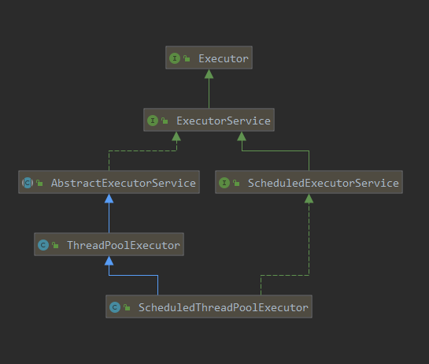
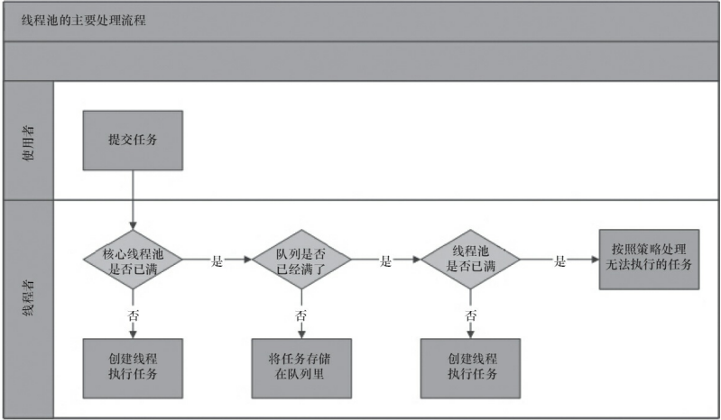
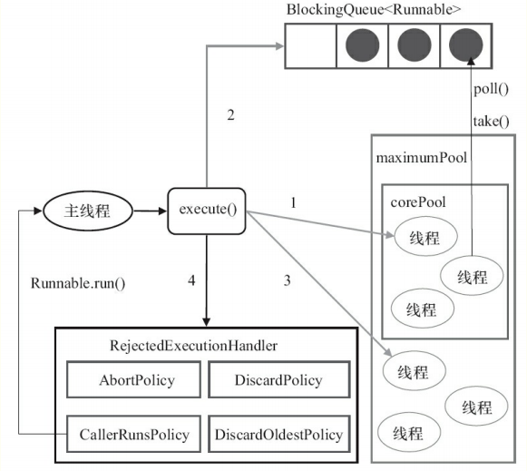

# 1 前言

---

我们使用线程的时候就去创建一个线程，这样实现起来非常简便，但是就会有一个问题：

如果并发的线程数量很多，并且每个线程都是执行一个时间很短的任务就结束了，这样频繁创建线程就会大大降低系统的效率，因为频繁创建线程和销毁线程需要时间。

那么有没有一种办法使得线程可以复用，就是执行完一个任务，并不被销毁，而是可以继续执行其他的任务？

在Java中可以通过线程池来达到这样的效果。

# 2 介绍

---

Java 中的线程池是运用场景最多的并发框架，几乎所有需要异步或并发执行任务的程序都可以使用线程池。在开发过程中，合理地使用线程池能够带来 3 个好处。

- **降低资源的损耗**。重复利用创建好的线程，减少了线程创建和销毁的开销。
- **提高响应速度**。当任务来临时，创建好的线程能立马处理新来的任务，不需要等待线程创建完毕后再执行任务。
- **方便线程的管理**。线程是稀缺资源，过多的创建线程可能会降低系统的稳定性，线程池能控制线程创建的数量，并对其进行监控、管理、调优，从而提高系统稳定性。

# 3 概念

---

## 3.1 线程池的使用

### 3.1.1 线程池的创建

我们可以通过 `ThreadPoolExecutor` 来创建一个线程池。

    public ThreadPoolExecutor(corePoolSize, maximumPoolSize, keepAliveTime, unit, workQueue, threadFactory, handler)

构造方法中的字段含义如下：

- **corePoolSize**：核心线程数量，当有新任务在execute()方法提交时，会执行以下判断：
    1. 如果运行的线程少于 corePoolSize，则创建新线程来处理任务，即使线程池中的其他线程是空闲的；
    2. 如果线程池中的线程数量大于等于 corePoolSize 且小于 maximumPoolSize，则只有当workQueue满时才创建新的线程去处理任务；
    3. 如果设置的corePoolSize 和 maximumPoolSize相同，则创建的线程池的大小是固定的，这时如果有新任务提交，若workQueue未满，则将请求放入workQueue中，等待有空闲的线程去从workQueue中取任务并处理；
    4. 如果运行的线程数量大于等于maximumPoolSize，这时如果workQueue已经满了，则通过handler所指定的策略来处理任务；

    所以，任务提交时，判断的顺序为 corePoolSize --> workQueue --> maximumPoolSize。

- **maximumPoolSize**：最大线程数量；
- **workQueue**：用于保存等待执行的任务的阻塞队列。当任务提交时，如果线程池中的线程数量大于等于corePoolSize的时候，把该任务封装成一个Worker对象放入队列中。可以选择以下几个阻塞队列。
    1. [ArrayBlockingQueue](https://www.cnblogs.com/leesf456/p/5533770.html)：是一个基于数组结构的**有界**阻塞队列，此队列按 FIFO 原则对元素进行排序。
    2. [LinkedBlockingQueue](https://blog.csdn.net/sinat_36553913/article/details/79533606)：一个基于链表结构的**无界**阻塞队列，此队列按 FIFO 排序元素，吞吐量通常高于 ArrayBlockingQueue。静态工厂方法 `Executors.newFixedThreadPool()` 使用了这个队列。
    3. [SynchronousQueue](https://juejin.im/post/5ae754c7f265da0ba76f8534)：一个不存储元素的阻塞队列。每个插入操作必须等到另一个线程调用移除操作，否则插入操作一直处于阻塞状态，吞吐量通常要高于 LinkedBlockingQueue，静态工厂方法 `Executors.newCachedThreadPool()` 使用了这个队列。
    4. [PriorityBlockingQueue](https://www.cnblogs.com/duanxz/archive/2012/10/22/2733947.html)：一个具有优先级的无限阻塞队列。
    5. [LinkedTransferQueue](https://juejin.im/post/5ae7561b6fb9a07aab29a2b2)：是一个基于链表结构的无界阻塞队列，是 SynchronousQueue 和 LinkedBlockingQueue 的合体，性能比 LinkedBlockingQueue 更高（没有锁操作），比 SynchronousQueue能存储更多的元素。
- **keepAliveTime**：线程池维护线程所允许的空闲时间。当线程池中的线程数量大于corePoolSize的时候，如果这时没有新的任务提交，核心线程外的线程不会立即销毁，而是会等待，直到等待的时间超过了keepAliveTime。所以如果任务很多，并且每个任务执行的时间比较短，可以调大时间，提高线程的利用率。
- **threadFactory**：它是 ThreadFactory 类型的变量，用来创建新线程。默认使用`Executors.defaultThreadFactory()` 来创建线程。使用默认的 ThreadFactory 来创建线程时，会使新创建的线程具有相同的`Thread.NORM_PRIORITY`优先级并且是非守护线程，同时也设置了线程的名称。使用开源框架 guava 提供的 ThreadFactoryBuilder 可以快速给线程池里的线程设置有意义的名字

        new ThreadFactoryBuilder().setNameFormat("XX-task-%d").build();

- **handler**：它是 RejectedExecutionHandler 类型的变量，表示线程池的**饱和策略**。如果队列和线程池都满了，线程池处于饱和状态，这时如果继续提交任务，就需要采取一种策略处理该任务。线程池提供了4种策略：
    1. AbortPolicy：直接抛出异常，这是默认策略；
    2. CallerRunsPolicy：用调用者所在的线程来执行任务；
    3. DiscardOldestPolicy：丢弃阻塞队列中靠最前的任务，并执行当前任务；
    4. DiscardPolicy：直接丢弃任务；

    当然也可以根据应用场景需要自定义实现 RejectedExecutionHandler 接口自定义策略。

### 3.1.2 向线程池提交任务

可以使用两个方法向线程池提交任务，分别为 `execute()` 和 `submit()` 方法。

execute() 方法用于提交不需要返回值的任务，所以无法判断任务是否被线程池执行成功。通过以下代码可知 `execute()` 的输入的任务是一个实现 Runnable 接口的实例。 

    threadsPool.execute(new Runnable() {
        @Override
        public void run() {
            // TODO 任务逻辑
        }
    })

`submit()` 方法可以用于提交需要返回值的任务。线程池会返回一个 Future 类型的对象，通过这个 future 对象可以判断任务是否执行成功，并且可以通过 future 的 `get()` 方法来获取返回值，`get()` 方法会阻塞当前线程知道任务完成，而使用 get(long timeout, TimeUnit unit) 方法则会阻塞当前线程一段时间后立即返回，这是侯有可能任务还没有执行完。

    Future<Object> future = executor.submit(hasReturnValueTask);
    try {
        Object obj = future.get();
    } catch (InterruptedException e) {
        // 处理中断异常
    } catch (ExecutionException e) {
        // 处理无法执行任务异常
    } finally {
        // 关闭线程池
        executor.shutdown();
    }

### 3.1.3 关闭线程池

可以通过调用线程池的 `shutdown()` 或 `shutdownNow()` 方法来关闭线程池。它们的原理是遍历线程池中的工作线程，然后逐个调用线程的 `interrupt()` 方法来中断线程，所以无法响应中断的任务可能永远无法终止。但有些区别

- `shutdown()` 只是将线程池的状态设置成 `SHUTDOWN` 状态，然后中断所有没有正在执行任务的线程。
- `shutdownNow()` 首先将线程池的状态设置成 `STOP` ，然后尝试停止所有的正在执行或暂停任务的线程，并返回等待执行任务的列表。

只要调用了这两个关闭方法中的任意一个，`isShutdown()` 方法就会返回`true` 。当所有的任务都已关闭后，才表示线程池关闭成功，只是调用 `isTerminaed()` 方法会返回 `true` 。至于应该调用哪一种方法来关闭线程池，应该由提交到线程池的任务特性决定，通常调用 `shutdown()` 方法来关闭线程池，如果任务不一定要执行完，则可以调用 `shutdownNow()` 方法。

### 3.1.4  合理的配置线程池

任务一般可分为：CPU密集型、IO密集型、混合型，对于不同类型的任务需要分配不同大小的线程池。

- CPU密集型任务
尽量使用较小的线程池，一般为CPU核心数+1。
因为CPU密集型任务使得CPU使用率很高，若开过多的线程数，只能增加上下文切换的次数，因此会带来额外的开销。
- IO密集型任务
可以使用稍大的线程池，一般为2*CPU核心数。
IO密集型任务CPU使用率并不高，因此可以让CPU在等待IO的时候去处理别的任务，充分利用CPU时间。
- 混合型任务
可以将任务分成IO密集型和CPU密集型任务，然后分别用不同的线程池去处理。
只要分完之后两个任务的执行时间相差不大，那么就会比串行执行来的高效。
因为如果划分之后两个任务执行时间相差甚远，那么先执行完的任务就要等后执行完的任务，最终的时间仍然取决于后执行完的任务，而且还要加上任务拆分与合并的开销，得不偿失。

### 3.1.5 线程池的监控

通过线程池提供的参数进行监控。线程池里有一些属性在监控线程池的时候可以使用以下方法

- **getTaskCount**：线程池已经执行的和未执行的任务总数；
- **getCompletedTaskCount**：线程池已完成的任务数量，该值小于等于taskCount；
- **getLargestPoolSize**：线程池曾经创建过的最大线程数量。通过这个数据可以知道线程池是否满过，也就是达到了maximumPoolSize；
- **getPoolSize**：线程池当前的线程数量；
- **getActiveCount**：当前线程池中正在执行任务的线程数量。

通过这些方法，可以对线程池进行监控，在ThreadPoolExecutor类中提供了几个空方法，如beforeExecute方法，afterExecute方法和terminated方法，可以扩展这些方法在执行前或执行后增加一些新的操作，例如统计线程池的执行任务的时间等，可以继承自ThreadPoolExecutor来进行扩展。这几个方法在线程池里是空方法。

    protected void beforeExecute(Thread t, Runnable r) { }

## 3.2 线程池接口概览

### 3.2.1 线程池架构图

### 3.2.2 接口介绍

[线程池相关接口介绍](线程池相关接口介绍.md)

### 3.2.3 FixedThreadPool 示例

    /**
     * Executors.newFixedThreadPool(int n)：创建一个可重用固定个数的线程池，以共享的无界队列方式来运行这些线程
     *
     * @author fengxuechao
     * @version 0.1
     * @date 2020/1/7
     */
    public class FixedThreadPoolExample {
    
        public static void main(String[] args) {
            //创建一个可重用固定个数的线程池
            ExecutorService fixedThreadPool = Executors.newFixedThreadPool(3);
            for (int i = 0; i < 10; i++) {
                fixedThreadPool.execute(new Runnable() {
                    @Override
                    public void run() {
                        try {
                            //打印正在执行的缓存线程信息
                            System.out.println(Thread.currentThread().getName() + "正在被执行");
                            Thread.sleep(2000);
                        } catch (InterruptedException e) {
                            e.printStackTrace();
                        }
                    }
                });
            }
        }
    }

输出结果：因为线程池大小为3，每个任务输出打印结果后sleep 2秒，所以每两秒打印3个结果。定长线程池的大小最好根据系统资源进行设置。如`Runtime.getRuntime().availableProcessors()`

    pool-1-thread-1正在被执行
    pool-1-thread-3正在被执行
    pool-1-thread-2正在被执行
    pool-1-thread-3正在被执行
    pool-1-thread-2正在被执行
    pool-1-thread-1正在被执行
    pool-1-thread-3正在被执行
    pool-1-thread-2正在被执行
    pool-1-thread-1正在被执行
    pool-1-thread-1正在被执行

### 3.2.4 SingleThreadExecutor 示例

    /**
     * Executors.newSingleThreadExecutor()：创建一个单线程化的线程池，它只会用唯一的工作线程来执行任务，保证所有任务按照指定顺序(FIFO, LIFO, 优先级)执行
     *
     * @author fengxuechao
     * @version 0.1
     * @date 2020/1/6
     */
    public class SingleThreadPoolExample {
    
        public static void main(String[] args) {
            //创建一个单线程化的线程池
            ExecutorService singleThreadExecutor = Executors.newSingleThreadExecutor();
            for (int i = 0; i < 10; i++) {
                final int index = i;
                singleThreadExecutor.execute(new Runnable() {
                    @Override
                    public void run() {
                        try {
                            //结果依次输出，相当于顺序执行各个任务
                            System.out.println(Thread.currentThread().getName() + "正在被执行,打印的值是:" + index);
                            Thread.sleep(1000);
                        } catch (InterruptedException e) {
                            e.printStackTrace();
                        }
                    }
                });
            }
        }
    }

输出结果：

    pool-1-thread-1正在被执行,打印的值是:0
    pool-1-thread-1正在被执行,打印的值是:1
    pool-1-thread-1正在被执行,打印的值是:2
    pool-1-thread-1正在被执行,打印的值是:3
    pool-1-thread-1正在被执行,打印的值是:4
    pool-1-thread-1正在被执行,打印的值是:5
    pool-1-thread-1正在被执行,打印的值是:6
    pool-1-thread-1正在被执行,打印的值是:7
    pool-1-thread-1正在被执行,打印的值是:8
    pool-1-thread-1正在被执行,打印的值是:9

### 3.2.5 ScheduledThreadPool 示例

    /**
     * Executors.newScheduledThreadPool(int n)：创建一个定长线程池，支持定时及周期性任务执行
     *
     * @author fengxuechao
     * @version 0.1
     * @date 2020/1/7
     */
    public class ScheduledThreadPoolExample {
    
        public static void main(String[] args) {
            //创建一个定长线程池，支持定时及周期性任务执行——延迟执行
            ScheduledExecutorService scheduledThreadPool = Executors.newScheduledThreadPool(5);
            System.out.println(LocalDateTime.now(ZoneOffset.of("+8")).format(DateTimeFormatter.ofPattern("yyyy-MM-dd HH:mm:ss.SSS")));
            //延迟1秒执行
            scheduledThreadPool.schedule(() -> System.out.println(LocalDateTime.now(ZoneOffset.of("+8")).format(DateTimeFormatter.ofPattern("yyyy-MM-dd HH:mm:ss.SSS"))), 1, TimeUnit.SECONDS);
    
            // 创建并执行一个在给定初始延迟后首次启用的定期操作，后续操作具有给定的周期；
            // 也就是将在 initialDelay 后开始执行，然后在 initialDelay+period 后执行，接着在 initialDelay + 2 * period 后执行，依此类推
            /*scheduledThreadPool.scheduleAtFixedRate(
                    () -> System.out.println(LocalDateTime.now(ZoneOffset.of("+8")).format(DateTimeFormatter.ofPattern("yyyy-MM-dd HH:mm:ss.SSS"))),
                    2, 4, TimeUnit.SECONDS);*/
    
            // 创建并执行一个在给定初始延迟后首次启用的定期操作，随后，在每一次执行终止和下一次执行开始之间都存在给定的延迟。
            /*scheduledThreadPool.scheduleWithFixedDelay(
                    () -> System.out.println(LocalDateTime.now(ZoneOffset.of("+8")).format(DateTimeFormatter.ofPattern("yyyy-MM-dd HH:mm:ss.SSS"))),
                    2, 4, TimeUnit.SECONDS);*/
        }
    }

结果输出：延迟1秒执行

    2020-01-07 16:19:43.497
    2020-01-07 16:19:44.561

### 3.2.5 CachedThreadPool 示例

    /**
     * Executors.newCacheThreadPool():
     * 可缓存线程池，先查看池中有没有以前建立的线程.
     * 如果有，就直接使用。
     * 如果没有，就建一个新的线程加入池中.
     * 缓存型池子通常用于执行一些生存期很短的异步型任务
     *
     * @author fengxuechao
     * @version 0.1
     * @date 2020/1/7
     */
    public class CacheThreadPoolExample {
    
        public static void main(String[] args) {
            //创建一个可缓存线程池
            ExecutorService cachedThreadPool = Executors.newCachedThreadPool();
            for (int i = 0; i < 10; i++) {
                try {
                    //sleep可明显看到使用的是线程池里面以前的线程，没有创建新的线程
                    Thread.sleep(1000);
                } catch (InterruptedException e) {
                    e.printStackTrace();
                }
                cachedThreadPool.execute(new Runnable() {
                    @Override
                    public void run() {
                        //打印正在执行的缓存线程信息
                        System.out.println(Thread.currentThread().getName() + "正在被执行");
                    }
                });
            }
        }
    }

输出结果：线程池为无限大，当执行当前任务时上一个任务已经完成，会复用执行上一个任务的线程，而不用每次新建线程

    pool-1-thread-1正在被执行
    pool-1-thread-1正在被执行
    pool-1-thread-1正在被执行
    pool-1-thread-1正在被执行
    pool-1-thread-1正在被执行
    pool-1-thread-1正在被执行
    pool-1-thread-1正在被执行
    pool-1-thread-1正在被执行
    pool-1-thread-1正在被执行
    pool-1-thread-1正在被执行

### 3.2.6 ForkJoinPool 示例

ForkJoinPool支持将一个任务拆分成多个“小任务”并行计算，再把多个“小任务”的结果合并成总的计算结果。ForkJoinPool是ExecutorService的实现类，是一种特殊的线程池。

    /**
     * ForkJoinPool的优势在于，可以充分利用多cpu，多核cpu的优势，把一个任务拆分成多个“小任务”，
     * 把多个“小任务”放到多个处理器核心上并行执行；当多个“小任务”执行完成之后，再将这些执行结果合并起来即可。
     * 

     * ForkJoinPool是ExecutorService的实现类，因此是一种特殊的线程池。
     * 

     * RecursiveAction:无返回值
     * RecursiveTask:有返回值
     *
     * @author fengxuechao
     * @version 0.1
     * @date 2020/1/7
     */
    public class ForkJoinExample {
    
        public static void main(String[] args) throws Exception {
            // RecursiveAction
            /*PrintTask task = new PrintTask(0, 300);
            //创建实例，并执行分割任务
    //        ForkJoinPool pool = new ForkJoinPool();
            ForkJoinPool pool = (ForkJoinPool) Executors.newWorkStealingPool();
            pool.submit(task);
            //线程阻塞，等待所有任务完成
            pool.awaitTermination(2, TimeUnit.SECONDS);
            pool.shutdown();*/
    
            // RecursiveTask
            int[] arr = new int[100];
            Random random = new Random();
            int total =0;
            //初始化100个数组元素
            for(int i=0,len = arr.length;i<len;i++){
                int temp = random.nextInt(20);
                //对数组元素赋值，并将数组元素的值添加到sum总和中
                total += (arr[i]=temp);
            }
            System.out.println("初始化数组总和："+total);
            SumTask task = new SumTask(arr, 0, arr.length);
    //        创建一个通用池，这个是jdk1.8提供的功能
            ForkJoinPool pool = ForkJoinPool.commonPool();
    //        ForkJoinPool pool = (ForkJoinPool) Executors.newWorkStealingPool();
            //提交分解的SumTask 任务
            Future<Integer> future = pool.submit(task);
            System.out.println("多线程执行结果："+future.get());
            pool.shutdown();
        }
    }
    
    class SumTask extends RecursiveTask<Integer> {
    
        private static final long serialVersionUID = -1323286987958381289L;
    
        /**
         * 每个小任务 最多只累加20个数
         */
        private static final int THRESHOLD = 20;
    
        private int arr[];
        private int start;
        private int end;
    
    
        /**
         * Creates a new instance of SumTask.
         * 累加从start到end的arry数组
         *
         * @param arr
         * @param start
         * @param end
         */
        public SumTask(int[] arr, int start, int end) {
            super();
            this.arr = arr;
            this.start = start;
            this.end = end;
        }
    
    
        @Override
        protected Integer compute() {
            int sum = 0;
            //当end与start之间的差小于threshold时，开始进行实际的累加
            if (end - start < THRESHOLD) {
                for (int i = start; i < end; i++) {
                    sum += arr[i];
                }
                return sum;
            } else {
                //当end与start之间的差大于threshold，即要累加的数超过20个时候，将大任务分解成小任务
                int middle = (start + end) / 2;
                SumTask left = new SumTask(arr, start, middle);
                SumTask right = new SumTask(arr, middle, end);
                //并行执行两个 小任务
                left.fork();
                right.fork();
                //把两个小任务累加的结果合并起来
                return left.join() + right.join();
            }
    
        }
    
    }
    
    /**
     * 继承RecursiveAction来实现“可分解”的任务。
     */
    class PrintTask extends RecursiveAction {
        private static final long serialVersionUID = -1923493986607152713L;
    
        /**
         * 最多只能打印50个数
         */
        private static final int THRESHOLD = 20;
        private int start;
        private int end;
    
        public PrintTask(int start, int end) {
            this.start = start;
            this.end = end;
        }
    
        @Override
        protected void compute() {
            if (end - start < THRESHOLD) {
                for (int i = start; i < end; i++) {
                    System.out.println(Thread.currentThread().getName() + "的i值：" + i);
                }
            } else {
                int middle = (start + end) / 2;
                PrintTask left = new PrintTask(start, middle);
                PrintTask right = new PrintTask(middle, end);
                //并行执行两个“小任务”
                left.fork();
                right.fork();
            }
        }
    }

结果输出：

    初始化数组总和：867
    多线程执行结果：867

### 3.2.7 自定义线程池ThreadPoolExecutor 示例

    /**
     * BlockingQueue是双缓冲队列。BlockingQueue内部使用两条队列，允许两个线程同时向队列一个存储，一个取出操作。在保证并发安全的同时，提高了队列的存取效率。
     * 常用的几种BlockingQueue：
     * 1. ArrayBlockingQueue（int i）:规定大小的BlockingQueue，其构造必须指定大小。其所含的对象是FIFO顺序排序的。
     * 2. LinkedBlockingQueue（）或者（int i）:大小不固定的BlockingQueue，若其构造时指定大小，生成的BlockingQueue有大小限制，不指定大小，其大小有Integer.MAX_VALUE来决定,其所含的对象是FIFO顺序排序的。
     * 3. PriorityBlockingQueue（）或者（int i）:类似于LinkedBlockingQueue，但是其所含对象的排序不是FIFO，而是依据对象的自然顺序或者构造函数的Comparator决定。
     * 4. SynchronizedQueue（）:特殊的BlockingQueue，对其的操作必须是放和取交替完成。
     * 

     * 自定义线程池，可以用ThreadPoolExecutor类创建，它有多个构造方法来创建线程池。
     *
     * @author fengxuechao
     * @version 0.1
     * @date 2020/1/7
     */
    public class ThreadPoolExecutorExample implements Runnable {
    
        @Override
        public void run() {
            // 打印正在执行的缓存线程信息
            System.out.println(Thread.currentThread().getName() + "正在被执行");
            try {
                // sleep一秒保证3个任务在分别在3个线程上执行
                Thread.sleep(1000);
            } catch (InterruptedException e) {
                e.printStackTrace();
            }
        }
    
        public static void main(String[] args) {
            // 创建数组型缓冲等待队列
            BlockingQueue<Runnable> bq = new ArrayBlockingQueue<Runnable>(10);
            // 用开源框架 guava 提供的 ThreadFactoryBuilder 可以快
            ThreadFactory threadFactory = new ThreadFactoryBuilder().setNameFormat("guava-pool-%d").build();
            // ThreadPoolExecutor:创建自定义线程池，池中保存的线程数为3，允许最大的线程数为6
            ThreadPoolExecutor executor = new ThreadPoolExecutor(3, 6, 50, TimeUnit.MILLISECONDS, bq, threadFactory);
            for (int i = 0; i < 3; i++) {
                executor.execute(new ThreadPoolExecutorExample());
            }
            // 关闭自定义线程池
            executor.shutdown();
        }
    }

结果输出：

    guava-pool-0正在被执行
    guava-pool-1正在被执行
    guava-pool-2正在被执行

## 3.3 线程池的实现原理

当向线程池提交一个任务之后，线程池是如何处理这个任务的呢？线程池的处理流程如下。

从上图中可以看出流程是这样的：

1. 线程池判断核心线程池里的线程是否都在执行任务。如果不是，则创建一个新的工作线程来执行任务。如果核心线程池里的线程都在执行任务，则进入下个流程。
2. 线程池判断工作队列是否已满。如果工作队列没有满，则将新提交的任务存储在这个工作队列里。如果工作队列满了，则进入下个流程。
3. 线程池判断线程池的线程是否都处于饱和工作状态。如果没有，则创建一个新的工作线程来执行任务。如果已经满了，则交给饱和策略来处理这个任务。

`ThreadPoolExecutor` 执行 `execute` 方法分下面 4 中情况。

1. 如果当前运行的线程少于`corePoolSize`，则创建新线程来执行任务（注意，执行这一步需要获取[全局锁](https://blog.csdn.net/qq_40409115/article/details/80205676)）。
2. 如果运行的线程等于或多于`corePoolSize`，则将任务加入`BlockingQueue`。
3. 如果无法将任务加入`BlockingQueue`（队列已满），则创建新的线程来处理任务（注意，执行这一步骤需要获取全局锁）。
4. 如果创建新线程将使当前运行的线程超出`maximumPoolSize`，任务将被拒绝，并调用`RejectedExecutionHandler.rejectedExecution()`方法。

`ThreadPoolExecutor`采取上述步骤的总体设计思路，是为了在执行`execute()`方法时，尽可能地避免获取全局锁（那将会是一个严重的[可伸缩瓶颈](https://blog.csdn.net/v123411739/article/details/79188746)）。在`ThreadPoolExecutor`完成预热之后（当前运行的线程数大于等于`corePoolSize`），几乎所有的`execute()`方法调用都是执行步骤2，而步骤2不需要获取全局锁。

## 3.4 源码解析

[Java8 ThreadPoolExecutor 源码解析](Java8ThreadPoolExecutor源码解析.md)

[Java8 ScheduledThreadPoolExecutor 详解](https://www.notion.so/Java8-ScheduledThreadPoolExecutor-102670ddec0f42bdb9d01a23125f5974)

[ForkJoinPool 详解](https://www.notion.so/ForkJoinPool-37cd1435e25f4924b6498ba2ac6bea27)