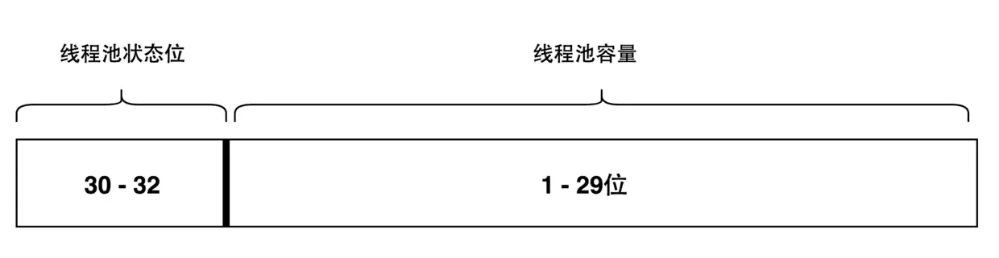
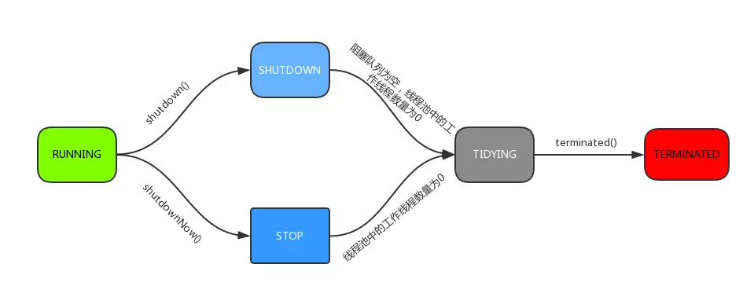

# 1 线程池类图

---

# 2 ThreadPoolExecutor 源码分析

---

## 状态字

    private final AtomicInteger ctl = new AtomicInteger(ctlOf(RUNNING, 0));
    private static final int COUNT_BITS = Integer.SIZE - 3;
    private static final int CAPACITY   = (1 << COUNT_BITS) - 1;
     
    // 状态字的高比特位存放线程池状态信息
    private static final int RUNNING    = -1 << COUNT_BITS;
    private static final int SHUTDOWN   =  0 << COUNT_BITS;
    private static final int STOP       =  1 << COUNT_BITS;
    private static final int TIDYING    =  2 << COUNT_BITS;
    private static final int TERMINATED =  3 << COUNT_BITS;
     
    // 打包/提取状态字信息
    private static int runStateOf(int c)     { return c & ~CAPACITY; }
    private static int workerCountOf(int c)  { return c & CAPACITY; }
    private static int ctlOf(int rs, int wc) { return rs | wc; }
      
    // 判断当前线程池是否正在执行
    private static boolean isRunning(int c) {
        return c < SHUTDOWN;
    }

`ctl`是对线程池的运行状态和线程池中有效线程的数量进行控制的一个字段， 它包含两部分的信息: 线程池的运行状态 (runState) 和线程池内有效线程的数量 (workerCount)，这里可以看到，使用了Integer类型来保存，高3位保存runState，低29位保存workerCount。COUNT_BITS 就是29，CAPACITY就是1左移29位减1（29个1），这个常量表示workerCount的上限值，大约是5亿。

ThreadPoolExecutor把**线程池状态**和**线程池容量**打包成一个int型变量，如下图所示。

| 状态 | 高位值枚举 | 正负性 |
| --- | --- | --- |
| RUNNING    | 111 | 负数（-536870912） |
| SHUTDOWN   | 000 | 0                  |
| STOP       | 001 | 正数（536870912） |
| TIDYING    | 010 | 正数（1073741824） |
| TERMINATED | 011 | 正数（1610612736） |

因此在状态值的排布上可以知道 **TERMINATED > TIDYING > STOP >SHUTDOWN > RUNNING**

## 生命周期

线程池的 5 种状态位：

1. **RUNNING** ：能接受新提交的任务，并且也能处理阻塞队列中的任务；
2. **SHUTDOWN**：关闭状态，不再接受新提交的任务，但却可以继续处理阻塞队列中已保存的任务。在线程池处于 RUNNING 状态时，调用 shutdown()方法会使线程池进入到该状态（finalize() 方法在执行过程中也会调用shutdown()方法进入该状态）；
3. **STOP**：不能接受新任务，也不处理队列中的任务，会中断正在处理任务的线程。在线程池处于 RUNNING 或 SHUTDOWN 状态时，调用 shutdownNow() 方法会使线程池进入到该状态；
4. **TIDYING**：如果所有的任务都已终止了，workerCount (有效线程数) 为0，线程池进入该状态后会调用 terminated() 方法进入TERMINATED 状态。
5. **TERMINATED**：在 terminated() 方法执行完后进入该状态，默认 terminated() 方法中什么也没有做。进入 TERMINATED 的条件如下：
    - 线程池不是 RUNNING 状态；
    - 线程池状态不是 TIDYING 状态或 TERMINATED 状态；
    - 如果线程池状态是 SHUTDOWN 并且 workerQueue 为空；
    - workerCount 为 0；
    - 设置 TIDYING 状态成功。

总结为下图：

## ctl 相关方法

对ctl进行计算的方法：

    // 获取运行状态
    private static int runStateOf(int c)     { return c & ~CAPACITY; }
    // 获取活动线程数
    private static int workerCountOf(int c)  { return c & CAPACITY; }
    // 获取运行状态和活动线程数的值
    private static int ctlOf(int rs, int wc) { return rs | wc; }

## 构造方法

    public ThreadPoolExecutor(int corePoolSize,
                              int maximumPoolSize,
                              long keepAliveTime,
                              TimeUnit unit,
                              BlockingQueue<Runnable> workQueue,
                              ThreadFactory threadFactory,
                              RejectedExecutionHandler handler) {
        if (corePoolSize < 0 ||
            maximumPoolSize <= 0 ||
            maximumPoolSize < corePoolSize ||
            keepAliveTime < 0)
            throw new IllegalArgumentException();
        if (workQueue == null || threadFactory == null || handler == null)
            throw new NullPointerException();
        // 核心池大小
        this.corePoolSize = corePoolSize;
        // 最大池大小
        this.maximumPoolSize = maximumPoolSize;
        // 线程池的等待队列
        this.workQueue = workQueue;
        this.keepAliveTime = unit.toNanos(keepAliveTime);
        // 线程工厂对象
        this.threadFactory = threadFactory;
        // 拒绝策略的句柄
        this.handler = handler;
    }

## execute 方法

`execute()`的作用是将任务添加到线程池中执行。它会分为3种情况进行处理：

- **情况1：**如果"线程池中工作线程数量" < "核心池大小"时。此时就新建一个线程，并将该任务添加到线程中进行执行。
- **情况2：**如果"线程池中工作线程数量" >= "核心池大小"，并且"线程池是`RUNNING`状态"；此时，则将任务添加到阻塞队列中阻塞等待。在该情况下，会再次确认"线程池的状态"，如果"第2次读到的线程池状态"和"第1次读到的线程池状态"不同，则从阻塞队列中删除该任务。
- **情况3：**非以上两种情况。在这种情况下，尝试新建一个线程，并将该任务添加到线程中进行执行。如果执行失败，则通过reject()拒绝该任务。

    public void execute(Runnable command) {
        if (command == null)
            throw new NullPointerException();
        /*
         * clt记录着runState和workerCount
         */
        int c = ctl.get();
        /*
         * workerCountOf方法取出低29位的值，表示当前工作线程数；
         * 当工作线程数 < corePoolSize时，则通过addWorker(command, true)新建一个线程，
         * 并将任务(command)添加到该线程中；然后，启动该线程从而执行任务。
         */
        if (workerCountOf(c) < corePoolSize) {
            /*
             * addWorker中的第二个参数表示限制添加线程的数量是根据corePoolSize来判断还是maximumPoolSize来判断；
             * 如果为true，根据corePoolSize来判断；
             * 如果为false，则根据maximumPoolSize来判断
             */
            if (addWorker(command, true))
                return;
            /*
             * 如果添加失败，则重新获取ctl值
             */
            c = ctl.get();
        }
        /*
         * 当工作线程数量 >= corePoolSize时，
         * 而且"线程池处于运行状态"时，则尝试将任务添加到阻塞队列中。
         */
        if (isRunning(c) && workQueue.offer(command)) {
            // 重新获取ctl值
            int recheck = ctl.get();
            // 再次判断线程池的运行状态，如果不是运行状态，由于之前已经把command添加到workQueue中了，
            // 这时需要移除该command
            // 执行过后通过handler使用拒绝策略对该任务进行处理，整个方法返回
            if (! isRunning(recheck) && remove(command))
                reject(command);
            /*
             * 获取线程池中的有效线程数，如果数量是0，则执行addWorker方法
             * 这里传入的参数表示：
             * 1. 第一个参数为null，表示在线程池中创建一个线程，但不去启动；
             * 2. 第二个参数为false，将线程池的有限线程数量的上限设置为maximumPoolSize，添加线程时根据maximumPoolSize来判断；
             * 如果判断workerCount大于0，则直接返回，在workQueue中新增的command会在将来的某个时刻被执行。
             */
            else if (workerCountOf(recheck) == 0)
                addWorker(null, false);
        }
        /*
         * 如果执行到这里，有两种情况：
         * 1. 线程池已经不是RUNNING状态；
         * 2. 线程池是RUNNING状态，但workerCount >= corePoolSize并且workQueue已满。
         * 这时，再次调用addWorker方法，但第二个参数传入为false，将线程池的有限线程数量的上限设置为maximumPoolSize；
         * 如果失败则拒绝该任务
         */
        else if (!addWorker(command, false))
            reject(command);
    }

流程图.png)

简单来说，在执行execute()方法时如果状态一直是`RUNNING`时，的执行过程如下：

1. 如果`workerCount < corePoolSize`，则创建并启动一个线程来执行新提交的任务；
2. 如果`workerCount >= corePoolSize`，且线程池内的阻塞队列未满，则将任务添加到该阻塞队列中；
3. 如果`workerCount >= corePoolSize && workerCount < maximumPoolSize`，且线程池内的阻塞队列已满，则创建并启动一个线程来执行新提交的任务；
4. 如果`workerCount >= maximumPoolSize`，并且线程池内的阻塞队列已满, 则根据拒绝策略来处理该任务, 默认的处理方式是直接抛异常。

这里要注意一下`addWorker(null, false);`，也就是创建一个线程，但并没有传入任务，因为任务已经被添加到workQueue中了，所以worker在执行的时候，会直接从workQueue中获取任务。所以，在`workerCountOf(recheck) == 0`时执行`addWorker(null, false);`也是为了保证线程池在`RUNNING`状态下必须要有一个线程来执行任务。

## addWorker 方法

`addWorker`方法的主要工作是在线程池中创建一个新的线程并执行。

`firstTask`参数用于指定新增的线程执行的第一个任务。

`core`参数为`true`表示在新增线程时会判断当前活动线程数是否少于corePoolSize，

`false`表示新增线程前需要判断当前活动线程数是否少于maximumPoolSize。代码如下：

    private boolean addWorker(Runnable firstTask, boolean core) {
        retry:
        for (;;) {
            int c = ctl.get();
            // 获取运行状态
            int rs = runStateOf(c);
    
            /*
             * 这个if判断
             * 如果rs >= SHUTDOWN，则表示此时不再接收新任务；
             * 接着判断以下3个条件，只要有1个不满足，则返回false：
             * 1. rs == SHUTDOWN，这时表示关闭状态，不再接受新提交的任务，但却可以继续处理阻塞队列中已保存的任务
             * 2. firsTask为空
             * 3. 阻塞队列不为空
             * 
             * 首先考虑rs == SHUTDOWN的情况
             * 这种情况下不会接受新提交的任务，所以在firstTask不为空的时候会返回false；
             * 然后，如果firstTask为空，并且workQueue也为空，则返回false，
             * 因为队列中已经没有任务了，不需要再添加线程了
             */
            // Check if queue empty only if necessary.
            if (rs >= SHUTDOWN &&
                ! (rs == SHUTDOWN &&
                   firstTask == null &&
                   ! workQueue.isEmpty()))
                return false;
    
            for (;;) {
                // 获取工作线程数
                int wc = workerCountOf(c);
                // 如果wc超过CAPACITY，也就是ctl的低29位的最大值（二进制是29个1），返回false；
                // 这里的core是addWorker方法的第二个参数，如果为true表示根据corePoolSize来比较，
                // 如果为false则根据maximumPoolSize来比较。
                // 
                if (wc >= CAPACITY ||
                    wc >= (core ? corePoolSize : maximumPoolSize))
                    return false;
                // 尝试增加workerCount，如果成功，则跳出第一个for循环
                if (compareAndIncrementWorkerCount(c))
                    break retry;
                // 如果增加workerCount失败，则重新获取ctl的值
                c = ctl.get();  // Re-read ctl
                // 如果当前的运行状态不等于rs(与之前状态不一致)，说明状态已被改变，返回第一个for循环继续执行
                if (runStateOf(c) != rs)
                    continue retry;
                // else CAS failed due to workerCount change; retry inner loop
            }
        }
    
        boolean workerStarted = false;
        boolean workerAdded = false;
        Worker w = null;
        // 添加任务到线程池，并启动任务所在的线程。
        try {
            // 新建Worker，并且指定firstTask为Worker的第一个任务。
            w = new Worker(firstTask);
            // 获取Worker对应的线程。
            final Thread t = w.thread;
            if (t != null) {
                // 获取锁
                final ReentrantLock mainLock = this.mainLock;
                mainLock.lock();
                try {
                    // Recheck while holding lock.
                    // Back out on ThreadFactory failure or if
                    // shut down before lock acquired.
                    int rs = runStateOf(ctl.get());
                    // 再次确认"线程池状态
                    // rs < SHUTDOWN表示是RUNNING状态；
                    // 如果rs是RUNNING状态或者rs是SHUTDOWN状态并且firstTask为null，向线程池中添加线程。
                    // 因为在SHUTDOWN时不会在添加新的任务，但还是会执行workQueue中的任务
                    if (rs < SHUTDOWN ||
                        (rs == SHUTDOWN && firstTask == null)) {
                        if (t.isAlive()) // precheck that t is startable
                            throw new IllegalThreadStateException();
                        // 将Worker对象(w)添加到"线程池的Worker集合(workers)"中
                        workers.add(w);
                        int s = workers.size();
                        // largestPoolSize记录着线程池中出现过的最大线程数量,更新largestPoolSize
                        if (s > largestPoolSize)
                            // 更新largestPoolSize
                            largestPoolSize = s;
                        workerAdded = true;
                    }
                } finally {
                    // 释放锁
                    mainLock.unlock();
                }
                if (workerAdded) {
                    // 如果"成功将任务添加到线程池"中，则启动任务所在的线程。
                    t.start();
                    workerStarted = true;
                }
            }
        } finally {
            if (! workerStarted)
                addWorkerFailed(w);
        }
        // 返回任务是否启动。
        return workerStarted;
    }

**注意**一下这里的`t.start()`这个语句，启动时会调用Worker类中的run方法，Worker本身实现了Runnable接口，所以一个Worker类型的对象也是一个线程。

从`addWorker()`中，我们能清晰的发现：

线程池在添加任务时，会创建任务对应的Worker对象，而一个Workder对象包含一个Thread对象。

通过将Worker对象添加到"线程的workers集合"中，从而实现将任务添加到线程池中。 

通过启动Worker对应的Thread线程，则执行该任务。

## Worker 类

线程池中的每一个线程被封装成一个Worker对象，ThreadPool维护的其实就是一组Worker对象，看一下Worker的定义：

    private final class Worker
            extends AbstractQueuedSynchronizer
            implements Runnable
        {
            /**
             * This class will never be serialized, but we provide a
             * serialVersionUID to suppress a javac warning.
             */
            private static final long serialVersionUID = 6138294804551838833L;
    
            /** Thread this worker is running in.  Null if factory fails. */
            final Thread thread;
            /** Initial task to run.  Possibly null. */
            Runnable firstTask;
            /** Per-thread task counter */
            volatile long completedTasks;
    
            /**
             * Creates with given first task and thread from ThreadFactory.
             * @param firstTask the first task (null if none)
             */
            Worker(Runnable firstTask) {
                setState(-1); // inhibit interrupts until runWorker
                this.firstTask = firstTask;
                this.thread = getThreadFactory().newThread(this);
            }
    
            /** Delegates main run loop to outer runWorker  */
            public void run() {
                runWorker(this);
            }
    
            // Lock methods
            //
            // The value 0 represents the unlocked state.
            // The value 1 represents the locked state.
    
            protected boolean isHeldExclusively() {
                return getState() != 0;
            }
    
            protected boolean tryAcquire(int unused) {
                if (compareAndSetState(0, 1)) {
                    setExclusiveOwnerThread(Thread.currentThread());
                    return true;
                }
                return false;
            }
    
            protected boolean tryRelease(int unused) {
                setExclusiveOwnerThread(null);
                setState(0);
                return true;
            }
    
            public void lock()        { acquire(1); }
            public boolean tryLock()  { return tryAcquire(1); }
            public void unlock()      { release(1); }
            public boolean isLocked() { return isHeldExclusively(); }
    
            void interruptIfStarted() {
                Thread t;
                if (getState() >= 0 && (t = thread) != null && !t.isInterrupted()) {
                    try {
                        t.interrupt();
                    } catch (SecurityException ignore) {
                    }
                }
            }
        }

Worker类继承了AQS，并实现了Runnable接口，注意其中的firstTask和thread属性：firstTask用它来保存传入的任务；thread是在调用构造方法时通过ThreadFactory来创建的线程，是用来处理任务的线程。

在调用构造方法时，需要把任务传入，这里通过`getThreadFactory().newThread(this);`来新建一个线程，newThread方法传入的参数是this，因为Worker本身继承了Runnable接口，也就是一个线程，所以一个Worker对象在启动的时候会调用Worker类中的run方法。

**Worker继承了AQS，使用AQS来实现独占锁的功能。**为什么不使用ReentrantLock来实现呢？可以看到`tryAcquire`方法，它是不允许重入的，而ReentrantLock是允许重入的：

1. lock方法一旦获取了独占锁，表示当前线程正在执行任务中；
2. 如果正在执行任务，则不应该中断线程；
3. 如果该线程现在不是独占锁的状态，也就是空闲的状态，说明它没有在处理任务，这时可以对该线程进行中断；
4. 线程池在执行shutdown方法或tryTerminate方法时会调用interruptIdleWorkers方法来中断空闲的线程，interruptIdleWorkers方法会使用tryLock方法来判断线程池中的线程是否是空闲状态；
5. 之所以设置为不可重入，是因为我们不希望任务在调用像setCorePoolSize这样的线程池控制方法时重新获取锁。如果使用ReentrantLock，它是可重入的，这样如果在任务中调用了如setCorePoolSize这类线程池控制的方法，会中断正在运行的线程。

所以，Worker继承自AQS，用于判断线程是否空闲以及是否可以被中断。

此外，在构造方法中执行了`setState(-1);`，把state变量设置为-1，为什么这么做呢？是因为AQS中默认的state是0，如果刚创建了一个Worker对象，还没有执行任务时，这时就不应该被中断，看一下`tryAquire`方法：

    protected boolean tryAcquire(int unused) {
        if (compareAndSetState(0, 1)) {
            setExclusiveOwnerThread(Thread.currentThread());
            return true;
        }
        return false;
    }

**tryAcquire方法**是根据state是否是0来判断的，所以，`setState(-1);`**将state设置为-1是为了禁止在执行任务前对线程进行中断。**

正因为如此，**在runWorker方法中会先调用Worker对象的unlock方法将state设置为0**.

## runWorker 方法

在Worker类中的run方法调用了runWorker方法来执行任务，runWorker方法的代码如下：

    final void runWorker(Worker w) {
        Thread wt = Thread.currentThread();
        // 获取第一个任务
        Runnable task = w.firstTask;
        w.firstTask = null;
        // 允许中断
        w.unlock(); // allow interrupts
        // 是否因为异常退出循环
        boolean completedAbruptly = true;
        try {
            // 如果task为空，则通过getTask来获取任务
            while (task != null || (task = getTask()) != null) {
                w.lock();
                // If pool is stopping, ensure thread is interrupted;
                // if not, ensure thread is not interrupted.  This
                // requires a recheck in second case to deal with
                // shutdownNow race while clearing interrupt
                if ((runStateAtLeast(ctl.get(), STOP) ||
                     (Thread.interrupted() &&
                      runStateAtLeast(ctl.get(), STOP))) &&
                    !wt.isInterrupted())
                    wt.interrupt();
                try {
                    beforeExecute(wt, task);
                    Throwable thrown = null;
                    try {
                        task.run();
                    } catch (RuntimeException x) {
                        thrown = x; throw x;
                    } catch (Error x) {
                        thrown = x; throw x;
                    } catch (Throwable x) {
                        thrown = x; throw new Error(x);
                    } finally {
                        afterExecute(task, thrown);
                    }
                } finally {
                    task = null;
                    w.completedTasks++;
                    w.unlock();
                }
            }
            completedAbruptly = false;
        } finally {
            processWorkerExit(w, completedAbruptly);
        }
    }

这里说明一下第一个if判断，目的是：

- 如果线程池正在停止，那么要保证当前线程是中断状态；
- 如果不是的话，则要保证当前线程不是中断状态；

这里要考虑在执行该if语句期间可能也执行了shutdownNow方法，shutdownNow方法会把状态设置为STOP，回顾一下STOP状态。

不能接受新任务，也不处理队列中的任务，会中断正在处理任务的线程。在线程池处于 RUNNING 或 SHUTDOWN 状态时，调用 shutdownNow() 方法会使线程池进入到该状态。

STOP状态要中断线程池中的所有线程，而这里使用`Thread.interrupted()`来判断是否中断是为了确保在RUNNING或者SHUTDOWN状态时线程是非中断状态的，因为`Thread.interrupted()`方法会复位中断的状态。

总结一下`runWorker`方法的**执行过程**：

1. while循环不断地通过`getTask()`方法获取任务；
2. `getTask()`方法从阻塞队列中取任务；
3. 如果线程池正在停止，那么要保证当前线程是中断状态，否则要保证当前线程不是中断状态；
4. 调用`task.run()`执行任务；
5. 如果task为null则跳出循环，执行`processWorkerExit()`方法；
6. runWorker方法执行完毕，也代表着Worker中的run方法执行完毕，销毁线程。

这里的beforeExecute方法和afterExecute方法在ThreadPoolExecutor类中是空的，留给子类来实现。

`completedAbruptly`变量来表示在执行任务过程中是否出现了异常，在processWorkerExit方法中会对该变量的值进行判断。

## getTask方法

`getTask`方法用来从阻塞队列中取任务，代码如下：

    private Runnable getTask() {
        // timeOut变量的值表示上次从阻塞队列中取任务时是否超时
        boolean timedOut = false; // Did the last poll() time out?
    
        for (;;) {
            int c = ctl.get();
            int rs = runStateOf(c);
    
            // Check if queue empty only if necessary.
            /*
             * 如果线程池状态rs >= SHUTDOWN，也就是非RUNNING状态，再进行以下判断：
             * 1. rs >= STOP，线程池是否正在stop；
             * 2. 阻塞队列是否为空。
             * 如果以上条件满足，则将workerCount减1并返回null。
             * 因为如果当前线程池状态的值是SHUTDOWN或以上时，不允许再向阻塞队列中添加任务。
             */
            if (rs >= SHUTDOWN && (rs >= STOP || workQueue.isEmpty())) {
                decrementWorkerCount();
                return null;
            }
    
            int wc = workerCountOf(c);
    
            // Are workers subject to culling?
            // timed变量用于判断是否需要进行超时控制。
            // allowCoreThreadTimeOut默认是false，也就是核心线程不允许进行超时；
            // wc > corePoolSize，表示当前线程池中的线程数量大于核心线程数量；
            // 对于超过核心线程数量的这些线程，需要进行超时控制
            boolean timed = allowCoreThreadTimeOut || wc > corePoolSize;
    
            /*
             * wc > maximumPoolSize的情况是因为可能在此方法执行阶段同时执行了setMaximumPoolSize方法；
             * timed && timedOut 如果为true，表示当前操作需要进行超时控制，并且上次从阻塞队列中获取任务发生了超时
             * 接下来判断，如果有效线程数量大于1，或者阻塞队列是空的，那么尝试将workerCount减1；
             * 如果减1失败，则返回重试。
             * 如果wc == 1时，也就说明当前线程是线程池中唯一的一个线程了。
             */
            if ((wc > maximumPoolSize || (timed && timedOut))
                && (wc > 1 || workQueue.isEmpty())) {
                if (compareAndDecrementWorkerCount(c))
                    return null;
                continue;
            }
    
            try {
                /*
                 * 根据timed来判断，如果为true，则通过阻塞队列的poll方法进行超时控制，如果在keepAliveTime时间内没有获取到任务，则返回null；
                 * 否则通过take方法，如果这时队列为空，则take方法会阻塞直到队列不为空。
                 * 
                 */
                Runnable r = timed ?
                    workQueue.poll(keepAliveTime, TimeUnit.NANOSECONDS) :
                    workQueue.take();
                if (r != null)
                    return r;
                // 如果 r == null，说明已经超时，timedOut设置为true
                timedOut = true;
            } catch (InterruptedException retry) {
                // 如果获取任务时当前线程发生了中断，则设置timedOut为false并返回循环重试
                timedOut = false;
            }
        }
    }

这里**重要**的地方是**第二个if判断，目的是控制线程池的有效线程数量**。由上文中的分析可以知道，在执行execute方法时，如果当前线程池的线程数量超过了corePoolSize且小于maximumPoolSize，并且workQueue已满时，则可以增加工作线程，但这时如果超时没有获取到任务，也就是timedOut为true的情况，说明workQueue已经为空了，也就说明了当前线程池中不需要那么多线程来执行任务了，可以把多于corePoolSize数量的线程销毁掉，保持线程数量在corePoolSize即可。

什么时候会销毁？当然是runWorker方法执行完之后，也就是Worker中的run方法执行完，由JVM自动回收。

getTask方法返回null时，在runWorker方法中会跳出while循环，然后会执行processWorkerExit方法。

## processWorkerExit 方法

    private void processWorkerExit(Worker w, boolean completedAbruptly) {
        // 如果completedAbruptly值为true，则说明线程执行时出现了异常，需要将workerCount减1；
        // 如果线程执行时没有出现异常，说明在getTask()方法中已经已经对workerCount进行了减1操作，这里就不必再减了。  
        if (completedAbruptly) // If abrupt, then workerCount wasn't adjusted
            decrementWorkerCount();
    
        final ReentrantLock mainLock = this.mainLock;
        mainLock.lock();
        try {
            //统计完成的任务数
            completedTaskCount += w.completedTasks;
            // 从workers中移除，也就表示着从线程池中移除了一个工作线程
            workers.remove(w);
        } finally {
            mainLock.unlock();
        }
    
        // 根据线程池状态进行判断是否结束线程池
        tryTerminate();
    
        int c = ctl.get();
        /*
         * 当线程池是RUNNING或SHUTDOWN状态时，如果worker是异常结束，那么会直接addWorker；
         * 如果allowCoreThreadTimeOut=true，并且等待队列有任务，至少保留一个worker；
         * 如果allowCoreThreadTimeOut=false，workerCount不少于corePoolSize。
         */
        if (runStateLessThan(c, STOP)) {
            if (!completedAbruptly) {
                int min = allowCoreThreadTimeOut ? 0 : corePoolSize;
                if (min == 0 && ! workQueue.isEmpty())
                    min = 1;
                if (workerCountOf(c) >= min)
                    return; // replacement not needed
            }
            addWorker(null, false);
        }
    }

至此，processWorkerExit执行完之后，工作线程被销毁，以上就是整个工作线程的生命周期，从execute方法开始，Worker使用ThreadFactory创建新的工作线程，runWorker通过getTask获取任务，然后执行任务，如果getTask返回null，进入processWorkerExit方法，整个线程结束，如图所示：

流程图_1.png)

## tryTerminate 方法

tryTerminate方法根据线程池状态进行判断是否结束线程池，代码如下：

    final void tryTerminate() {
        for (;;) {
            int c = ctl.get();
            /*
             * 当前线程池的状态为以下几种情况时，直接返回：
             * 1. RUNNING，因为还在运行中，不能停止；
             * 2. TIDYING或TERMINATED，因为线程池中已经没有正在运行的线程了；
             * 3. SHUTDOWN并且等待队列非空，这时要执行完workQueue中的task；
             */
            if (isRunning(c) ||
                runStateAtLeast(c, TIDYING) ||
                (runStateOf(c) == SHUTDOWN && ! workQueue.isEmpty()))
                return;
            // 如果线程数量不为0，则中断一个空闲的工作线程，并返回
            if (workerCountOf(c) != 0) { // Eligible to terminate
                interruptIdleWorkers(ONLY_ONE);
                return;
            }
    
            final ReentrantLock mainLock = this.mainLock;
            mainLock.lock();
            try {
                // 这里尝试设置状态为TIDYING，如果设置成功，则调用terminated方法
                if (ctl.compareAndSet(c, ctlOf(TIDYING, 0))) {
                    try {
                        // terminated方法默认什么都不做，留给子类实现
                        terminated();
                    } finally {
                        // 设置状态为TERMINATED
                        ctl.set(ctlOf(TERMINATED, 0));
                        termination.signalAll();
                    }
                    return;
                }
            } finally {
                mainLock.unlock();
            }
            // else retry on failed CAS
        }
    }

## shutdown 方法

shutdown方法要将线程池切换到SHUTDOWN状态，并调用interruptIdleWorkers方法请求中断所有空闲的worker，最后调用tryTerminate尝试结束线程池。

    public void shutdown() {
        final ReentrantLock mainLock = this.mainLock;
        mainLock.lock();
        try {
            // 安全策略判断
            checkShutdownAccess();
            // 切换状态为SHUTDOWN
            advanceRunState(SHUTDOWN);
            // 中断空闲线程
            interruptIdleWorkers();
            onShutdown(); // hook for ScheduledThreadPoolExecutor
        } finally {
            mainLock.unlock();
        }
        // 尝试结束线程池
        tryTerminate();
    }

这里思考一个问题：在runWorker方法中，执行任务时对Worker对象w进行了lock操作，为什么要在执行任务的时候对每个工作线程都加锁呢？

下面仔细分析一下：

- 在getTask方法中，如果这时线程池的状态是SHUTDOWN并且workQueue为空，那么就应该返回null来结束这个工作线程，而使线程池进入SHUTDOWN状态需要调用shutdown方法；
- shutdown方法会调用interruptIdleWorkers来中断空闲的线程，interruptIdleWorkers持有mainLock，会遍历workers来逐个判断工作线程是否空闲。但getTask方法中没有mainLock；
- 在getTask中，如果判断当前线程池状态是RUNNING，并且阻塞队列为空，那么会调用`workQueue.take()`进行阻塞；
- 如果在判断当前线程池状态是RUNNING后，这时调用了shutdown方法把状态改为了SHUTDOWN，这时如果不进行中断，那么当前的工作线程在调用了`workQueue.take()`后会一直阻塞而不会被销毁，因为在SHUTDOWN状态下不允许再有新的任务添加到workQueue中，这样一来线程池永远都关闭不了了；
- 由上可知，shutdown方法与getTask方法（从队列中获取任务时）存在竞态条件；
- 解决这一问题就需要用到线程的中断，也就是为什么要用interruptIdleWorkers方法。在调用`workQueue.take()`时，如果发现当前线程在执行之前或者执行期间是中断状态，则会抛出InterruptedException，解除阻塞的状态；
- 但是要中断工作线程，还要判断工作线程是否是空闲的，如果工作线程正在处理任务，就不应该发生中断；
- 所以Worker继承自AQS，在工作线程处理任务时会进行lock，interruptIdleWorkers在进行中断时会使用tryLock来判断该工作线程是否正在处理任务，如果tryLock返回true，说明该工作线程当前未执行任务，这时才可以被中断。

下面就来分析一下interruptIdleWorkers方法。

## interruptIdleWorkers 方法

    private void interruptIdleWorkers() {
        interruptIdleWorkers(false);
    }
    
    private void interruptIdleWorkers(boolean onlyOne) {
        final ReentrantLock mainLock = this.mainLock;
        mainLock.lock();
        try {
            for (Worker w : workers) {
                Thread t = w.thread;
                if (!t.isInterrupted() && w.tryLock()) {
                    try {
                        t.interrupt();
                    } catch (SecurityException ignore) {
                    } finally {
                        w.unlock();
                    }
                }
                if (onlyOne)
                    break;
            }
        } finally {
            mainLock.unlock();
        }
    }

interruptIdleWorkers遍历workers中所有的工作线程，若线程没有被中断tryLock成功，就中断该线程。

为什么需要持有mainLock？因为workers是HashSet类型的，不能保证线程安全。

## shutdownNow 方法

    public List<Runnable> shutdownNow() {
        List<Runnable> tasks;
        final ReentrantLock mainLock = this.mainLock;
        mainLock.lock();
        try {
            checkShutdownAccess();
            advanceRunState(STOP);
            // 中断所有工作线程，无论是否空闲
            interruptWorkers();
            // 取出队列中没有被执行的任务
            tasks = drainQueue();
        } finally {
            mainLock.unlock();
        }
        tryTerminate();
        return tasks;
    }

shutdownNow方法与shutdown方法类似，不同的地方在于：

1. 设置状态为STOP；
2. 中断所有工作线程，无论是否是空闲的；
3. 取出阻塞队列中没有被执行的任务并返回。

shutdownNow方法执行完之后调用tryTerminate方法，该方法在上文已经分析过了，目的就是使线程池的状态设置为TERMINATED。

## 线程池的监控

通过线程池提供的参数进行监控。线程池里有一些属性在监控线程池的时候可以使用

- **getTaskCount**：线程池已经执行的和未执行的任务总数；
- **getCompletedTaskCount**：线程池已完成的任务数量，该值小于等于taskCount；
- **getLargestPoolSize**：线程池曾经创建过的最大线程数量。通过这个数据可以知道线程池是否满过，也就是达到了maximumPoolSize；
- **getPoolSize**：线程池当前的线程数量；
- **getActiveCount**：当前线程池中正在执行任务的线程数量。

通过这些方法，可以对线程池进行监控，在ThreadPoolExecutor类中提供了几个空方法，如beforeExecute方法，afterExecute方法和terminated方法，可以扩展这些方法在执行前或执行后增加一些新的操作，例如统计线程池的执行任务的时间等，可以继承自ThreadPoolExecutor来进行扩展。

# 总结

---

本文比较详细的分析了线程池的工作流程，总体来说有如下几个内容：

- 分析了线程的创建，任务的提交，状态的转换以及线程池的关闭；
- 这里通过execute方法来展开线程池的工作流程，execute方法通过corePoolSize，maximumPoolSize以及阻塞队列的大小来判断决定传入的任务应该被立即执行，还是应该添加到阻塞队列中，还是应该拒绝任务。
- 介绍了线程池关闭时的过程，也分析了shutdown方法与getTask方法存在竞态条件；
- 在获取任务时，要通过线程池的状态来判断应该结束工作线程还是阻塞线程等待新的任务，也解释了为什么关闭线程池时要中断工作线程以及为什么每一个worker都需要lock。

在向线程池提交任务时，除了execute方法，还有一个submit方法，submit方法会返回一个Future对象用于获取返回值，有关Future和Callable在下文中。

[JUC 之 Future 和 Callable](https://www.notion.so/JUC-Future-Callable-0c238c89e6cb4f62ae74137c0bad18cf)