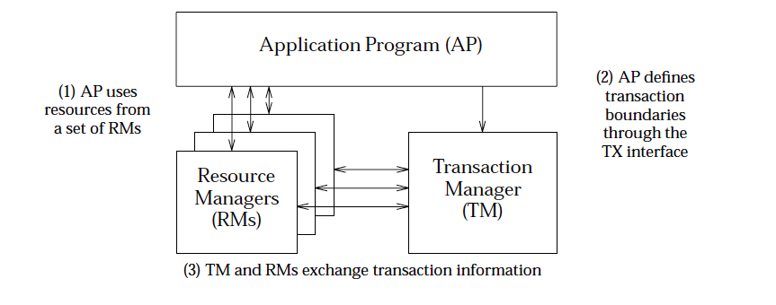
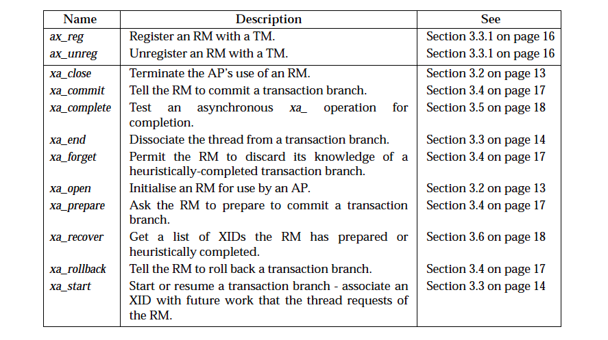

# MySQL 中基于 XA 实现的分布式事务记录

## XA 协议



分布式事务处理的XA规范(由 AP、RM、TM 组成):

- 其中应用程序（Application Program ，简称 AP）：AP 定义事务边界（定义事务开始和结束）并访问事务边界内的资源。
- 资源管理器（Resource Manager，简称 RM）：RM 管理计算机共享的资源，许多软件都可以去访问这些资源，资源包含比如数据库、文件系统、打印机服务器等。
- 事务管理器（Transaction Manager ，简称TM）：负责管理全局事务，分配事务唯一标识，监控事务的执行进度，并负责事务的提交、回滚、失败恢复等。

XA 主要规定了 RM 与 TM 之间的交互，下面来看下 XA 规范中定义的 RM 和 TM 交互的接口：



- xa_start 负责开启或者恢复一个事务分支，并且关联 XID 到调用线程
- xa_end 负责取消当前线程与事务分支的关联
- xa_prepare 负责询问 RM 是否准备好了提交事务分支
- xa_commit 通知 RM 提交事务分支
- xa_rollback 通知 RM 回滚事务分支

XA 协议是使用了二阶段协议的，其中：

- 第一阶段 TM 要求所有的 RM 准备提交对应的事务分支，询问 RM 是否有能力保证成功的提交事务分支，RM 根据自己的情况，如果判断自己进行的工作可以被提交，那就就对工作内容进行持久化，并给 TM 回执 OK；否者给 TM 的回执 NO。RM 在发送了否定答复并回滚了已经的工作后，就可以丢弃这个事务分支信息了。
- 第二阶段 TM 根据阶段 1 各个 RM prepare 的结果，决定是提交还是回滚事务。如果所有的 RM 都 prepare 成功，那么 TM 通知所有的 RM 进行提交；如果有 RM prepare 回执 NO 的话，则 TM 通知所有 RM 回滚自己的事务分支。

也就是 TM 与 RM 之间是通过两阶段提交协议进行交互的。

## MySQL 实现 XA

确认下 MySQL 是否启动了 XA 功能：`show variables like 'innodb_support_xa'`

### maven 依赖

```xml
<dependencies>
    <dependency>
        <groupId>mysql</groupId>
        <artifactId>mysql-connector-java</artifactId>
        <version>8.0.15</version>
    </dependency>
    <dependency>
        <groupId>javax.transaction</groupId>
        <artifactId>jta</artifactId>
        <version>1.1</version>
    </dependency>
</dependencies>
```

### Java 代码实现

如下代码是对两个数据库进行转账操作

```java
package com.littlefxc.examples.mysqlxa2pc;

import com.mysql.cj.jdbc.MysqlXADataSource;
import com.mysql.cj.jdbc.MysqlXid;

import javax.sql.XAConnection;
import javax.transaction.xa.XAException;
import javax.transaction.xa.XAResource;
import javax.transaction.xa.Xid;
import java.sql.Connection;
import java.sql.SQLException;
import java.sql.Statement;

/**
 * @author fengxuechao
 */
public class XaExample {

    public static void main(String[] args) throws SQLException, XAException {
        String url1 = "jdbc:mysql://192.168.120.63:3306/learn?useSSL=false&serverTimezone=UTC";
        String url2 = "jdbc:mysql://192.168.120.63:3306/learn2?useSSL=false&serverTimezone=UTC";
        String url3 = "jdbc:mysql://localhost:3306/learn?useSSL=false&serverTimezone=UTC";

        // 从不同的数据库获取数据库数据源
        MysqlXADataSource ds1 = getDataSource(url1, "root", "123456");
        MysqlXADataSource ds2 = getDataSource(url2, "root", "123456");

        // 数据库1获取连接
        XAConnection xAConn1 = ds1.getXAConnection();
        Connection conn1 = xAConn1.getConnection();
        XAResource xaResource1 = xAConn1.getXAResource();
        Statement statement1 = conn1.createStatement();

        // 数据库2获取连接
        XAConnection xAConn2 = ds2.getXAConnection();
        Connection conn2 = xAConn2.getConnection();
        XAResource xaResource2 = xAConn2.getXAResource();
        Statement statement2 = conn2.createStatement();

        // 其中 xid 是一个全局唯一的 id 标示一个分支事务，每个分支事务有自己的全局唯一的一个 id。
        Xid xid1 = new MysqlXid(new byte[]{0x01}, new byte[]{0x02}, 100);
        Xid xid2 = new MysqlXid(new byte[]{0x011}, new byte[]{0x012}, 100);

        try {
            // 事务分支1关联事务sql语句
            xaResource1.start(xid1, XAResource.TMNOFLAGS);
            int update1 = statement1.executeUpdate("update account_from set money = money - 0.5 where id = 1");
            xaResource1.end(xid1, XAResource.TMSUCCESS);

            // 事务分支2关联事务sql语句
            xaResource2.start(xid2, XAResource.TMNOFLAGS);
            int update2 = statement2.executeUpdate("update account_to set money = money + 0.5 where id = 1");
            xaResource2.end(xid2, XAResource.TMSUCCESS);

            // 两阶段提交协议第一阶段
            int ret1 = xaResource1.prepare(xid1);
            int ret2 = xaResource2.prepare(xid2);

            // 两阶段提交协议第二阶段
            if (XAResource.XA_OK == ret1 && XAResource.XA_OK == ret2) {
                xaResource1.commit(xid1, false);
                xaResource2.commit(xid2, false);
                System.out.println("result:" + update1 + ", result2:" + update2);
            }
        } catch (XAException e) {
            xaResource1.rollback(xid1);
            xaResource2.rollback(xid2);
            e.printStackTrace();
        }
    }

    /**
     * 获取 MysqlXADataSource
     *
     * @param url
     * @param username
     * @param password
     * @return
     */
    public static MysqlXADataSource getDataSource(String url, String username, String password) {
        MysqlXADataSource dataSource = new MysqlXADataSource();
        dataSource.setUrl(url);
        dataSource.setUser(username);
        dataSource.setPassword(password);
        return dataSource;
    }
}
```

## 问题记录

MySQL 8.x版本更新安全插件 `mysql_native_password` 变为 `caching_sha2_password`

Unable to load authentication plugin 'caching_sha2_password'.

解决办法：升级 `mysql-connector-java` 依赖的版本。