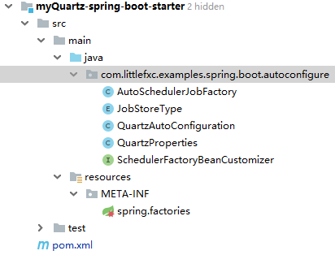
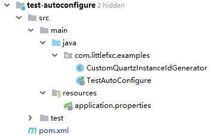

# 自定义Starter:myQuartz-spring-boot-starter

模仿学习Spring Boot starter写一个关于Quartz的自动配置的依赖。

## 1. 自定义Starter的模块结构



## 2. Maven 依赖配置

自定义starter命名方式：

- 官方 spring-boot-starter-模块名
- 非官方（如我们自己编写的） 模块名-spring-boot-starter

`spring-boot-configuration-processor`是2.x必须引入的包。

```xml
<?xml version="1.0" encoding="UTF-8"?>
<project xmlns="http://maven.apache.org/POM/4.0.0"
         xmlns:xsi="http://www.w3.org/2001/XMLSchema-instance"
         xsi:schemaLocation="http://maven.apache.org/POM/4.0.0 http://maven.apache.org/xsd/maven-4.0.0.xsd">
    <modelVersion>4.0.0</modelVersion>

    <groupId>com.littlefxc.examples</groupId>
    <artifactId>myQuartz-spring-boot-starter</artifactId>
    <version>1.0-snapshot</version>
    <packaging>jar</packaging>

    <parent>
        <groupId>org.springframework.boot</groupId>
        <artifactId>spring-boot-starter-parent</artifactId>
        <version>1.5.18.RELEASE</version>
        <relativePath />
    </parent>

    <properties>
        <quartz.version>2.3.0</quartz.version>
    </properties>

    <dependencies>
        <!-- starter的基本配置 -->
        <dependency>
            <groupId>org.springframework.boot</groupId>
            <artifactId>spring-boot-starter</artifactId>
        </dependency>
        <dependency>
            <groupId>org.springframework.boot</groupId>
            <artifactId>spring-boot-configuration-processor</artifactId>
            <optional>true</optional>
        </dependency>
        <!-- quartz的基本配置 -->
        <dependency>
            <groupId>org.quartz-scheduler</groupId>
            <artifactId>quartz</artifactId>
            <version>${quartz.version}</version>
            <exclusions>
                <exclusion>
                    <artifactId>c3p0</artifactId>
                    <groupId>com.mchange</groupId>
                </exclusion>
                <exclusion>
                    <artifactId>HikariCP-java6</artifactId>
                    <groupId>com.zaxxer</groupId>
                </exclusion>
            </exclusions>
        </dependency>
        <dependency>
            <groupId>org.springframework</groupId>
            <artifactId>spring-context-support</artifactId>
        </dependency>
        <dependency>
            <groupId>org.springframework</groupId>
            <artifactId>spring-tx</artifactId>
        </dependency>
        <dependency>
            <groupId>org.springframework.boot</groupId>
            <artifactId>spring-boot-starter-jdbc</artifactId>
        </dependency>
    </dependencies>
</project>
```

## 3. 创建自动配置类`QuartzAutoConfiguration`

**构造函数隐式注入**
在4.3之前,如果你构造函数中要依赖另外一个bean，你必须显示依赖`@Autowired`, 例如:

```java
@Service
public class FooService {
    private final FooRepository repository;
    @Autowired
    public FooService(FooRepository repository) {
        this.repository = repository
    }
}
```

相当常见的用例但是如果你忘记构造函数上的@Autowired注释，容器将抛出一个寻找默认构造函数的异常，除非你在bean定义设置中明确指出autowire模式'constructor'。

因此，从4.3开始，您不再需要在这样的单构造函数场景中指定显式注入注释。对于那些根本不带任何容器注释的类来说，这是特别优雅的，FooService会从beanFactory中查找FooRepository。

同样的，`@Configuration`类在4.3之前不支持构造函数注入。

**为什么要使用`ObjectProvider`?**

上文讲过**构造函数隐式注入**，但其有个缺点那就是强依赖。
Spring Framework 4.3引入了ObjectProvider，它是现有ObjectFactory接口的扩展，具有方便的签名，例如getIfAvailable和getIfUnique，只有在它实际存在时才检索bean（可选支持）或者如果可以确定单个候选者（特别是：主要候选者）在多个匹配的bean的情况下）。它的Spring核心源码见`org.springframework.beans.factory.support.DefaultListableBeanFactory#resolveDependency()`

** 用到的几个和Starter相关的注解:

- `@ConditionalOnClass`，当`classpath`下发现该类的情况下进行自动配置。
- `@ConditionalOnMissingBean`，当Spring Context中不存在该Bean时。
- `@EnableConfigurationProperties(QuartzProperties.class)`，使@ConfigurationProperties注解生效。
- `@ConfigurationProperties`，主要用来把properties配置文件转化为bean。
- `@AutoConfigureAfter`，自动注入该类在什么类加载之后。

### 自定义Quartz的调度器工厂Bean的自动配置类

```java
@Configuration
@ConditionalOnClass({Scheduler.class, SchedulerFactoryBean.class, PlatformTransactionManager.class})
@EnableConfigurationProperties(QuartzProperties.class)
@AutoConfigureAfter({DataSourceAutoConfiguration.class, HibernateJpaAutoConfiguration.class})
public class QuartzAutoConfiguration {

    private final static Logger log = LoggerFactory.getLogger(QuartzAutoConfiguration.class);

    private final List<SchedulerFactoryBeanCustomizer> customizers;

    private final QuartzProperties properties;

    private final JobDetail[] jobDetails;

    private final Map<String, Calendar> calendars;

    private final Trigger[] triggers;

    private final ApplicationContext applicationContext;

    private final DataSource dataSource;

    private final PlatformTransactionManager transactionManager;

    public QuartzAutoConfiguration(QuartzProperties properties,
                                   ObjectProvider<List<SchedulerFactoryBeanCustomizer>> customizers,
                                   ObjectProvider<JobDetail[]> jobDetails,
                                   ObjectProvider<Map<String, Calendar>> calendars,
                                   ObjectProvider<Trigger[]> triggers,
                                   ApplicationContext applicationContext,
                                   ObjectProvider<DataSource> dataSource,
                                   ObjectProvider<PlatformTransactionManager> transactionManager) {
        this.properties = properties;
        this.jobDetails = jobDetails.getIfAvailable();
        this.calendars = calendars.getIfAvailable();
        this.triggers = triggers.getIfAvailable();
        this.applicationContext = applicationContext;
        this.dataSource = dataSource.getIfAvailable();
        this.transactionManager = transactionManager.getIfAvailable();
        this.customizers = customizers.getIfAvailable();
    }

    /**
     * 如果没有调度器，就创建
     *
     * @return
     */
    @Bean
    @ConditionalOnMissingBean
    public SchedulerFactoryBean schedulerFactoryBean() {
        log.info("Init SchedulerFactoryBean");
        SchedulerFactoryBean schedulerFactoryBean = new SchedulerFactoryBean();
        schedulerFactoryBean.setJobFactory(new AutoSchedulerJobFactory(this.applicationContext.getAutowireCapableBeanFactory()));
        if (!this.properties.getProperties().isEmpty()) {
            schedulerFactoryBean.setQuartzProperties(asProperties(this.properties.getProperties()));
        }
        if (this.jobDetails != null && this.jobDetails.length > 0) {
            schedulerFactoryBean.setJobDetails(this.jobDetails);
        }
        if (this.calendars != null && !this.calendars.isEmpty()) {
            schedulerFactoryBean.setCalendars(this.calendars);
        }
        if (this.triggers != null && this.triggers.length > 0) {
            schedulerFactoryBean.setTriggers(this.triggers);
        }
        // todo quartz数据源初始化
        if (properties.getJobStoreType() == JobStoreType.JDBC) {
            if (dataSource != null) {
                schedulerFactoryBean.setDataSource(dataSource);
            }
            if (transactionManager != null) {
                schedulerFactoryBean.setTransactionManager(transactionManager);
            }
        }
        customize(schedulerFactoryBean);
        return schedulerFactoryBean;
    }

    /**
     * 自定义调度器
     *
     * @param schedulerFactoryBean
     */
    private void customize(SchedulerFactoryBean schedulerFactoryBean) {
        if (this.customizers != null) {
            for (SchedulerFactoryBeanCustomizer customizer : this.customizers) {
                customizer.customize(schedulerFactoryBean);
            }
        }
    }

    private Properties asProperties(Map<String, String> source) {
        Properties properties = new Properties();
        properties.putAll(source);
        return properties;
    }

}
```

## 4. `resources/META-INF/spring.factories`

```properties
org.springframework.boot.autoconfigure.EnableAutoConfiguration=\
com.littlefxc.examples.spring.boot.autoconfigure.QuartzAutoConfiguration
```

## 5. 其它

### QuartzProperties

```java
@ConfigurationProperties("spring.quartz")
public class QuartzProperties {

    /**
     * Quartz job store type.
     */
    private JobStoreType jobStoreType = JobStoreType.MEMORY;

    /**
     * Additional Quartz Scheduler properties.
     */
    private final Map<String, String> properties = new HashMap<>();

    public JobStoreType getJobStoreType() {
        return this.jobStoreType;
    }

    public void setJobStoreType(JobStoreType jobStoreType) {
        this.jobStoreType = jobStoreType;
    }

    public Map<String, String> getProperties() {
        return this.properties;
    }
}
```

### JobStoreType

```java
public enum JobStoreType {

    /**
     * Store jobs in memory.
     */
    MEMORY,

    /**
     * Store jobs in the database.
     */
    JDBC

}
```

### AutoSchedulerJobFactory

```java
/**
 * 模仿了：{@link org.springframework.boot.autoconfigure.quartz.AutowireCapableBeanJobFactory}
 *
 * @author fengxuechao
 * @date 12/19/2018
 * @see <a href="http://blog.btmatthews.com/?p=40#comment-33797">注入Spring上下文(applicationContext)
 */
public class AutoSchedulerJobFactory extends SpringBeanJobFactory {

    private AutowireCapableBeanFactory beanFactory;

    AutoSchedulerJobFactory(AutowireCapableBeanFactory factory) {
        beanFactory = factory;
    }

    @Override
    protected Object createJobInstance(final TriggerFiredBundle bundle) throws Exception {
        final Object job = super.createJobInstance(bundle);
        beanFactory.autowireBean(job);
        this.beanFactory.initializeBean(job, null);
        return job;
    }
}
```

### SchedulerFactoryBeanCustomizer

```java
/**
 * 回调接口，可以由希望在完全初始化之前自定义Quartz SchedulerFactoryBean的bean实现，特别是调整其配置。
 * @author fengxuechao
 */
@FunctionalInterface
public interface SchedulerFactoryBeanCustomizer {

    /**
     * 自定义{@link SchedulerFactoryBean}.
     * @param schedulerFactoryBean the scheduler to customize
     */
    void customize(SchedulerFactoryBean schedulerFactoryBean);

}
```

## 6. 测试

### 6.1 项目结构

新建项目,结构如下图所示：



### 6.2 Maven 依赖

```xml
<?xml version="1.0" encoding="UTF-8"?>
<project xmlns="http://maven.apache.org/POM/4.0.0"
         xmlns:xsi="http://www.w3.org/2001/XMLSchema-instance"
         xsi:schemaLocation="http://maven.apache.org/POM/4.0.0 http://maven.apache.org/xsd/maven-4.0.0.xsd">
    <modelVersion>4.0.0</modelVersion>

    <groupId>com.littlefxc.examples</groupId>
    <artifactId>test-autoconfigure</artifactId>
    <version>1.0-snapshot</version>

    <parent>
        <groupId>org.springframework.boot</groupId>
        <artifactId>spring-boot-starter-parent</artifactId>
        <!--<version>2.0.4.RELEASE</version>-->
        <version>1.5.18.RELEASE</version>
        <relativePath />
    </parent>

    <properties>
        <quartz.version>2.3.0</quartz.version>
    </properties>

    <dependencies>
        <dependency>
            <groupId>org.springframework.boot</groupId>
            <artifactId>spring-boot-starter-web</artifactId>
        </dependency>
        <dependency>
            <groupId>com.littlefxc.examples</groupId>
            <artifactId>myQuartz-spring-boot-starter</artifactId>
            <version>1.0-snapshot</version>
        </dependency>
        <dependency>
            <groupId>org.quartz-scheduler</groupId>
            <artifactId>quartz-jobs</artifactId>
            <version>${quartz.version}</version>
        </dependency>
        <dependency>
            <groupId>org.springframework.boot</groupId>
            <artifactId>spring-boot-starter-test</artifactId>
            <scope>test</scope>
        </dependency>
        <dependency>
            <groupId>org.projectlombok</groupId>
            <artifactId>lombok</artifactId>
        </dependency>
        <dependency>
            <groupId>mysql</groupId>
            <artifactId>mysql-connector-java</artifactId>
        </dependency>
        <dependency>
            <groupId>com.alibaba</groupId>
            <artifactId>druid-spring-boot-starter</artifactId>
            <version>1.1.10</version>
        </dependency>
    </dependencies>
</project>
```

### 6.3 application.properties

```properties
logging.level.root=warn
logging.level.com.littlefxc.examples=debug

# DataSource Config
spring.datasource.url=jdbc:mysql://localhost:3306/learn-quartz?useSSL=false
spring.datasource.username=root
spring.datasource.password=123456
spring.datasource.driver-class-name=com.mysql.jdbc.Driver
spring.datasource.type=com.alibaba.druid.pool.DruidDataSource
spring.datasource.druid.filters=slf4j,wall
spring.datasource.druid.initial-size=1
spring.datasource.druid.min-idle=1
spring.datasource.druid.max-active=8
spring.datasource.druid.max-wait=60000
spring.datasource.druid.time-between-eviction-runs-millis=60000
spring.datasource.druid.min-evictable-idle-time-millis=300000
spring.datasource.druid.test-while-idle=true
spring.datasource.druid.test-on-borrow=false
spring.datasource.druid.test-on-return=false
spring.datasource.druid.pool-prepared-statements=true
spring.datasource.druid.max-pool-prepared-statement-per-connection-size=20

# Quartz Config
spring.quartz.job-store-type=jdbc
spring.quartz.properties.org.quartz.scheduler.instanceName=schedulerFactoryBean
spring.quartz.properties.org.quartz.scheduler.instanceId=AUTO
spring.quartz.properties.org.quartz.scheduler.instanceIdGenerator.class=com.littlefxc.examples.CustomQuartzInstanceIdGenerator
spring.quartz.properties.org.quartz.threadPool.threadCount=20
spring.quartz.properties.org.quartz.jobStore.class=org.quartz.impl.jdbcjobstore.JobStoreTX
spring.quartz.properties.org.quartz.jobStore.driverDelegateClass=org.quartz.impl.jdbcjobstore.StdJDBCDelegate
spring.quartz.properties.org.quartz.jobStore.useProperties=true
spring.quartz.properties.org.quartz.jobStore.misfireThreshold=60000
spring.quartz.properties.org.quartz.jobStore.tablePrefix=qrtz_
spring.quartz.properties.org.quartz.jobStore.isClustered=true
spring.quartz.properties.org.quartz.plugin.shutdownHook.class=org.quartz.plugins.management.ShutdownHookPlugin
spring.quartz.properties.org.quartz.plugin.shutdownHook.cleanShutdown=TRUE
```

### 6.4 代码

**核心代码**

```java
@Slf4j
@SpringBootApplication
public class TestAutoConfigure {

    public static void main(String[] args) {
        SpringApplication.run(TestAutoConfigure.class, args);
    }

    @Bean
    public SchedulerFactoryBeanCustomizer dataSourceCustomizer() {
        return (schedulerFactoryBean) -> {
            schedulerFactoryBean.setOverwriteExistingJobs(false);
            schedulerFactoryBean.setWaitForJobsToCompleteOnShutdown(true);
            schedulerFactoryBean.setStartupDelay(10);
        };
    }

    /**
     * JobDetailFactoryBean
     *
     * @return
     */
    @Bean
    public JobDetailFactoryBean jobDetailFactoryBean() {
        JobDetailFactoryBean bean = new JobDetailFactoryBean();
        bean.setName("job-1");
        bean.setGroup("job-group-1");
        bean.setJobClass(MyJob.class);
        JobDataMap jobDataMap = new JobDataMap();
        jobDataMap.put("hello", "world");
        bean.setJobDataMap(jobDataMap);
        bean.setDurability(true);
        return bean;
    }

    /**
     * CronTriggerFactoryBean
     *
     * @param jobDetail
     * @return
     */
    @Bean
    public CronTriggerFactoryBean cronTrigger(JobDetail jobDetail) {
        CronTriggerFactoryBean bean = new CronTriggerFactoryBean();
        bean.setName("cron-1");
        bean.setGroup("cron-group-1");
        bean.setCronExpression("0/5 * * * * ?");
        bean.setJobDetail(jobDetail);
        return bean;
    }

    /**
     * Job
     */
    @Component
    public static class MyJob extends QuartzJobBean {

        @Override
        protected void executeInternal(JobExecutionContext jobExecutionContext) throws JobExecutionException {
            JobDetail jobDetail = jobExecutionContext.getJobDetail();
            String jobName = jobDetail.getKey().getName();
            String jobGroup = jobDetail.getKey().getGroup();
            String jobDataMapHello = (String) jobDetail.getJobDataMap().get("hello");
            log.info("job.name = {}, job.group = {}, job.dataMap.hello = {}", jobName, jobGroup, jobDataMapHello);
        }
    }
}
```

**`CustomQuartzInstanceIdGenerator`**

```java
public class CustomQuartzInstanceIdGenerator implements InstanceIdGenerator {

    @Override
    public String generateInstanceId() throws SchedulerException {
        try {
            return UUID.randomUUID().toString().replaceAll("-", "");
        } catch (Exception ex) {
            throw new SchedulerException("Couldn't generate UUID!", ex);
        }
    }

}
```