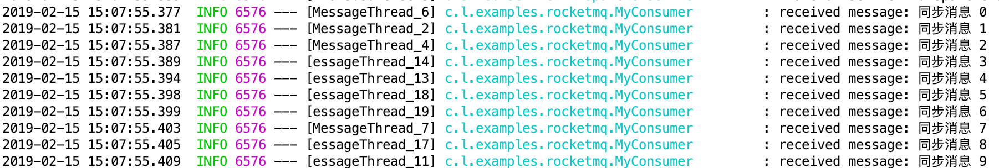

# RocketMQ 使用记录

## RocketMQ 启动

```shell
nohup sh bin/mqnamesrv &

nohup sh bin/mqbroker -n localhost:9876 autoCreateTopicEnable=true &
```

## `spring-boot-starter-rocketmq` 依赖使用记录

### maven依赖

```xml
<dependency>
    <groupId>org.rocketmq.spring.boot</groupId>
    <artifactId>rocketmq-spring-boot-starter</artifactId>
    <version>1.0.0.RELEASE</version>
</dependency>
```

### 核心配置

其中 `spring.rocketmq.nameServer` 中的 `nameServer` 不能写成 `name-server`

```yaml
spring.rocketmq.nameServer=192.168.212.75:9876;192.168.212.76:9876
spring.rocketmq.producer.group=rmq-group
```

### 核心代码

#### 生产者

```java
package com.littlefxc.examples.rocketmq;

import lombok.extern.slf4j.Slf4j;
import org.apache.rocketmq.client.exception.MQClientException;
import org.apache.rocketmq.client.producer.DefaultMQProducer;
import org.apache.rocketmq.common.message.Message;
import org.apache.rocketmq.remoting.common.RemotingHelper;
import org.rocketmq.starter.annotation.EnableRocketMQ;
import org.springframework.beans.factory.annotation.Autowired;
import org.springframework.boot.SpringApplication;
import org.springframework.boot.autoconfigure.SpringBootApplication;
import org.springframework.web.bind.annotation.RequestMapping;
import org.springframework.web.bind.annotation.RestController;

import javax.annotation.PostConstruct;
import javax.annotation.PreDestroy;

/**
 * @author fengxuechao
 * @date 2019-02-15
 */
@Slf4j
@SpringBootApplication
@EnableRocketMQ
@RestController
public class RocketMqProducerApp {

    @Autowired
    private DefaultMQProducer producer;

    public static void main(String[] args) {
        SpringApplication.run(RocketMqProducerApp.class, args);
    }

    /**
     * spring-boot-starter-rocketmq 只是初始化了生产者，但并没有启动生产者
     */
    @PostConstruct
    public void postConstruct() {
        try {
            if (producer != null) {
                producer.start();
            }
        } catch (MQClientException e) {
            e.printStackTrace();
        }
    }

    /**
     * 生产者正常关闭可以防止消息丢失
     */
    @PreDestroy
    public void preDestroy() {
        if (producer != null) {
            producer.shutdown();
        }
    }

    /**
     * 发送同步消息
     * @throws Exception
     */
    @RequestMapping("send")
    public void send() throws Exception {
        for (int i = 0; i < 10; i++) {
            Message message = new Message(
                    "Topic_A",
                    "TagA",
                    ("同步消息 " + i).getBytes(RemotingHelper.DEFAULT_CHARSET)
            );
            producer.send(message);
        }
    }

}
```

#### 消费者

```java
package com.littlefxc.examples.rocketmq;

import lombok.extern.slf4j.Slf4j;
import org.rocketmq.starter.annotation.RocketMQListener;
import org.rocketmq.starter.annotation.RocketMQMessage;
import org.springframework.stereotype.Service;

/**
 * @author fengxuechao
 * @date 2019-02-15
 */
@Slf4j
@Service
@RocketMQListener(topic = "Topic_A")
public class MyConsumer {

     @RocketMQMessage(messageClass = String.class,tag = "TagA")
     public void onMessage(String message) {
         log.info("received message: {}", message);
     }
}
```

### 程序启动

```shell
curl http://localhost:8080/send
```

#### 验证




