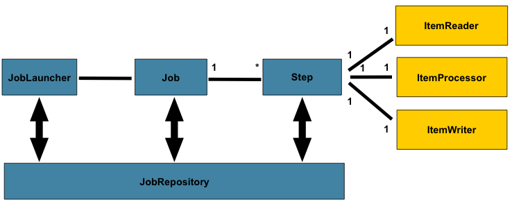

# Spring Batch CSV to XML 

学习使用Spring batch从CSV文件读取记录，并使用 `StaxEventItemWriter` 输出经过处理的记录转换为 XML 的数据。



1. JobLauncher： 顾名思义，该领域对象就是Job的启动器，其作用就是绑定一组JobParameters到Job上，然后运行该Job。

2. Job： 定义，配置批处理任务的领域对象，该对象的作用，第一是做Step的容器，配置该批处理任务需要的Step，以及他们之间的逻辑关系。第二是配置该批处理任务的特征，比方说名字，是否可重启，是否对JobParameters进行验证以及验证规则等。

3. Step： 定义批处理任务中一个对立的逻辑任务处理单元。基本上的业务逻辑处理代码都是封装在Step中的。Step有2种实现形式，一种是Tasklet形式的，这种形式非常自由，开发人员只需要实现Tasklet接口，其中的逻辑完全有自己决定，另一种是Chunk-Oriented形式的，这种形式定义了一个Step的流程必须是“读-处理（可选）-写”，当然Spring Batch也对每一个步骤提供了接口ItemReader， ItemProcessor，ItemWriter还有很多常用的默认实现（读文件，读数据库，写文件，写数据库等等）。 每一个Step只能由一个Tasklet或者一个Chunk构成。

4. JobRepository： 该领域对象会为Spring Batch的运维数据提供一种持久化机制。其为所有的运维数据的提供CRUD的操作接口，并为所有的操作提供事务支持。

## 项目概述

在这个应用程序中，我们将执行以下任务:

1. 使用 `FlatFileItemReader` 从CSV文件读取交易记录
2. 使用 `CustomItemProcessor` 进行项目的业务处理。当 `ItemReader` 读取一个项目，而 `ItemWriter` 写入它们时，
`ItemProcessor` 提供一个转换或应用其他业务处理的访问点。 
3. ~~使用 `StaxEventItemWriter` 获取 `CustomItemProcessor` 的处理结果，并将它转换成 XML 类型数据作为最终输出。~~
3. 使用 `MyBatisBatchItemWriter` 获取 `CustomItemProcessor` 的处理结果，并将它转换成 XML 类型数据作为最终输出。
4. 查看MySQL

## 工程结构


## Maven 依赖

`sqlite-jdbc` 和 `mysql-connector-java` 可以选择其中一个。
当选择其中一种时，同时也要在 `applicationContext.xml` 文件中做出相应的改动。

改动:

- 依赖的版本由 `platform-bom` 来统一管理
- 添加 `mybatis`, `mybatis-spring`

```xml
<?xml version="1.0" encoding="UTF-8"?>
<project xmlns="http://maven.apache.org/POM/4.0.0"
         xmlns:xsi="http://www.w3.org/2001/XMLSchema-instance"
         xsi:schemaLocation="http://maven.apache.org/POM/4.0.0 http://maven.apache.org/xsd/maven-4.0.0.xsd">
    <modelVersion>4.0.0</modelVersion>

    <groupId>com.littlefxc.example</groupId>
    <artifactId>Spring-CSV-to-DB</artifactId>
    <version>1.0-snapshot</version>

    <properties>
        <project.build.sourceEncoding>UTF-8</project.build.sourceEncoding>
        <spring.version>5.0.9.RELEASE</spring.version>
        <spring.batch.version>4.0.1.RELEASE</spring.batch.version>
        <sqlite.version>3.8.11.2</sqlite.version>
        <mysql.version>5.1.47</mysql.version>
    </properties>

    <dependencyManagement>
        <dependencies>
            <dependency>
                <groupId>io.spring.platform</groupId>
                <artifactId>platform-bom</artifactId>
                <version>Cairo-RELEASE</version>
                <type>pom</type>
                <scope>import</scope>
            </dependency>
        </dependencies>
    </dependencyManagement>

    <dependencies>
        <!-- MySQL database driver -->
        <dependency>
            <groupId>mysql</groupId>
            <artifactId>mysql-connector-java</artifactId>
        </dependency>
        <!-- spring的XML文件处理依赖 -->
        <dependency>
            <groupId>org.springframework</groupId>
            <artifactId>spring-oxm</artifactId>
        </dependency>
        <dependency>
            <groupId>org.mybatis</groupId>
            <artifactId>mybatis</artifactId>
            <version>3.5.0</version>
        </dependency>
        <dependency>
            <groupId>org.mybatis</groupId>
            <artifactId>mybatis-spring</artifactId>
            <version>2.0.0</version>
        </dependency>
        <dependency>
            <groupId>org.springframework</groupId>
            <artifactId>spring-jdbc</artifactId>
        </dependency>
        <dependency>
            <groupId>org.springframework.batch</groupId>
            <artifactId>spring-batch-core</artifactId>
        </dependency>
        <dependency>
            <groupId>org.projectlombok</groupId>
            <artifactId>lombok</artifactId>
        </dependency>
    </dependencies>

</project>
```

## applicationContext.xml

我们将使用 `FlatFileItemReader` 读取 CSV 文件。
我们将使用它的标准配置，包括 `DefaultLineMapper`，`DelimitedLineTokenizer` 和 `BeanWrapperFieldSetMapper` 类。
为了在XML文件中输出记录，我们将使用 `StaxEventItemWriter` 作为标准编写器。

改动：

- 将输出XML变为输出到mysql
- Spring Batch 持久层框架由 `spring-jdbc` 改为 `mybatis`, `mybatis-spring` 

当然，原来的输出 `itemWriter` 去掉注释后，仍然起作用

```xml
<?xml version="1.0" encoding="UTF-8"?>
<beans xmlns="http://www.springframework.org/schema/beans"
       xmlns:xsi="http://www.w3.org/2001/XMLSchema-instance"
       xmlns:jdbc="http://www.springframework.org/schema/jdbc"
       xmlns:batch="http://www.springframework.org/schema/batch"
       xmlns:p="http://www.springframework.org/schema/p"
       xmlns:context="http://www.springframework.org/schema/context"
       xmlns:tx="http://www.springframework.org/schema/tx"
       xsi:schemaLocation="
       http://www.springframework.org/schema/beans http://www.springframework.org/schema/beans/spring-beans.xsd
       http://www.springframework.org/schema/jdbc http://www.springframework.org/schema/jdbc/spring-jdbc.xsd
       http://www.springframework.org/schema/batch http://www.springframework.org/schema/batch/spring-batch.xsd
       http://www.springframework.org/schema/context http://www.springframework.org/schema/context/spring-context.xsd
       http://www.springframework.org/schema/tx http://www.springframework.org/schema/tx/spring-tx.xsd">

    <context:property-placeholder location="classpath:application.properties"/>
    <context:component-scan base-package="com.littlefxc.examples.batch"/>

    <!-- 1. 数据库脚本：这里是为了方便起见保证每次重启程序数据库都是最新的（生产环境中不要这么做!!!） -->
    <jdbc:initialize-database>
        <jdbc:script location="${batch.schema-drop}"/>
        <jdbc:script location="${batch.schema-create}"/>
        <jdbc:script location="${project.schema-drop}"/>
        <jdbc:script location="${project.schema-create}"/>
    </jdbc:initialize-database>

    <!-- 2. 连接数据库：可以选择其它的数据源实现 -->
    <bean id="dataSource" class="org.springframework.jdbc.datasource.DriverManagerDataSource"
          p:driverClassName="${jdbc.driver-class-name}"
          p:url="${jdbc.url}"
          p:username="${jdbc.username}"
          p:password="${jdbc.password}"/>

    <!-- 3. 事务管理 -->
    <!--<bean id="transactionManager" class="org.springframework.batch.support.transactionRecord.ResourcelessTransactionManager"/>-->
    <bean id="transactionManager" class="org.springframework.jdbc.datasource.DataSourceTransactionManager"
          p:dataSource-ref="dataSource"/>

    <!-- 3.1 申明式事务 -->
    <tx:annotation-driven/>

    <!-- 3.2 mybatis 配置 -->
    <bean id="sqlSessionFactory" class="org.mybatis.spring.SqlSessionFactoryBean"
          p:dataSource-ref="dataSource"
          p:typeAliasesPackage="${mybatis.type-aliases-package}"
          p:configLocation="${mybatis.configuration}"/>

    <!-- 3.3 mybatis dao 配置 -->
    <bean class="org.mybatis.spring.mapper.MapperScannerConfigurer"
          p:basePackage="com.littlefxc.examples.batch.dao"
          p:sqlSessionFactoryBeanName="sqlSessionFactory"/>

    <!-- 4. 为JobLauncher，Job和Step实现提供CRUD操作 -->
    <bean id="jobRepository" class="org.springframework.batch.core.repository.support.JobRepositoryFactoryBean"
          p:dataSource-ref="dataSource"
          p:transactionManager-ref="transactionManager"
          p:databaseType="mysql"/>

    <!-- 5. JobLauncher表示一个简单的接口，用于使用给定的 JobParameter 启动作业 -->
    <bean id="jobLauncher" class="org.springframework.batch.core.launch.support.SimpleJobLauncher"
          p:jobRepository-ref="jobRepository"/>

    <!-- 6. batch 输入 -->
    <bean id="itemReader" class="org.springframework.batch.item.file.FlatFileItemReader">
        <!-- 输入资源 -->
        <property name="resource" value="input/record.csv"/>
        <!-- 不读取第一行数据 -->
        <property name="linesToSkip" value="1"/>
        <!-- 将输入资源转化为对象 -->
        <property name="lineMapper">
            <bean class="org.springframework.batch.item.file.mapping.DefaultLineMapper">
                <property name="lineTokenizer">
                    <bean class="org.springframework.batch.item.file.transform.DelimitedLineTokenizer">
                        <property name="names" value="username,user_id,transaction_date,transaction_amount"/>
                    </bean>
                </property>
                <property name="fieldSetMapper" ref="recordFieldSetMapper"/>
            </bean>
        </property>
    </bean>

    <!-- 7. batch的处理器 -->
    <bean id="itemProcessor" class="com.littlefxc.examples.batch.service.CustomItemProcessor"/>

    <!-- 8. batch 输出:输出为xml -->
    <!--<bean id="itemWriter" class="org.springframework.batch.item.xml.StaxEventItemWriter">
        <property name="resource" value="file:xml/output.xml"/>
        <property name="marshaller">
            &lt;!&ndash; xml 与 对象的转换器 &ndash;&gt;
            <bean class="org.springframework.oxm.jaxb.Jaxb2Marshaller"
                  p:packagesToScan="com.littlefxc.examples.batch.model"/>
        </property>
        <property name="rootTagName" value="transactionRecord"/>
    </bean>-->
    <!-- 8. batch 输出:输出到mysql -->
    <!--<bean id="itemWriter" class="org.springframework.batch.item.database.JdbcBatchItemWriter"
          p:dataSource-ref="dataSource" p:sql="${batch.sql}">
        <property name="itemSqlParameterSourceProvider">
            <bean class="org.springframework.batch.item.database.BeanPropertyItemSqlParameterSourceProvider"/>
        </property>
    </bean>-->
    <!-- 8. batch 输出:使用 mybatis 输出到mysql -->
    <bean id="itemWriter" class="org.mybatis.spring.batch.MyBatisBatchItemWriter">
        <property name="sqlSessionFactory" ref="sqlSessionFactory"/>
        <!-- 与 mybatis 关联的 dao 层的接口名：com.littlefxc.examples.batch.dao.TransactionRecordDao.insertTransactionRecord -->
        <property name="statementId" value="insertTransactionRecord"/>
    </bean>

    <!-- 9. 配置batch的输入(6)、处理器(7)、输出(8) -->
    <!-- commit-interval:提交事务之前将处理的项目数。 -->
    <batch:job id="firstBatchJob">
        <batch:step id="step1">
            <batch:tasklet>
                <batch:chunk reader="itemReader" processor="itemProcessor" writer="itemWriter" commit-interval="2"/>
            </batch:tasklet>
        </batch:step>
    </batch:job>

</beans>
```

## RecordFieldSetMapper

`ItemReader` 的属性，作用是将 `FieldSet` 转换为对象

```java
package com.littlefxc.examples.batch.service;

import com.littlefxc.examples.batch.model.TransactionRecord;
import org.springframework.batch.item.file.mapping.FieldSetMapper;
import org.springframework.batch.item.file.transform.FieldSet;
import org.springframework.validation.BindException;

import java.text.ParseException;
import java.text.SimpleDateFormat;

/**
 * 将 FieldSet 转换为对象
 * @author fengxuechao
 * @date 2019/1/4
 **/
public class RecordFieldSetMapper implements FieldSetMapper<Transaction> {

    public Transaction mapFieldSet(FieldSet fieldSet) throws BindException {
        SimpleDateFormat dateFormat = new SimpleDateFormat("dd/MM/yyyy");
        Transaction transactionRecord = new Transaction();

        transactionRecord.setUsername(fieldSet.readString("username"));
        transactionRecord.setUserId(fieldSet.readInt("user_id"));
        transactionRecord.setAmount(fieldSet.readDouble("transaction_amount"));
        String dateString = fieldSet.readString("transaction_date");
        try {
            transactionRecord.setTransactionDate(dateFormat.parse(dateString));
        } catch (ParseException e) {
            e.printStackTrace();
        }
        return transactionRecord;
    }
}
```

## CustomItemProcessor

自定义实现接口 `ItemProcessor`, 作为 `ItemReader` 和 `ItemWriter` 的转换点。

```java
package com.littlefxc.examples.batch.service;

import com.littlefxc.examples.batch.model.TransactionRecord;
import org.springframework.batch.item.file.mapping.FieldSetMapper;
import org.springframework.batch.item.file.transform.FieldSet;
import org.springframework.validation.BindException;

import java.text.ParseException;
import java.text.SimpleDateFormat;

/**
 * 将读取到的数据集合转换为对象
 * @author fengxuechao
 * @date 2019/1/4
 **/
public class RecordFieldSetMapper implements FieldSetMapper<Transaction> {

    public Transaction mapFieldSet(FieldSet fieldSet) throws BindException {
        SimpleDateFormat dateFormat = new SimpleDateFormat("dd/MM/yyyy");
        Transaction transactionRecord = new Transaction();

        transactionRecord.setUsername(fieldSet.readString("username"));
        transactionRecord.setUserId(fieldSet.readInt("user_id"));
        transactionRecord.setAmount(fieldSet.readDouble("transaction_amount"));
        String dateString = fieldSet.readString("transaction_date");
        try {
            transactionRecord.setTransactionDate(dateFormat.parse(dateString));
        } catch (ParseException e) {
            e.printStackTrace();
        }
        return transactionRecord;
    }
}
```

## 模型

```java
package com.littlefxc.examples.batch.model;

import lombok.Data;

import javax.xml.bind.annotation.XmlRootElement;
import java.util.Date;

/**
 * @author fengxuechao
 */
@Data
@XmlRootElement(name = "transactionRecord")
public class Transaction {

    private String username;

    private int userId;

    private Date transactionDate;

    private double amount;
}
```

## record.csv

```csv
devendra, 1234, 31/10/2015, 10000
john    , 2134, 3/12/2015 , 12321
robin   , 2134, 2/02/2015 , 23411
```

## 启动程序

```java
package com.littlefxc.examples.batch;

import org.springframework.batch.core.Job;
import org.springframework.batch.core.JobExecution;
import org.springframework.batch.core.JobParameters;
import org.springframework.batch.core.launch.JobLauncher;
import org.springframework.context.support.ClassPathXmlApplicationContext;

public class App {
    public static void main(String[] args) {
        ClassPathXmlApplicationContext context = new ClassPathXmlApplicationContext();
        context.setConfigLocations("classpath:spring-context.xml");
        context.refresh();

        JobLauncher jobLauncher = (JobLauncher) context.getBean("jobLauncher");
        Job job = (Job) context.getBean("firstBatchJob");
        System.out.println("Starting the batch job");
        try {
            JobExecution execution = jobLauncher.run(job, new JobParameters());
            System.out.println("Job Status : " + execution.getStatus());
            System.out.println("Job completed");
        } catch (Exception e) {
            e.printStackTrace();
            System.out.println("Job failed");
        }
    }
}
```

## 验证

```xml
<?xml version="1.0" encoding="UTF-8"?>
<transactionRecord>
    <transactionRecord>
        <amount>10000.0</amount>
        <transactionDate>2015-10-31T00:00:00+08:00</transactionDate>
        <userId>1234</userId>
        <username>devendra</username>
    </transactionRecord>
    <transactionRecord>
        <amount>12321.0</amount>
        <transactionDate>2015-12-03T00:00:00+08:00</transactionDate>
        <userId>2134</userId>
        <username>john</username>
    </transactionRecord>
    <transactionRecord>
        <amount>23411.0</amount>
        <transactionDate>2015-02-02T00:00:00+08:00</transactionDate>
        <userId>2134</userId>
        <username>robin</username>
    </transactionRecord>
</transactionRecord>
```