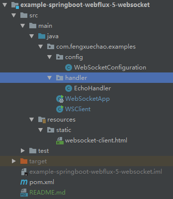
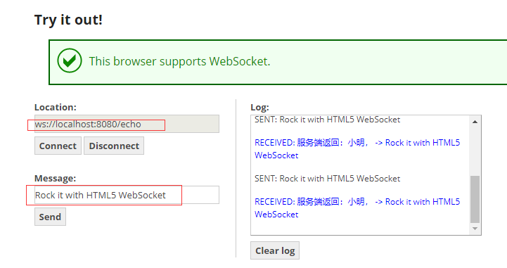

# WebFlux 中 WebSocket 实现通信

## 前言

WebFlux 该模块中包含了对反应式 HTTP、服务器推送事件和 WebSocket 的客户端和服务器端的支持。这里我们简单实践下 WebFlux 中 WebSocket 实现通信。

## 什么是 WebSocket

WebSocket 是一种通信协议，类比下 HTTP 协议，HTTP 协议只能有客户端发起请求，然后得到响应。 一般通过 HTTP 的轮询方式，实现 WebSocket 类似功能。

因为轮询，每次新建连接，请求响应，浪费资源。WebSocket 就出现了，它支持客户端和服务端双向通讯。类似 http 和 https，WebSocket 的标识符为 ws 和 wss，案例地址为：

```
ws://localhost:8080/echo
```

## 项目结构



目录核心如下：

- EchoHandler websocket 处理类（类似 HTTP Servlet 处理）
- WebSocketConfiguration websocket 配置类
- websocket-client.html HTML 客户端实现
- WSClient java 客户端实现

## EchoHandler 处理类

```java
@Component
public class EchoHandler implements WebSocketHandler {

    @Override
    public Mono<Void> handle(final WebSocketSession session) {
        return session.send(
                session.receive()
                        .map(msg -> {
                            String s = "服务端返回：小明， -> " + msg.getPayloadAsText();
                            System.out.println(s);
                            return session.textMessage(s);
                        }));
    }
}
```

代码详解：

1. WebSocketHandler 接口，实现该接口来处理 WebSokcet 消息。
2. handle(WebSocketSession session) 方法，接收 WebSocketSession 对象，即获取客户端信息、发送消息和接收消息的操作对象。
3. receive() 方法，接收消息，使用 map 操作获取的 Flux 中包含的消息持续处理，并拼接出返回消息 Flux 对象。
4. send() 方法，发送消息。消息为“服务端返回：小明， -> ”开头的。

## WebSocketConfiguration 配置类

```java
@Configuration
public class WebSocketConfiguration {

    @Autowired
    @Bean
    public HandlerMapping webSocketMapping(final EchoHandler echoHandler) {
        final Map<String, WebSocketHandler> map = new HashMap<>(8);
        map.put("/echo", echoHandler);

        final SimpleUrlHandlerMapping mapping = new SimpleUrlHandlerMapping();
        mapping.setOrder(Ordered.HIGHEST_PRECEDENCE);
        mapping.setUrlMap(map);
        return mapping;
    }

    @Bean
    public WebSocketHandlerAdapter handlerAdapter() {
        return new WebSocketHandlerAdapter();
    }
}
```

代码详解：

- WebSocketHandlerAdapter 负责将 EchoHandler 处理类适配到 WebFlux 容器中；
- SimpleUrlHandlerMapping 指定了 WebSocket 的路由配置；
- 使用 map 指定 WebSocket 协议的路由，路由为 ws://localhost:8080/echo。

## 启动

启动程序。

打开 https://www.websocket.org/echo.html网页，大多数浏览器是支持 WebSokcet 协议的。



