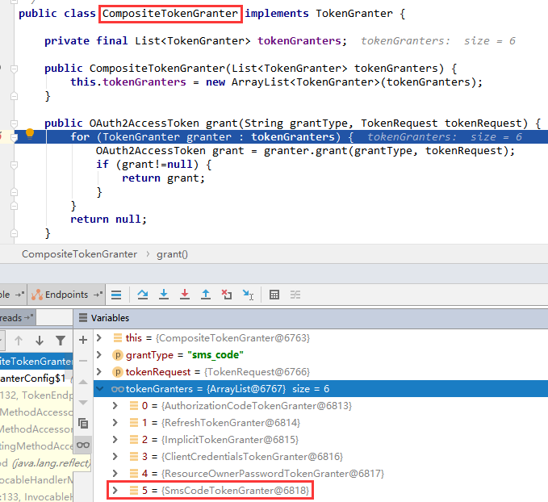

# Spring Security Oauth2 如何增加自定义授权类型

在 oauth2 的授权模式中有4种：

- 授权码模式
- 隐式授权模式
- 密码模式
- 客户端模式

但如果我们想要增加一个自定义的授权模式，又该怎么做呢？

相关的源码是这样的：

```java
public class CompositeTokenGranter implements TokenGranter {

	private final List<TokenGranter> tokenGranters;

	public CompositeTokenGranter(List<TokenGranter> tokenGranters) {
		this.tokenGranters = new ArrayList<TokenGranter>(tokenGranters);
	}
	
	//四种授权模式+刷新令牌的模式根据grant_type判断
	public OAuth2AccessToken grant(String grantType, TokenRequest tokenRequest) {
		for (TokenGranter granter : tokenGranters) {
			OAuth2AccessToken grant = granter.grant(grantType, tokenRequest);
			if (grant!=null) {
				return grant;
			}
		}
		return null;
	}
	
	public void addTokenGranter(TokenGranter tokenGranter) {
		if (tokenGranter == null) {
			throw new IllegalArgumentException("Token granter is null");
		}
		tokenGranters.add(tokenGranter);
	}

}
```

oauth2 端点配置类部分源码：

```java
public final class AuthorizationServerEndpointsConfigurer {
    
    // 省略部分代码
    
    private TokenGranter tokenGranter;
    
    public AuthorizationServerEndpointsConfigurer tokenGranter(TokenGranter tokenGranter) {
    	this.tokenGranter = tokenGranter;
    	return this;
    }
    
    // 默认的四种授权模式+刷新令牌的模式的配置
    private TokenGranter tokenGranter() {
    	if (tokenGranter == null) {
    		tokenGranter = new TokenGranter() {
    			private CompositeTokenGranter delegate;
    
    			@Override
    			public OAuth2AccessToken grant(String grantType, TokenRequest tokenRequest) {
    				if (delegate == null) {
    					delegate = new CompositeTokenGranter(getDefaultTokenGranters());
    				}
    				return delegate.grant(grantType, tokenRequest);
    			}
    		};
    	}
    	return tokenGranter;
    }
    
    // 默认的四种授权模式+刷新令牌的模式的配置
    private List<TokenGranter> getDefaultTokenGranters() {
    	ClientDetailsService clientDetails = clientDetailsService();
    	AuthorizationServerTokenServices tokenServices = tokenServices();
    	AuthorizationCodeServices authorizationCodeServices = authorizationCodeServices();
    	OAuth2RequestFactory requestFactory = requestFactory();
    	
    	List<TokenGranter> tokenGranters = new ArrayList<TokenGranter>();
    	// 添加授权码模式
    	tokenGranters.add(new AuthorizationCodeTokenGranter(tokenServices, authorizationCodeServices, clientDetails,
    			requestFactory));
    	// 添加刷新令牌的模式
    	tokenGranters.add(new RefreshTokenGranter(tokenServices, clientDetails, requestFactory));
    	// 添加隐式授权模式
    	ImplicitTokenGranter implicit = new ImplicitTokenGranter(tokenServices, clientDetails, requestFactory);
    	tokenGranters.add(implicit);
    	// 添加客户端模式
    	tokenGranters.add(new ClientCredentialsTokenGranter(tokenServices, clientDetails, requestFactory));
    	if (authenticationManager != null) {
    	    // 添加密码模式
    		tokenGranters.add(new ResourceOwnerPasswordTokenGranter(authenticationManager, tokenServices,
    				clientDetails, requestFactory));
    	}
    	
    	// 可以复制相关代码，然后这里添加自定义的授权模式
    	
    	return tokenGranters;
    }
}
```

看到这里就可以发现 spring 已经把默认的四种授权模式+刷新令牌的模式的配置在代码中写死了!

那又如何添加自定义的授权模式呢？

我的思路是这样的：

直接把这部分的代码复制，在其中添加自定义的授权模式。

我直接把密码模式复制，将其中的 `GRANT_TYPE` 的值改为 `sms_code`,然后使用 `/oauth/token?grant_type=sms_code&scope=read&username=user&password=123456` 来验证结果。

## 自定义授权模式：SmsCodeTokenGranter

```java
/**
 * @author fengxuechao
 * @version 0.1
 * @date 2019/5/17
 */
public class SmsCodeTokenGranter extends AbstractTokenGranter {

    // 仅仅复制了 ResourceOwnerPasswordTokenGranter，只是改变了 GRANT_TYPE 的值，来验证自定义授权模式的可行性
    private static final String GRANT_TYPE = "sms_code";

    private final AuthenticationManager authenticationManager;

    public SmsCodeTokenGranter(
            AuthenticationManager authenticationManager,
            AuthorizationServerTokenServices tokenServices,
            ClientDetailsService clientDetailsService,
            OAuth2RequestFactory requestFactory) {
        this(authenticationManager, tokenServices, clientDetailsService, requestFactory, GRANT_TYPE);

    }

    protected SmsCodeTokenGranter(
            AuthenticationManager authenticationManager,
            AuthorizationServerTokenServices tokenServices,
            ClientDetailsService clientDetailsService,
            OAuth2RequestFactory requestFactory,
            String grantType) {
        super(tokenServices, clientDetailsService, requestFactory, grantType);
        this.authenticationManager = authenticationManager;
    }

    @Override
    protected OAuth2Authentication getOAuth2Authentication(ClientDetails client, TokenRequest tokenRequest) {
        Map<String, String> parameters = new LinkedHashMap<String, String>(tokenRequest.getRequestParameters());
        String username = parameters.get("username");
        String password = parameters.get("password");
        // Protect from downstream leaks of password
        parameters.remove("password");

        Authentication userAuth = new UsernamePasswordAuthenticationToken(username, password);
        ((AbstractAuthenticationToken) userAuth).setDetails(parameters);
        try {
            userAuth = authenticationManager.authenticate(userAuth);
        } catch (AccountStatusException ase) {
            //covers expired, locked, disabled cases (mentioned in section 5.2, draft 31)
            throw new InvalidGrantException(ase.getMessage());
        } catch (BadCredentialsException e) {
            // If the username/password are wrong the spec says we should send 400/invalid grant
            throw new InvalidGrantException(e.getMessage());
        }
        if (userAuth == null || !userAuth.isAuthenticated()) {
            throw new InvalidGrantException("Could not authenticate user: " + username);
        }

        OAuth2Request storedOAuth2Request = getRequestFactory().createOAuth2Request(client, tokenRequest);
        return new OAuth2Authentication(storedOAuth2Request, userAuth);
    }
}
```

## 授权模式配置类：TokenGranterConfig

```java
/**
 * @author fengxuechao
 * @version 0.1
 * @date 2019/5/17
 */
@Configuration
@Profile("inMemory")
public class TokenGranterConfig {

    @Autowired
    private ClientDetailsService clientDetailsService;

    @Autowired
    private UserDetailsService userDetailsService;

    @Autowired
    private AuthenticationManager authenticationManager;

    @Autowired
    private TokenStore tokenStore;

    @Autowired
    TokenEnhancer tokenEnhancer;

    private AuthorizationCodeServices authorizationCodeServices;

    private boolean reuseRefreshToken = true;

    private AuthorizationServerTokenServices tokenServices;

    private TokenGranter tokenGranter;

    /**
     * 授权模式
     *
     * @return
     */
    @Bean
    public TokenGranter tokenGranter() {
        if (tokenGranter == null) {
            tokenGranter = new TokenGranter() {
                private CompositeTokenGranter delegate;

                @Override
                public OAuth2AccessToken grant(String grantType, TokenRequest tokenRequest) {
                    if (delegate == null) {
                        delegate = new CompositeTokenGranter(getDefaultTokenGranters());
                    }
                    return delegate.grant(grantType, tokenRequest);
                }
            };
        }
        return tokenGranter;
    }

    /**
     * 程序支持的授权类型
     *
     * @return
     */
    private List<TokenGranter> getDefaultTokenGranters() {
        AuthorizationServerTokenServices tokenServices = tokenServices();
        AuthorizationCodeServices authorizationCodeServices = authorizationCodeServices();
        OAuth2RequestFactory requestFactory = requestFactory();

        List<TokenGranter> tokenGranters = new ArrayList<TokenGranter>();
        // 添加授权码模式
        tokenGranters.add(new AuthorizationCodeTokenGranter(tokenServices, authorizationCodeServices, clientDetailsService, requestFactory));
        // 添加刷新令牌的模式
        tokenGranters.add(new RefreshTokenGranter(tokenServices, clientDetailsService, requestFactory));
        // 添加隐士授权模式
        tokenGranters.add(new ImplicitTokenGranter(tokenServices, clientDetailsService, requestFactory));
        // 添加客户端模式
        tokenGranters.add(new ClientCredentialsTokenGranter(tokenServices, clientDetailsService, requestFactory));
        if (authenticationManager != null) {
            // 添加密码模式
            tokenGranters.add(new ResourceOwnerPasswordTokenGranter(authenticationManager, tokenServices, clientDetailsService, requestFactory));
            // 添加自定义授权模式（实际是密码模式的复制）
            tokenGranters.add(new SmsCodeTokenGranter(authenticationManager, tokenServices, clientDetailsService, requestFactory));
        }
        return tokenGranters;
    }

    /**
     * TokenServices
     *
     * @return
     */
    private AuthorizationServerTokenServices tokenServices() {
        if (tokenServices != null) {
            return tokenServices;
        }
        this.tokenServices = createDefaultTokenServices();
        return tokenServices;
    }

    /**
     * 授权码API
     *
     * @return
     */
    private AuthorizationCodeServices authorizationCodeServices() {
        if (authorizationCodeServices == null) {
            authorizationCodeServices = new InMemoryAuthorizationCodeServices();
        }
        return authorizationCodeServices;
    }

    /**
     * OAuth2RequestFactory的默认实现，它初始化参数映射中的字段，
     * 验证授权类型(grant_type)和范围(scope)，并使用客户端的默认值填充范围(scope)（如果缺少这些值）。
     *
     * @return
     */
    private OAuth2RequestFactory requestFactory() {
        return new DefaultOAuth2RequestFactory(clientDetailsService);
    }

    /**
     * 默认 TokenService
     *
     * @return
     */
    private DefaultTokenServices createDefaultTokenServices() {
        DefaultTokenServices tokenServices = new DefaultTokenServices();
        tokenServices.setTokenStore(tokenStore);
        tokenServices.setSupportRefreshToken(true);
        tokenServices.setReuseRefreshToken(reuseRefreshToken);
        tokenServices.setClientDetailsService(clientDetailsService);
        tokenServices.setTokenEnhancer(tokenEnhancer);
        addUserDetailsService(tokenServices, this.userDetailsService);
        return tokenServices;
    }

    /**
     * 添加预身份验证
     *
     * @param tokenServices
     * @param userDetailsService
     */
    private void addUserDetailsService(DefaultTokenServices tokenServices, UserDetailsService userDetailsService) {
        if (userDetailsService != null) {
            PreAuthenticatedAuthenticationProvider provider = new PreAuthenticatedAuthenticationProvider();
            provider.setPreAuthenticatedUserDetailsService(new UserDetailsByNameServiceWrapper<PreAuthenticatedAuthenticationToken>(userDetailsService));
            tokenServices.setAuthenticationManager(new ProviderManager(Arrays.<AuthenticationProvider>asList(provider)));
        }
    }
}
```

## 授权认证服务端点配置

```java
package com.fengxuechao.examples.auth.config.inmemory;
/**
 * @author fengxuechao
 * @version 0.1
 * @date 2019/5/8
 */
@Slf4j
@EnableAuthorizationServer
@Configuration
@Profile("inMemory")
public class AuthorizationServerConfigInMemory extends AuthorizationServerConfigurerAdapter {

    // 省略部分代码
    
    @Autowired
    private TokenGranter tokenGranter;

    /**
     * 认证服务器节点配置
     *
     * @param endpoints
     * @throws Exception
     */
    @Override
    public void configure(AuthorizationServerEndpointsConfigurer endpoints) throws Exception {
        endpoints
                .tokenGranter(tokenGranter) // 四种授权模式+刷新令牌的模式+自定义授权模式
                .tokenStore(tokenStore)
                .approvalStore(approvalStore)
                .userDetailsService(userDetailsService)
                .authenticationManager(authenticationManager)
                .setClientDetailsService(clientDetailsService);
    }
}
```

## 演示效果



```http request
POST http://localhost:8080/oauth/token?grant_type=sms_code&scope=read&username=user&password=123456

HTTP/1.1 200 
X-Application-Context: application:inMemory
Cache-Control: no-store
Pragma: no-cache
X-Content-Type-Options: nosniff
X-XSS-Protection: 1; mode=block
X-Frame-Options: DENY
Content-Type: application/json;charset=UTF-8
Transfer-Encoding: chunked
Date: Tue, 18 Jun 2019 07:13:12 GMT

{
  "access_token": "19f2e44a-6c9a-45c4-be7e-0aada6a0a9e6",
  "token_type": "bearer",
  "refresh_token": "f59336a8-03c4-4c85-bc31-16c6d80f1381",
  "expires_in": 359,
  "scope": "read",
  "organization": "userWqTI"
}

Response code: 200; Time: 335ms; Content length: 190 bytes
```
