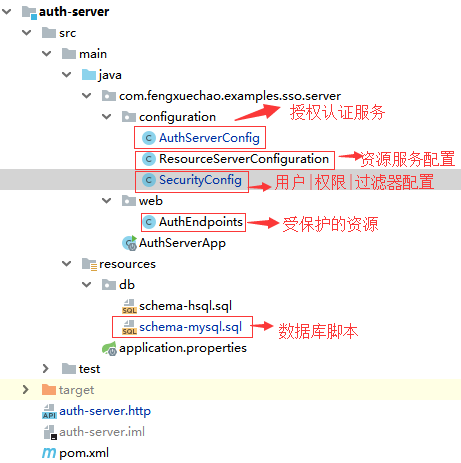
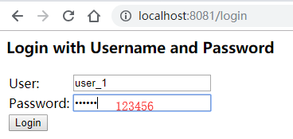
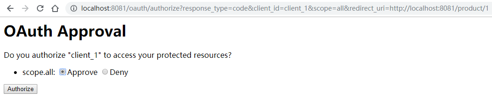
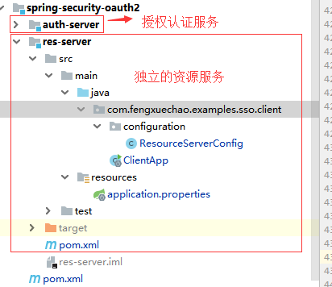

# Spring-Security-Oauth2第一篇

## 1. Oauth 介绍

OAuth 是一个关于授权（authorization）的开放网络标准，在全世界得到广泛应用，目前的版本是2.0版。

OAuth 是一个开放标准，允许用户让第三方应用访问该用户在某一网站上存储的私密的资源（如照片，视频，联系人列表），
而不需要将用户名和密码提供给第三方应用。OAuth允许用户提供一个令牌，而不是用户名和密码来访问他们存放在特定服务提供者的数据。
每一个令牌授权一个特定的网站在特定的时段内访问特定的资源。这样，OAuth让用户可以授权第三方网站访问他们存储在另外服务提供者的某些特定信息。
更多OAuth2请参考理解[OAuth 2.0](http://www.ruanyifeng.com/blog/2014/05/oauth_2_0.html)

## 2. Spring Security Oauth2 的使用

### 2.1. 使用MySQL存储 access_token 和 client 信息

在学习过程中，很多示例中，所有的token信息都是保存在内存中的，这显然无法在生产环境中使用(进程结束后所有token丢失, 用户需要重新授权)，
也不利于我们的学习，因此需要将这些信息进行持久化操作。

授权服务器中的数据存储到数据库中并不难 `spring-security-oauth2` 已经为我们设计好了一套Schema和对应的DAO对象。
但在使用之前，我们需要先对相关的类有一定的了解。

### 2.2. 数据结构脚本

`spring-security-oauth2` 为我们提供了 Schema：

[https://github.com/spring-projects/spring-security-oauth/blob/master/spring-security-oauth2/src/test/resources/schema.sql](https://github.com/spring-projects/spring-security-oauth/blob/master/spring-security-oauth2/src/test/resources/schema.sql)

> 注意: 框架所提供的数据脚本适用于 HSQL，语句中会有某些字段为 `LONGVARBINARY` 类型，它对应 MYSQL 的 `BLOB` 类型。

### 2.3. 相关的接口

`spring-security-oauth2` 通过 `DefaultTokenServices` 类来完成 token 生成、过期等 OAuth2 标准规定的业务逻辑，
而 `DefaultTokenServices` 又是通过 `TokenStore` 接口完成对生成数据的持久化。

对于 Token 信息，本篇文章使用 `JdbcTokenStore`，在生产环境中更喜爱使用 `RedisTokenStore`。

对于 Client 信息，本篇文章使用 `JdbcClientDetailsService`。

### 2.4. 服务类型

OAuth2 在服务提供者上可分为两类：

- 授权认证服务：AuthenticationServer

    ```java
    @Configuration
    @EnableAuthorizationServer
    public class AuthServerConfig extends AuthorizationServerConfigurerAdapter {}
    ```

- 资源获取服务：ResourceServer

    ```java
    @Configuration
    @EnableResourceServer
    public class ResourceServerConfiguration extends ResourceServerConfigurerAdapter {}
    ```

> 注意：这两者有时候可能存在同一个应用程序中（即SOA架构）。在Spring OAuth中可以简便的将其分配到两个应用中（即微服务），而且可多个资源获取服务共享一个授权认证服务。

### 2.5. 项目结构和 maven 依赖

前面浅尝辄止的讲述了一些原理，下面的内容是示例展示。



```xml
<dependencies>
    <dependency>
        <groupId>org.springframework.boot</groupId>
        <artifactId>spring-boot-starter-security</artifactId>
    </dependency>
    <!-- oauth2 核心依赖 -->
    <dependency>
        <groupId>org.springframework.security.oauth</groupId>
        <artifactId>spring-security-oauth2</artifactId>
    </dependency>
    <dependency>
        <groupId>org.springframework.boot</groupId>
        <artifactId>spring-boot-starter-web</artifactId>
    </dependency>
    <!-- 将token存储在redis中 -->
    <dependency>
        <groupId>org.springframework.boot</groupId>
        <artifactId>spring-boot-starter-data-redis</artifactId>
    </dependency>
    <dependency>
        <groupId>org.springframework.boot</groupId>
        <artifactId>spring-boot-starter-actuator</artifactId>
    </dependency>
    <dependency>
        <groupId>com.alibaba</groupId>
        <artifactId>druid-spring-boot-starter</artifactId>
        <version>1.1.10</version>
    </dependency>
    <dependency>
        <groupId>mysql</groupId>
        <artifactId>mysql-connector-java</artifactId>
    </dependency>
</dependencies>
```

#### 2.5.1. 配置授权认证服务

```java
package com.fengxuechao.examples.sso.server.configuration;

import org.springframework.beans.factory.annotation.Autowired;
import org.springframework.context.annotation.Bean;
import org.springframework.context.annotation.Configuration;
import org.springframework.security.authentication.AuthenticationManager;
import org.springframework.security.oauth2.config.annotation.configurers.ClientDetailsServiceConfigurer;
import org.springframework.security.oauth2.config.annotation.web.configuration.AuthorizationServerConfigurerAdapter;
import org.springframework.security.oauth2.config.annotation.web.configuration.EnableAuthorizationServer;
import org.springframework.security.oauth2.config.annotation.web.configurers.AuthorizationServerEndpointsConfigurer;
import org.springframework.security.oauth2.config.annotation.web.configurers.AuthorizationServerSecurityConfigurer;
import org.springframework.security.oauth2.provider.client.JdbcClientDetailsService;
import org.springframework.security.oauth2.provider.token.TokenStore;
import org.springframework.security.oauth2.provider.token.store.JdbcTokenStore;

import javax.sql.DataSource;

/**
 * @author fengxuechao
 * @date 2019/3/26
 */
@Configuration
@EnableAuthorizationServer
public class AuthServerConfig extends AuthorizationServerConfigurerAdapter {

    private static final String DEMO_RESOURCE_ID = "*";

    @Autowired
    AuthenticationManager authenticationManager;

    @Autowired
    private DataSource dataSource;

    /**
     * 声明TokenStore实现
     *
     * @return
     */
    @Bean
    public TokenStore tokenStore() {
        return new JdbcTokenStore(dataSource);
    }

    /**
     * 声明 ClientDetails实现
     *
     * @return
     */
    @Bean
    public JdbcClientDetailsService clientDetailsService() {
        return new JdbcClientDetailsService(dataSource);
    }

    /**
     * 第三方用户客户端详情
     * Grant Type代表当前授权的类型：
     * <p>
     *     authorization_code：传统的授权码模式<br>
     *     implicit：隐式授权模式<br>
     *     password：资源所有者（即用户）密码模式<br>
     *     client_credentials：客户端凭据（客户端ID以及Key）模式<br>
     *     refresh_token：获取access token时附带的用于刷新新的token模式
     * </p>
     *
     * @param clients
     * @throws Exception
     */
    @Override
    public void configure(ClientDetailsServiceConfigurer clients) throws Exception {
        clients.jdbc(dataSource)
                .withClient("client_1")
                .secret("123456")
                .resourceIds(DEMO_RESOURCE_ID)
                .redirectUris("https://www.baidu.com", "http://localhost:8081/product/1")
                .accessTokenValiditySeconds(1200)
                .refreshTokenValiditySeconds(50000)
                .authorizedGrantTypes("client_credentials", "refresh_token", "password", "authorization_code")
                .scopes("all")
                .authorities(res).and().build();
    }

    @Override
    public void configure(AuthorizationServerEndpointsConfigurer endpoints) throws Exception {
        // redis保存token
        // endpoints.tokenStore(new RedisTokenStore(redisConnectionFactory))
        // JDBC 保存 token
        endpoints.tokenStore(new JdbcTokenStore(dataSource));
        endpoints.setClientDetailsService(clientDetailsService());
        endpoints.authenticationManager(authenticationManager);

    }

    @Override
    public void configure(AuthorizationServerSecurityConfigurer oauthServer) throws Exception {
        // 允许表单认证
        oauthServer.allowFormAuthenticationForClients();
        // 授权认证服务需要把 /oauth/check_toke 暴露出来，并且附带上权限访问。
        oauthServer.checkTokenAccess("isAuthenticated()");
    }
}
```

#### 2.5.2. 配置用户权限|拦截保护的请求

```java
package com.fengxuechao.examples.sso.server.configuration;

import org.springframework.context.annotation.Bean;
import org.springframework.context.annotation.Configuration;
import org.springframework.core.annotation.Order;
import org.springframework.security.config.annotation.web.builders.HttpSecurity;
import org.springframework.security.config.annotation.web.configuration.EnableWebSecurity;
import org.springframework.security.config.annotation.web.configuration.WebSecurityConfigurerAdapter;
import org.springframework.security.core.userdetails.User;
import org.springframework.security.core.userdetails.UserDetailsService;
import org.springframework.security.provisioning.InMemoryUserDetailsManager;

/**
 * @author fengxuechao
 * @date 2019/3/26
 */
@Order(2)
@Configuration
@EnableWebSecurity
public class SecurityConfig extends WebSecurityConfigurerAdapter {

    /**
     * 具体的用户权限控制实现类
     *
     * @return
     */
    @Bean
    @Override
    protected UserDetailsService userDetailsService() {
        InMemoryUserDetailsManager manager = new InMemoryUserDetailsManager();
        manager.createUser(User.withUsername("user_1").password("123456").authorities("USER").build());
        manager.createUser(User.withUsername("user_2").password("123456").authorities("USER").build());
        return manager;
    }

    /**
     * 用来配置拦截保护的请求
     *
     * @param http
     * @throws Exception
     */
    @Override
    protected void configure(HttpSecurity http) throws Exception {
        http
                .csrf().disable()
                .requestMatchers().antMatchers("/oauth/**", "/login/**", "/logout/**")
                .and().authorizeRequests().antMatchers("/oauth/*").authenticated()
                .and().formLogin().permitAll();
    }
}
```

#### 2.5.3. 配置资源获取服务

```java
package com.fengxuechao.examples.sso.server.configuration;

import org.springframework.context.annotation.Configuration;
import org.springframework.core.annotation.Order;
import org.springframework.security.config.annotation.web.builders.HttpSecurity;
import org.springframework.security.config.http.SessionCreationPolicy;
import org.springframework.security.oauth2.config.annotation.web.configuration.EnableResourceServer;
import org.springframework.security.oauth2.config.annotation.web.configuration.ResourceServerConfigurerAdapter;
import org.springframework.security.oauth2.config.annotation.web.configurers.ResourceServerSecurityConfigurer;

@Order(6)
@Configuration
@EnableResourceServer
public class ResourceServerConfiguration extends ResourceServerConfigurerAdapter {

    private static final String DEMO_RESOURCE_ID = "*";

    @Override
    public void configure(ResourceServerSecurityConfigurer resources) {
         resources.resourceId(DEMO_RESOURCE_ID).stateless(true);
    }

    @Override
    public void configure(HttpSecurity http) throws Exception {
         http.sessionManagement().sessionCreationPolicy(SessionCreationPolicy.IF_REQUIRED)
                .and().requestMatchers().anyRequest()
                .and().anonymous()
                .and().authorizeRequests()
//                    .antMatchers("/product/**").access("#oauth2.hasScope('select') and hasRole('ROLE_USER')")
                .antMatchers("/**").authenticated();  //配置访问权限控制，必须认证过后才可以访问
    }
}
```

> 注意：ResourceServerConfiguration 和 SecurityConfiguration上配置的顺序  
> SecurityConfiguration 一定要在 ResourceServerConfiguration 之前，因为 spring 实现安全是通过添加过滤器(Filter)来实现的，
> 基本的安全过滤应该在oauth过滤之前, 所以在 SecurityConfiguration 设置 @Order(2) , 在 ResourceServerConfiguration 上设置 @Order(6)

#### 2.5.4. 受保护的资源

```java
package com.fengxuechao.examples.sso.server.controller;

import org.springframework.security.core.Authentication;
import org.springframework.security.core.context.SecurityContextHolder;
import org.springframework.web.bind.annotation.GetMapping;
import org.springframework.web.bind.annotation.PathVariable;
import org.springframework.web.bind.annotation.RestController;

import java.security.Principal;

/**
 * @author fengxuechao
 * @date 2019/3/26
 */
@RestController
public class AuthEndpoints {

    @GetMapping("/product/{id}")
    public String getProduct(@PathVariable String id) {
        Authentication authentication = SecurityContextHolder.getContext().getAuthentication();
        return "product id : " + id;
    }

    @GetMapping("/order/{id}")
    public String getOrder(@PathVariable String id) {
        Authentication authentication = SecurityContextHolder.getContext().getAuthentication();
        return "order id : " + id;
    }

    @GetMapping("/user/me")
    public Principal user(Principal principal) {
        return principal;
    }
}
```

#### 2.5.5. 测试

1. 客户端凭据（客户端ID以及Key）模式

    发送 POST 请求获取 access_token

    ```http request
    POST http://localhost:8081/oauth/token?grant_type=client_credentials&scope=all&client_id=client_1&client_secret=123456
    ```
    
    请求结果：
    
    ```json
    {
      "access_token": "d3025813-fd1f-4ccb-9faa-495cad16deff",
      "token_type": "bearer",
      "expires_in": 1199,
      "scope": "all"
    }
    ```
    
    将请求结果中的 access_token 取出并作为请求受保护资源 api 的请求参数
    
    ```http request
    GET http://localhost:8081/order/1?access_token=d3025813-fd1f-4ccb-9faa-495cad16deff
    ```
    
2. 授权码模式

    授权链接
    
    ```
    http://localhost:8081/oauth/authorize?response_type=code&client_id=client_1&scope=all&redirect_uri=http://localhost:8081/product/1
    ```
    
    
    
    登陆后，同意授权
    
    
    
    
    
    将请求连接中的 `code` 作为请求令牌的请求参数
    
    ```
    POST http://localhost:8081/oauth/token?client_id=client_1&grant_type=authorization_code&redirect_uri=http://localhost:8081/product/1&client_secret=123456&code=7fTmqZ
    ```
    
    请求结果：
    
    ```json
    {
      "access_token": "b485ed7c-3c92-43b0-97f2-0dc54da61d80",
      "token_type": "bearer",
      "refresh_token": "02b204ea-31f5-45c0-809e-ef2693117d31",
      "expires_in": 1199,
      "scope": "all"
    }
    ```
    
    取出 access_token 作为受保护的请求资源的令牌
    
    ```http request
    GET http://localhost:8081/product/1?access_token=b485ed7c-3c92-43b0-97f2-0dc54da61d80
    ```
    
#### 2.5.6. 如何分离授权服务和资源服务

在上文 `2.4. 服务类型` 章节中，提过 `在Spring OAuth中可以简便的将其分配到两个应用中（即微服务），而且可多个资源获取服务共享一个授权认证服务`。

`ResourceServerTokenServices` 是组成授权服务的另一半。

1. 若是资源服务器和授权服务在同一个应用，可以使用 `DefaultTokenServices`
2. 若是分离的。`ResourceServerTokenServices` 必须知道令牌的如何解码。

`ResourceServerTokenServices` 解析令牌的方法：

- 使用 `RemoteTokenServices`，资源服务器通过HTTP请求来解码令牌。每次都请求授权服务器的端点 `/oauth/check_toke`，以此来解码令牌
- 若是访问量大，则通过http获取之后，换成令牌的结果
- 若是 jwt 令牌，需请求授权服务的 `/oauth/token_key`，来获取 key 进行解码

> 注意：授权认证服务需要把/oauth/check_toke暴露出来，并且附带上权限访问。

1. 项目结构

    

2. 独立资源服务器配置

    ```java
    package com.fengxuechao.examples.sso.res.configuration;
    
    import org.springframework.context.annotation.Configuration;
    import org.springframework.security.config.annotation.web.builders.HttpSecurity;
    import org.springframework.security.config.http.SessionCreationPolicy;
    import org.springframework.security.oauth2.config.annotation.web.configuration.EnableResourceServer;
    import org.springframework.security.oauth2.config.annotation.web.configuration.ResourceServerConfigurerAdapter;
    import org.springframework.security.oauth2.config.annotation.web.configurers.ResourceServerSecurityConfigurer;
    
    @Configuration
    @EnableResourceServer
    public class ResourceServerConfig extends ResourceServerConfigurerAdapter {
        private static final String DEMO_RESOURCE_ID = "*";
    
        @Override
        public void configure(ResourceServerSecurityConfigurer resources) {
            resources.resourceId(DEMO_RESOURCE_ID).stateless(true);
        }
    
        @Override
        public void configure(HttpSecurity http) throws Exception {
            http.sessionManagement().sessionCreationPolicy(SessionCreationPolicy.IF_REQUIRED)
                    .and().requestMatchers().anyRequest()
                    .and().anonymous()
                    .and().authorizeRequests().antMatchers("/**").authenticated();
        }
    
        /*@Primary
        @Bean
        public RemoteTokenServices tokenServices() {
            RemoteTokenServices tokenServices = new RemoteTokenServices();
            tokenServices.setCheckTokenEndpointUrl("http://localhost:8081/oauth/check_token");
            tokenServices.setClientId("client_1");
            tokenServices.setClientSecret("123456");
            return tokenServices;
        }*/
    }
    ```

3. 配置文件

    application.properties
    
    ```yaml
    server.port=8082
    security.oauth2.client.client-id=client_1
    security.oauth2.client.client-secret=123456
    # userInfoUri用户端点的URI，用于获取当前用户详细信息
    security.oauth2.resource.user-info-uri=http://localhost:8081/user/me
    # 解析令牌的地址
    security.oauth2.authorization.check-token-access=http://localhost:8001/oauth/check_token
    ```
    
4. 受保护资源
    
    ```java
    package com.fengxuechao.examples.sso.res;
    
    import org.springframework.boot.SpringApplication;
    import org.springframework.boot.autoconfigure.SpringBootApplication;
    import org.springframework.http.ResponseEntity;
    import org.springframework.security.core.context.SecurityContextHolder;
    import org.springframework.web.bind.annotation.RequestMapping;
    import org.springframework.web.bind.annotation.RestController;
    
    import java.util.HashMap;
    import java.util.Map;
    
    /**
     * @author fengxuechao
     * @date 2019/3/26
     */
    @SpringBootApplication
    @RestController
    public class ClientApp {
        public static void main(String[] args) {
            SpringApplication.run(ClientApp.class, args);
        }
    
        // 资源API
        @RequestMapping("/api/userinfo")
        public ResponseEntity<Map> getUserInfo() {
    
            String user = (String) SecurityContextHolder.getContext().getAuthentication().getPrincipal();
            String email = user + "@test.com";
            Map<String, String> map = new HashMap<>();
            map.put("name", user);
            map.put("email", email);
            return ResponseEntity.ok(map);
        }
    }
    ```

## 参考资源

- [https://projects.spring.io/spring-security-oauth/docs/oauth2.html](https://projects.spring.io/spring-security-oauth/docs/oauth2.html)
- [https://juejin.im/post/5a3cbce05188252582279467#heading-6](https://juejin.im/post/5a3cbce05188252582279467#heading-6)
- [http://www.spring4all.com/article/582](http://www.spring4all.com/article/582)