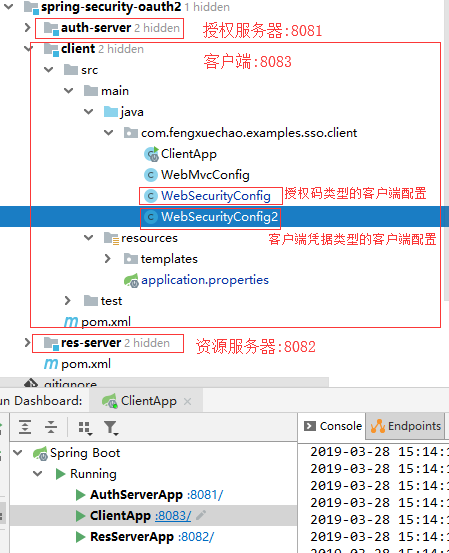
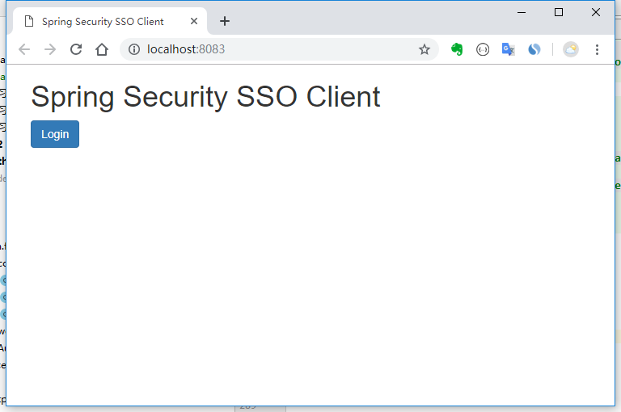
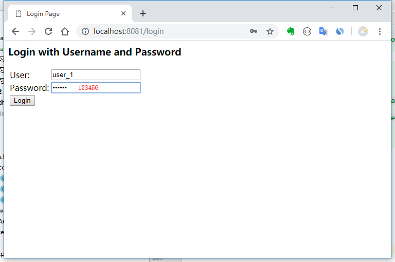
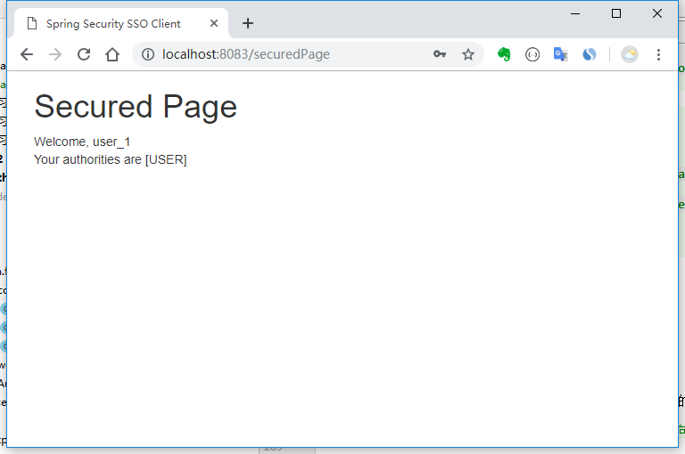
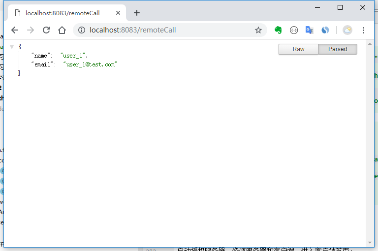
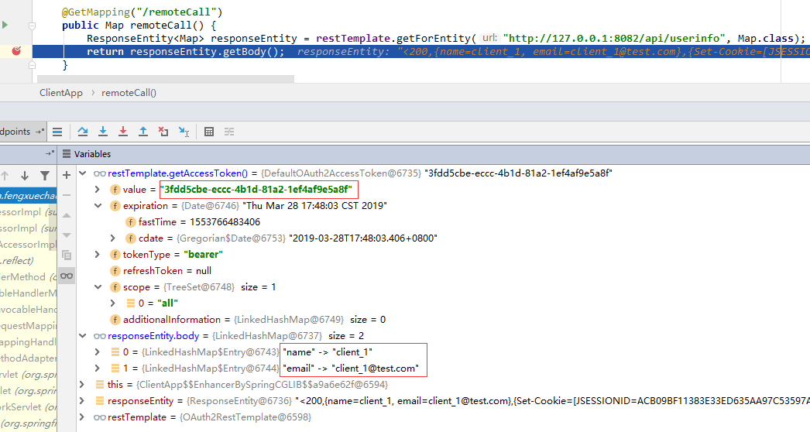

# Spring-Security-Oauth2第二篇之配置客户端

[TOC]

在[第一篇](Spring-Security-Oauth2第一篇.md)中，描述的都是授权服务器和资源服务器。本篇要描述的是关于如何配置客户端的示例。

首先，需要考虑在OAuth2中有四种不同的角色：

- 资源所有者  - 能够授予对其受保护资源的访问权限的实体
- 授权服务器  -在成功验证资源所有者  并获得其授权后， 向客户端授予访问令牌 
- 资源服务器  - 需要访问令牌以允许或至少考虑访问其资源的组件
- 客户端  - 能够从授权服务器获取访问令牌的实体

使用 `@EnableResourceServer` 表示资源服务器

使用 `@EnableOAuth2Sso` 表示授权码类型的客户端

使用 `@EnableOAuth2Client` 表示客户端凭据类型的客户端

## 1. 项目结构



## 2. maven 依赖

```xml
<parent>
    <groupId>org.springframework.boot</groupId>
    <artifactId>spring-boot-starter-parent</artifactId>
    <version>1.5.19.RELEASE</version>
</parent>
<dependencies>
    <dependency>
        <groupId>org.springframework.boot</groupId>
        <artifactId>spring-boot-starter-security</artifactId>
    </dependency>
    <dependency>
        <groupId>org.springframework.security.oauth</groupId>
        <artifactId>spring-security-oauth2</artifactId>
    </dependency>
    <dependency>
        <groupId>org.springframework.boot</groupId>
        <artifactId>spring-boot-starter-web</artifactId>
    </dependency>
    <dependency>
        <groupId>org.springframework.boot</groupId>
        <artifactId>spring-boot-starter-thymeleaf</artifactId>
    </dependency>
    <dependency>
        <groupId>org.thymeleaf.extras</groupId>
        <artifactId>thymeleaf-extras-springsecurity4</artifactId>
    </dependency>
    <dependency>
        <groupId>org.springframework.boot</groupId>
        <artifactId>spring-boot-starter-actuator</artifactId>
    </dependency>
</dependencies>
```

## 3. 使用 @EnableOAuth2Sso 注解安全配置

### 3.1. 客户端安全配置

```java
/**
 * 配置最核心的部分是用于启动单点登陆 @EnableOAuth2Sso 注解。
 * 这里要注意，我们需要重写WebSecurityConfigurerAdapter 否则所有的路径都会受到SSO的保护，
 * 这样无论用户访问哪个页面都会被重定向到登录页面，在这个例子里，index和login页面是唯一不需要被防护的。
 *
 * @author fengxuechao
 * @date 2019/3/27
 */
@EnableOAuth2Sso
@Configuration
public class WebSecurityConfig extends WebSecurityConfigurerAdapter {
    @Override
    protected void configure(HttpSecurity http) throws Exception {
        http.antMatcher("/**")
                .authorizeRequests()
                .antMatchers("/", "/login**")
                .permitAll()
                .anyRequest()
                .authenticated();
        http.csrf().disable();
    }
}
```

同时必须在授权服务器中的授权类型中添加授权码类型，同时添加回调链接(核心代码见 `3.2. 授权服务器核心代码`)。

### 3.2. 授权服务器核心代码

```java
@Configuration
@EnableAuthorizationServer
public class AuthServerConfig extends AuthorizationServerConfigurerAdapter {
    /**
     * 第三方用户客户端详情
     * Grant Type代表当前授权的类型：
     * <p>
     *     authorization_code：传统的授权码模式<br>
     *     implicit：隐式授权模式<br>
     *     password：资源所有者（即用户）密码模式<br>
     *     client_credentials：客户端凭据（客户端ID以及Key）模式<br>
     *     refresh_token：获取access token时附带的用于刷新新的token模式
     * </p>
     *
     * @param clients
     * @throws Exception
     */
    @Override
    public void configure(ClientDetailsServiceConfigurer clients) throws Exception {
        clients.jdbc(dataSource)
                .withClient("client_1")
                .secret("123456")
                .resourceIds(DEMO_RESOURCE_ID)
                .redirectUris("https://www.baidu.com", "http://localhost:8081/product/1", "http://localhost:8083/login")
                .accessTokenValiditySeconds(1200)
                .refreshTokenValiditySeconds(50000)
                .authorizedGrantTypes("client_credentials", "refresh_token", "password", "authorization_code")
                .scopes("all")
                .authorities("client")
                .autoApprove(true)
                .and().build();
    }
}
```

`redirectUris()` 中的链接表示回调接口，其中 `http://localhost:8083/login` 是本次需要添加的

`authorizedGrantTypes()` 表示授权服务器支持的授权类型，本次添加了 `authorization_code`。

`autoApprove(true)` 表示自动授权

### 3.3. 配置文件

```
server.port=8083
server.session.cookie.name=CLIENTSESSION
security.oauth2.client.client-id=client_1
security.oauth2.client.client-secret=123456
security.oauth2.client.access-token-uri=http://localhost:8081/oauth/token
security.oauth2.client.user-authorization-uri=http://localhost:8081/oauth/authorize
security.oauth2.client.scope=all
# userInfoUri用户端点的URI，用于获取当前用户详细信息
security.oauth2.resource.user-info-uri=http://localhost:8081/user/me
# 解析令牌的地址
security.oauth2.authorization.check-token-access=http://localhost:8001/oauth/check_token

security.basic.enabled=false

spring.thymeleaf.cache=false
```

> 注意：在配置文件中要注意 `server.session.cookie.name` 的配置，
> 因为 cookie 不会保存端口，所以要注意客户端的 cookie 名和授权服务器的 cookie 名的不同。

## 4. MVC 配置

### 4.1. 客户端 API

```java
/**
 * @author fengxuechao
 * @date 2019/3/27
 */
@RestController
@SpringBootApplication
public class ClientApp {
    public static void main(String[] args) {
        SpringApplication.run(ClientApp.class);
    }

    @Autowired
    OAuth2RestTemplate restTemplate;

    @GetMapping("/securedPage")
    public ModelAndView securedPage(OAuth2Authentication authentication) {
        return new ModelAndView("securedPage").addObject("authentication", authentication);
    }

    @GetMapping("/remoteCall")
    public Map remoteCall() {
        ResponseEntity<Map> responseEntity = restTemplate.getForEntity("http://127.0.0.1:8082/api/userinfo", Map.class);
        return responseEntity.getBody();
    }

    @Bean
    public OAuth2RestTemplate oauth2RestTemplate(
            OAuth2ClientContext oAuth2ClientContext, OAuth2ProtectedResourceDetails details) {
        return new OAuth2RestTemplate(details, oAuth2ClientContext);
    }
}
```

### 4.2. 客户端 MVC 映射

```java
/**
 * @author fengxuechao
 * @date 2019/3/27
 */
@Configuration
@EnableWebMvc
public class WebMvcConfig extends WebMvcConfigurerAdapter {

    @Bean
    public RequestContextListener requestContextListener() {
        return new RequestContextListener();
    }

    @Override
    public void addViewControllers(ViewControllerRegistry registry) {
        registry.addViewController("/").setViewName("forward:/index");
        registry.addViewController("/index");
    }

}
```

### 4.3. 前端

#### index.html

```html
<!DOCTYPE html>
<html lang="en">
<head>
    <meta http-equiv="Content-Type" content="text/html; charset=utf-8"/>
    <title>Spring Security SSO Client</title>
    <link rel="stylesheet"
          href="https://maxcdn.bootstrapcdn.com/bootstrap/3.3.2/css/bootstrap.min.css"/>
</head>

<body>
<div class="container">
    <div class="col-sm-12">
        <h1>Spring Security SSO Client</h1>
        <a class="btn btn-primary" href="securedPage">Login</a>
    </div>
</div>
</body>
</html>
```

#### securedPage.html

```html
<!DOCTYPE html>
<html lang="en" xmlns:th="http://www.thymeleaf.org">
<head>
    <meta http-equiv="Content-Type" content="text/html; charset=utf-8"/>
    <title>Spring Security SSO Client</title>
    <link rel="stylesheet"
          href="https://maxcdn.bootstrapcdn.com/bootstrap/3.3.2/css/bootstrap.min.css"/>
</head>

<body>
<div class="container">
    <div class="col-sm-12">
        <h1>Secured Page</h1>
        Welcome, <span th:text="${authentication.name}">Name</span>
        <br/>
        Your authorities are <span th:text="${authentication.authorities}">authorities</span>
    </div>
</div>
</body>
</html>
```

## 5. 测试

启动授权服务器，资源服务器和客户端，进入客户端首页：



点击登陆，重定向到授权服务器的登陆页面,输入授权服务器信任的用户名(user_1)和密码(123456):



点击登陆，重定向到安全页面：



调用资源服务器资源：



## 6. 使用 @EnableOAuth2Client 注解安全配置

如果使用客户端凭据模式就足够的话，那么对上文中的代码只需很少的配置即可完成客户端凭据模式的客户端。

### 6.1. 客户端安全配置

```java
/**
 * 使用 @EnableOAuth2Client 注解来开启 client_credentials。
 * 这里要注意的是要明确在配置文件中配置 security.oauth2.client.grant-type=client_credentials 。
 * 同时允许要调用的接口，注意对比与 WebSecurityConfig 类的不同点。
 *
 * @author fengxuechao
 * @date 2019/3/27
 */
@EnableOAuth2Client
@Configuration
public class WebSecurityConfig2 extends WebSecurityConfigurerAdapter {

    @Override
    protected void configure(HttpSecurity http) throws Exception {
        http.antMatcher("/**")
                .authorizeRequests()
                .antMatchers("/", "/login**", "/remoteCall")
                .permitAll()
                .anyRequest()
                .authenticated();
        http.csrf().disable();
    }
}
```

注意，因为客户端凭据模式信任持有客户端凭证的客户端发出的任何请求，将远程调用资源服务器的请求 "/remoteCall" 允许访问。

配置文件 application.properties 中添加 `security.oauth2.client.grant-type=client_credentials`

### 6.2. 测试



## 7. 参考资源

[Simple Single Sign-On with Spring Security OAuth2](https://www.baeldung.com/sso-spring-security-oauth2)

[https://spring.io/guides/tutorials/spring-boot-oauth2/](https://spring.io/guides/tutorials/spring-boot-oauth2/)