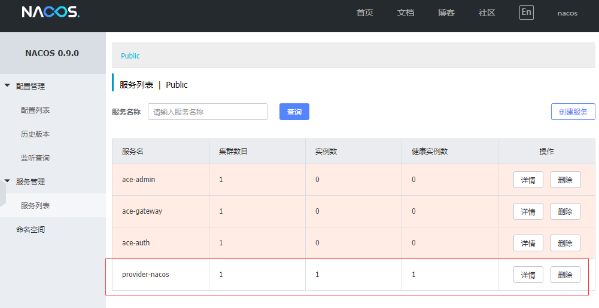
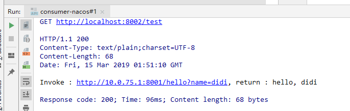

# 使用Nacos实现服务注册与发现

## 前言

Nacos致力于帮助您发现、配置和管理微服务。Nacos提供了一组简单易用的特性集，
帮助您快速实现动态服务发现、服务配置、服务元数据及流量管理。Nacos帮助您更敏捷和容易地构建、交付和管理微服务平台。
Nacos是构建以“服务”为中心的现代应用架构 (例如微服务范式、云原生范式) 的服务基础设施。

## nacos 是什么

Nacos致力于帮助您发现、配置和管理微服务。Nacos提供了一组简单易用的特性集，帮助您快速实现动态服务发现、服务配置、服务元数据及流量管理。
Nacos帮助您更敏捷和容易地构建、交付和管理微服务平台。Nacos是构建以“服务”为中心的现代应用架构 (例如微服务范式、云原生范式) 的服务基础设施。

在接下里的程序中，将使用Nacos作为微服务架构中的注册中心（替代：eurekba、consul等传统方案）以及配置中心（spring cloud config）来使用。

## 安装 nacos

下载地址：[https://github.com/alibaba/nacos/releases](https://github.com/alibaba/nacos/releases)
本文版本：0.9.0

下载完成之后，解压。根据不同平台，执行不同命令，启动单机版Nacos服务：

- Linux/Unix/Mac：sh startup.sh -m standalone
- Windows：cmd startup.cmd 或者双击 startup.cmd 运行文件。

### 进入 nacos 管理界面

启动完成之后，访问：[http://127.0.0.1:8848/nacos/](http://127.0.0.1:8848/nacos/)，可以进入Nacos的服务管理页面，具体如下:

账号：nacos 密码：naocs


## nacos 注册中心接入应用

完成了 nacos 的启动，现在要做的事验证 nacos 的服务发现和注册。

### 服务提供者

1. 创建一个 Spring Boot 应用，命名为： `provider-nacos`

2. 编辑 `pom.xml`, 加入必要的依赖：

    ```xml
    <parent>
         <groupId>org.springframework.boot</groupId>
         <artifactId>spring-boot-starter-parent</artifactId>
         <version>2.0.8.RELEASE</version>
         <relativePath/> <!-- lookup parent from repository -->
     </parent>
    
     <dependencyManagement>
         <dependencies>
             <dependency>
                 <groupId>org.springframework.cloud</groupId>
                 <artifactId>spring-cloud-dependencies</artifactId>
                 <version>Finchley.SR2</version>
                 <type>pom</type>
                 <scope>import</scope>
             </dependency>
             <dependency>
                 <groupId>org.springframework.cloud</groupId>
                 <artifactId>spring-cloud-alibaba-dependencies</artifactId>
                 <version>0.2.1.RELEASE</version>
                 <type>pom</type>
                 <scope>import</scope>
             </dependency>
         </dependencies>
     </dependencyManagement>
    
     <dependencies>
         <dependency>
             <groupId>org.springframework.boot</groupId>
             <artifactId>spring-boot-starter-web</artifactId>
         </dependency>
         <!-- 加入Nacos的服务注册与发现模块。由于在dependencyManagement中已经引入了版本，所以这里就不用指定具体版本 -->
         <dependency>
             <groupId>org.springframework.cloud</groupId>
             <artifactId>spring-cloud-starter-alibaba-nacos-discovery</artifactId>
         </dependency>
         <dependency>
             <groupId>org.projectlombok</groupId>
             <artifactId>lombok</artifactId>
             <version>1.18.2</version>
             <optional>true</optional>
         </dependency>
     </dependencies>   
    ```

3. 创建应用主类，并实现一个HTTP接口：

    ```java
    package com.fengxuechao.examples.nacos;
    
    import lombok.extern.slf4j.Slf4j;
    import org.springframework.boot.SpringApplication;
    import org.springframework.boot.autoconfigure.SpringBootApplication;
    import org.springframework.cloud.client.discovery.EnableDiscoveryClient;
    import org.springframework.web.bind.annotation.GetMapping;
    import org.springframework.web.bind.annotation.RequestParam;
    import org.springframework.web.bind.annotation.RestController;
    
    @EnableDiscoveryClient
    @SpringBootApplication
    public class ProviderNacosApplication {
    
        public static void main(String[] args) {
            SpringApplication.run(ProviderNacosApplication.class, args);
        }
    
        @Slf4j
        @RestController
        static class ProviderController {
    
            @GetMapping("/hello")
            public String hello(@RequestParam String name) {
                if (log.isDebugEnabled())
                    log.debug("invokd name = {}", name);
                return "hello, " + name;
            }
    
        }
    }
    ```

4. 配置服务名称和Nacos地址

    ```yaml
    # 服务命
    spring.application.name=provider-nacos
    # Nacos 地址
    spring.cloud.nacos.discovery.server-addr=127.0.0.1:8848
    server.port=8001
    ```

5. 启动程序

    启动程序成功后，访问 nacos 的管理界面
    
    

### 服务消费者

1. 创建一个 Spring Boot 应用，命名为： `consumer-nacos`

2. 编辑 pom.xml， 依赖与服务提供者保持一致

3. 创建应用主类，并实现一个HTTP接口：

    ```java
    package com.fengxuechao.examples.nacos;
    
    import lombok.extern.slf4j.Slf4j;
    import org.springframework.beans.factory.annotation.Autowired;
    import org.springframework.boot.SpringApplication;
    import org.springframework.boot.autoconfigure.SpringBootApplication;
    import org.springframework.cloud.client.ServiceInstance;
    import org.springframework.cloud.client.discovery.EnableDiscoveryClient;
    import org.springframework.cloud.client.loadbalancer.LoadBalancerClient;
    import org.springframework.web.bind.annotation.GetMapping;
    import org.springframework.web.bind.annotation.RestController;
    import org.springframework.web.client.RestTemplate;
    
    @EnableDiscoveryClient
    @SpringBootApplication
    public class ConsumerNacosApplication {
    
        public static void main(String[] args) {
            SpringApplication.run(ConsumerNacosApplication.class, args);
        }
    
        @Slf4j
        @RestController
        static class TestController {
    
            @Autowired
            LoadBalancerClient loadBalancerClient;
    
            @GetMapping("/test")
            public String test() {
                // 通过spring cloud common中的负载均衡接口选取服务提供节点实现接口调用
                ServiceInstance serviceInstance = loadBalancerClient.choose("provider-nacos");
                String url = serviceInstance.getUri() + "/hello?name=" + "didi";
                RestTemplate restTemplate = new RestTemplate();
                String result = restTemplate.getForObject(url, String.class);
                return "Invoke : " + url + ", return : " + result;
            }
        }
    }
    ```
    
    这里使用了Spring Cloud Common中的LoadBalancerClient接口来挑选服务实例信息。然后从挑选出的实例信息中获取可访问的URI，拼接上服务提供方的接口规则来发起调用。
    
4. 配置服务名称和Nacos地址，让服务消费者可以发现上面已经注册到Nacos的服务。

    ```yaml
    # 服务命
    spring.application.name=consumer-nacos
    # Nacos 地址
    spring.cloud.nacos.discovery.server-addr=127.0.0.1:8848
    server.port=8002
    ```
    
5. 启动服务消费者, 验证：

    

### 参考资料

文章转载程序猿DD-翟永超,出处http://blog.didispace.com/spring-cloud-alibaba-1/