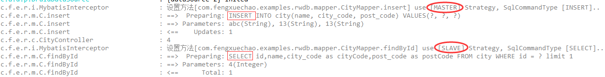

# Spring + MyBatis + MySQL主从分离

[TOC]

## 基于 Docker 的 MySQL 主从复制搭建

[基于 Docker 的 MySQL 主从复制搭建](docker-compose-mysql-master-slave/README.md)

## 前言

在大型应用程序中，配置主从数据库并使用读写分离是常见的设计模式。而要对现有的代码在不多改变源码的情况下，
可以使用 Spring 的 `AbstractRoutingDataSource` 和 Mybatis 的 `Interceptor` 为核心做到感知mysql读写分离

## 配置多数据源

使用了 druid 数据库连接池，配置 master datasource 为写数据库，配置 slave datasource 为读数据库。

```yaml
spring.datasource.druid.filter.slf4j.enabled=true
spring.datasource.druid.filter.slf4j.statement-create-after-log-enabled=false
spring.datasource.druid.filter.slf4j.statement-close-after-log-enabled=false
spring.datasource.druid.filter.slf4j.result-set-open-after-log-enabled=false
spring.datasource.druid.filter.slf4j.result-set-close-after-log-enabled=false

# master datasource
spring.datasource.druid.master.driver-class-name=com.mysql.cj.jdbc.Driver
spring.datasource.druid.master.url=jdbc:mysql://localhost:3306/learn?useSSl=false
spring.datasource.druid.master.password=root
spring.datasource.druid.master.username=root
# slave datasource
spring.datasource.druid.slave.driver-class-name=com.mysql.cj.jdbc.Driver
spring.datasource.druid.slave.url=jdbc:mysql://localhost:3307/learn?useSSl=false
spring.datasource.druid.slave.password=root
spring.datasource.druid.slave.username=root

spring.jackson.date-format=yyyy-MM-dd HH:mm:ss
spring.jackson.time-zone=GMT+8
spring.jackson.default-property-inclusion=always
spring.jackson.property-naming-strategy=SNAKE_CASE

mybatis.type-aliases-package=com.fengxuechao.examples.rwdb.entity
mybatis.configuration.use-generated-keys=true
mybatis.configuration.map-underscore-to-camel-case=true
mybatis.configuration.default-fetch-size=100
mybatis.configuration.default-statement-timeout=30
mybatis.configuration.cache-enabled=true

logging.level.root=info
logging.level.com.fengxuechao.examples.rwdb=debug
logging.level.druid.sql.Statement=error
```

## 使用 Spring 的 AbstractRoutingDataSource 动态切换数据源

### 用枚举标记读写数据源

```java
public enum RoutingType {
    /**
     * 代表写数据库
     */
    MASTER,

    /**
     * 代表读数据库
     */
    SLAVE;
}
```

### 用 ThreadLocal 记录当前线程数据源

在Servlet的线程模型中，使用ThreadLocal存储key最合适，因此，编写一个RoutingDataSourceContext，来设置并动态存储key：

```java
public class RoutingDataSourceContext implements AutoCloseable {

   private static final ThreadLocal<RoutingType> contextHolder = new ThreadLocal<>();

   public RoutingDataSourceContext(RoutingType routingType) {
      contextHolder.set(routingType);
   }
	
   public static void setRoutingType(RoutingType routingType) {
      Assert.notNull(routingType, "routingType cannot be null");
      contextHolder.set(routingType);
   }

   public static RoutingType getRoutingType() {
      return contextHolder.get();
   }

   public static void clear() {
      contextHolder.remove();
   }

   @Override
   public void close() throws Exception {
      clear();
   }
}
```

### 自定义路由数据源实现

用Spring内置的RoutingDataSource，把两个真实的数据源代理为一个动态数据源：

```java
public class RoutingDataSource extends AbstractRoutingDataSource {

    @Override
    protected Object determineCurrentLookupKey() {
        return RoutingDataSourceContext.getRoutingType();
    }
}
```

### 配置路由数据源

对于 `RoutingDataSource` 需要在SpringBoot中配置好并设置为主数据源：

```java
/**
 * @author fengxuechao
 */
@Slf4j
@Configuration
@EnableTransactionManagement
public class DbConfig {
    
    /**
     * 写数据库
     *
     * @return
     */
    @Bean
    @ConfigurationProperties("spring.datasource.druid.master")
    public DataSource masterDataSource() {
        return DruidDataSourceBuilder.create().build();
    }
    
    /**
     * 读数据库
     *
     * @return
     */
    @Bean
    @ConfigurationProperties("spring.datasource.druid.slave")
    public DataSource slaveDataSource() {
        return DruidDataSourceBuilder.create().build();
    }
    
    /**
     * 路由数据源
     * 一定要加 @Primary 使得 {@link MybatisInterceptor} 插件生效
     *
     * @return
     */
    @Bean
    @Primary
    public DataSource dataSource() {
        log.info("create routing datasource...");
        Map<Object, Object> map = new HashMap<>();
        map.put(RoutingType.MASTER, masterDataSource());
        map.put(RoutingType.SLAVE, slaveDataSource());
        RoutingDataSource routing = new RoutingDataSource();
        routing.setTargetDataSources(map);
        routing.setDefaultTargetDataSource(masterDataSource());
        return routing;
    }
    
    /**
     * 添加 MybatisInterceptor 拦截器
     * @param dataSource
     * @return
     */
    @Bean
    public SqlSessionFactoryBean sqlSessionFactory(DataSource dataSource) {
        SqlSessionFactoryBean sfb = new SqlSessionFactoryBean();
        sfb.setDataSource(dataSource);
        sfb.setPlugins(new Interceptor[]{new MybatisInterceptor()});
        return sfb;
    }
}
```

## 使用 MyBatis 的 Interceptor 拦截器对update使用写库，对query使用读库

原理：

查看 `org.apache.ibatis.executor.Executor` 可以发现 MyBatis 执行 sql 的语句都在这里边了：

```java
public interface Executor {

  // 执行sql 的 update, delete, insert
  int update(MappedStatement ms, Object parameter) throws SQLException;

  // 执行sql 的 select
  <E> List<E> query(MappedStatement ms, Object parameter, RowBounds rowBounds, ResultHandler resultHandler, CacheKey cacheKey, BoundSql boundSql) throws SQLException;

  // 执行sql 的 select
  <E> List<E> query(MappedStatement ms, Object parameter, RowBounds rowBounds, ResultHandler resultHandler) throws SQLException;

}
```

只要拦截这三个方法，是的 update() 方法使用写数据库，query() 方法使用读数据库就可以做到在不改写原业务代码的情况下使用多数据源，同时让Spring事务也正常运行。 

拦截器：

```java
/**
 * 拦截器，对update使用写库，对query使用读库
 * 优势：源代码不变（通过mybatis拦截器），易扩展
 *
 * @author fengxuechao
 * @date 2019-03-22
 */
@Intercepts({
        @Signature(
                type = Executor.class,
                method = "update",
                args = {MappedStatement.class, Object.class}),
        @Signature(
                type = Executor.class,
                method = "query",
                args = {MappedStatement.class, Object.class, RowBounds.class, ResultHandler.class}),
})
@Slf4j
public class MybatisInterceptor implements Interceptor {

    /**
     * 用map对象缓存数据，数据量大的话，此处需要优化。
     */
    private static final Map<String, RoutingType> cacheMap = new ConcurrentHashMap<>();

    /**
     * 通过正则表达式，拦截sql语句匹配类型设置数据源。
     */
    private static final String REGEX = ".*insert\\u0020.*|.*delete\\u0020.*|.*update\\u0020.*";

    @Override
    public Object intercept(Invocation invocation) throws Throwable {
        boolean synchronizationActive = TransactionSynchronizationManager.isSynchronizationActive();
        if (!synchronizationActive) {
            Object[] objects = invocation.getArgs();
            MappedStatement ms = (MappedStatement) objects[0];

            RoutingType routingType;

            if ((routingType = cacheMap.get(ms.getId())) == null) {
                //读方法
                if (ms.getSqlCommandType().equals(SqlCommandType.SELECT)) {
                    //!selectKey 为自增id查询主键(SELECT LAST_INSERT_ID() )方法，使用主库
                    if (ms.getId().contains(SelectKeyGenerator.SELECT_KEY_SUFFIX)) {
                        routingType = RoutingType.MASTER;
                    } else {
                        BoundSql boundSql = ms.getSqlSource().getBoundSql(objects[1]);
                        String sql = boundSql.getSql().toLowerCase(Locale.CHINA).replaceAll("[\\t\\n\\r]", " ");
                        if (sql.matches(REGEX)) {
                            routingType = RoutingType.MASTER;
                        } else {
                            routingType = RoutingType.SLAVE;
                        }
                    }
                } else {
                    routingType = RoutingType.MASTER;
                }
                if (log.isDebugEnabled()){
                    log.debug("设置方法[{}] use [{}] Strategy, SqlCommandType [{}]..", ms.getId(), routingType.name(), ms.getSqlCommandType().name());
                }
                cacheMap.put(ms.getId(), routingType);
            }
            RoutingDataSourceContext.setRoutingType(routingType);
        }
        return invocation.proceed();
    }

    @Override
    public Object plugin(Object target) {
        if (target instanceof Executor) {
            return Plugin.wrap(target, this);
        } else {
            return target;
        }
    }

    @Override
    public void setProperties(Properties properties) {
    }

}
```

注意：需要在 Mybatis 的 SqlSessionFactory 中将此拦截器放入

```java
/**
 * 添加 MybatisInterceptor 拦截器
 * @param dataSource
 * @return
 */
@Bean
public SqlSessionFactoryBean sqlSessionFactory(DataSource dataSource) {
    SqlSessionFactoryBean sfb = new SqlSessionFactoryBean();
    sfb.setDataSource(dataSource);
    sfb.setPlugins(new Interceptor[]{new MybatisInterceptor()});
    return sfb;
}
```

## 测试

```java
/**
 * @author fengxuechao
 */
@Repository
public interface CityMapper {

    @Select("SELECT id,name,city_code as cityCode,post_code as postCode FROM city WHERE id = #{id} limit 1")
    City findById(Integer id);

    @Insert("INSERT INTO city(name, city_code, post_code) VALUES(#{name}, #{cityCode}, #{postCode})")
    @Options(useGeneratedKeys = true, keyProperty = "id")
    int insert(City city);

    @Select("SELECT * FROM city WHERE id = #{id} limit 100")
    List<City> findAll();
}
```

```java
/**
 * @author fengxuechao
 * @date 2019/3/22
 */
@RestController
@RequestMapping("/city")
@Slf4j
public class CityController {

    @Autowired
    CityMapper cityMapper;

    //    @RoutingWith(value = RoutingType.SLAVE)
    @GetMapping("/{id}")
    public City get(@PathVariable Integer id) {
        return cityMapper.findById(id);
    }

    @GetMapping
    public List<City> list() {
        return cityMapper.findAll();
    }

    @PutMapping
    public City update(@RequestBody City city) {
        if (city.getId() != null) {
            cityMapper.update(city);
            cityMapper.findById(1);
            return city;
        }
        return null;
    }

}
```

日志：

