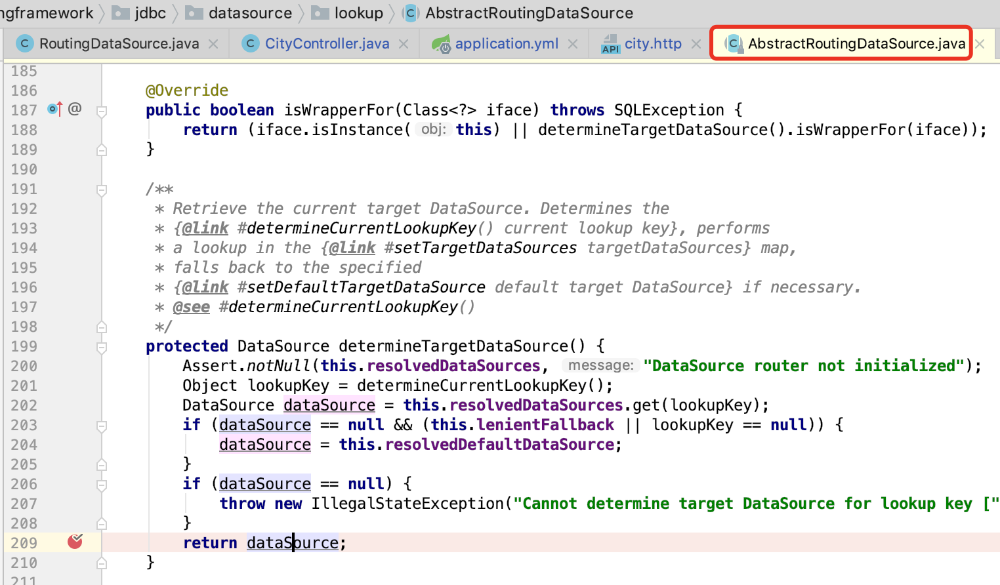

# Spring + MyBatis + MySQL主从分离

[TOC]

## 基于 Docker 的 MySQL 主从复制搭建

[基于 Docker 的 MySQL 主从复制搭建](docker-compose-mysql-master-slave/README.md)

Spring主从数据库的配置和动态数据源切换

https://www.liaoxuefeng.com/article/00151054582348974482c20f7d8431ead5bc32b30354705000

Spring动态数据源+Mybatis拦截器实现数据库读写分离

https://blog.csdn.net/FJeKin/article/details/79583744

在 `AbstractRoutingDataSource#determineTargetDataSource()` 打一个断点

## 前言

在大型应用程序中，配置主从数据库并使用读写分离是常见的设计模式。而要对现有的代码在不多改变源码的情况下

## 配置多数据源