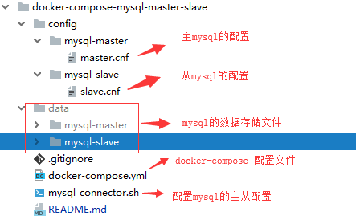

# Docker 配置 mysql主从

## 文件结构



## 主 mysql 的配置:master.cnf

```cnf
[mysqld]
## 设置server_id，一般设置为IP，注意要唯一
server_id=100
## 复制过滤：也就是指定哪个数据库不用同步（mysql库一般不同步）
binlog-ignore-db=mysql
## 开启二进制日志功能，可以随便取，最好有含义（关键就是这里了）
log-bin=replicas-mysql-bin
## 为每个session分配的内存，在事务过程中用来存储二进制日志的缓存
binlog_cache_size=1M
## 主从复制的格式（mixed,statement,row，默认格式是statement）
binlog_format=mixed
## 二进制日志自动删除/过期的天数。默认值为0，表示不自动删除。
expire_logs_days=7
## 跳过主从复制中遇到的所有错误或指定类型的错误，避免slave端复制中断。
## 如：1062错误是指一些主键重复，1032错误是因为主从数据库数据不一致
slave_skip_errors=1062
```

## 从 mysql 的配置:slave.cnf

```cnf
[mysqld]
## 设置server_id，一般设置为IP，注意要唯一
server_id=101
## 复制过滤：也就是指定哪个数据库不用同步（mysql库一般不同步）
binlog-ignore-db=mysql
## 开启二进制日志功能，以备Slave作为其它Slave的Master时使用
log-bin=replicas-mysql-slave1-bin
## 为每个session 分配的内存，在事务过程中用来存储二进制日志的缓存
binlog_cache_size=1M
## 主从复制的格式（mixed,statement,row，默认格式是statement）
binlog_format=mixed
## 二进制日志自动删除/过期的天数。默认值为0，表示不自动删除。
expire_logs_days=7
## 跳过主从复制中遇到的所有错误或指定类型的错误，避免slave端复制中断。
## 如：1062错误是指一些主键重复，1032错误是因为主从数据库数据不一致
slave_skip_errors=1062
## relay_log配置中继日志
relay_log=replicas-mysql-relay-bin
## log_slave_updates表示slave将复制事件写进自己的二进制日志
log_slave_updates=1
## 防止改变数据(除了特殊的线程)
read_only=1
```

## 配置mysql主从的脚本：mysql_connector.sh

```bash
#!/bin/bash
BASE_PATH=$(dirname $0)

echo "Waiting for mysql to get up"
# Give 60 seconds for master and slave to come up
sleep 60

echo "Create MySQL Servers (master / slave repl)"
echo "-----------------"


echo "* Create replication user"

mysql --host mysqlslave -uroot -p$MYSQL_SLAVE_PASSWORD -AN -e 'STOP SLAVE;';
mysql --host mysqlmaster -uroot -p$MYSQL_MASTER_PASSWORD -AN -e 'RESET SLAVE ALL;';

mysql --host mysqlmaster -uroot -p$MYSQL_MASTER_PASSWORD -AN -e "CREATE USER '$MYSQL_REPLICATION_USER'@'%';"
mysql --host mysqlmaster -uroot -p$MYSQL_MASTER_PASSWORD -AN -e "GRANT REPLICATION SLAVE ON *.* TO '$MYSQL_REPLICATION_USER'@'%' IDENTIFIED BY '$MYSQL_REPLICATION_PASSWORD';"
mysql --host mysqlmaster -uroot -p$MYSQL_MASTER_PASSWORD -AN -e 'flush privileges;'


echo "* Set MySQL01 as master on MySQL02"

MYSQL01_Position=$(eval "mysql --host mysqlmaster -uroot -p$MYSQL_MASTER_PASSWORD -e 'show master status \G' | grep Position | sed -n -e 's/^.*: //p'")
MYSQL01_File=$(eval "mysql --host mysqlmaster -uroot -p$MYSQL_MASTER_PASSWORD -e 'show master status \G'     | grep File     | sed -n -e 's/^.*: //p'")
MASTER_IP=$(eval "getent hosts mysqlmaster|awk '{print \$1}'")
echo $MASTER_IP
mysql --host mysqlslave -uroot -p$MYSQL_SLAVE_PASSWORD -AN -e "CHANGE MASTER TO master_host='mysqlmaster', master_port=3306, \
        master_user='$MYSQL_REPLICATION_USER', master_password='$MYSQL_REPLICATION_PASSWORD', master_log_file='$MYSQL01_File', \
        master_log_pos=$MYSQL01_Position;"

echo "* Set MySQL02 as master on MySQL01"

MYSQL02_Position=$(eval "mysql --host mysqlslave -uroot -p$MYSQL_SLAVE_PASSWORD -e 'show master status \G' | grep Position | sed -n -e 's/^.*: //p'")
MYSQL02_File=$(eval "mysql --host mysqlslave -uroot -p$MYSQL_SLAVE_PASSWORD -e 'show master status \G'     | grep File     | sed -n -e 's/^.*: //p'")

SLAVE_IP=$(eval "getent hosts mysqlslave|awk '{print \$1}'")
echo $SLAVE_IP
mysql --host mysqlmaster -uroot -p$MYSQL_MASTER_PASSWORD -AN -e "CHANGE MASTER TO master_host='mysqlslave', master_port=3306, \
        master_user='$MYSQL_REPLICATION_USER', master_password='$MYSQL_REPLICATION_PASSWORD', master_log_file='$MYSQL02_File', \
        master_log_pos=$MYSQL02_Position;"

echo "* Start Slave on both Servers"
mysql --host mysqlslave -uroot -p$MYSQL_SLAVE_PASSWORD -AN -e "start slave;"

echo "Increase the max_connections to 2000"
mysql --host mysqlmaster -uroot -p$MYSQL_MASTER_PASSWORD -AN -e 'set GLOBAL max_connections=2000';
mysql --host mysqlslave -uroot -p$MYSQL_SLAVE_PASSWORD -AN -e 'set GLOBAL max_connections=2000';

mysql --host mysqlslave -uroot -p$MYSQL_SLAVE_PASSWORD -e "show slave status \G"

echo "MySQL servers created!"
echo "--------------------"
echo
echo Variables available fo you :-
echo
echo MYSQL01_IP       : mysqlmaster
echo MYSQL02_IP       : mysqlslave
```

## docker-compose 配置文件

```docker-compose
version: '2'
services:
  mysqlmaster:
    image: mysql:5.7.15
    container_name: "mysql_master1"
    environment:
      - "MYSQL_ROOT_PASSWORD=root"
    volumes:
      - "./data/mysql-master:/var/lib/mysql/"
      - "./config/mysql-master:/etc/mysql/conf.d/"
    ports:
      - "3306:3306"
  mysqlslave:
    image: mysql:5.7.15
    container_name: "mysql_slave1"
    environment:
      - "MYSQL_ROOT_PASSWORD=root"
    volumes:
      - "./data/mysql-slave:/var/lib/mysql/"
      - "./config/mysql-slave:/etc/mysql/conf.d/"
    ports:
      - "3307:3306"
  mysqlconfigure:
    image: mysql:5.7.15
    container_name: "mysql_configure"
    environment:
      - "MYSQL_SLAVE_PASSWORD=root"
      - "MYSQL_MASTER_PASSWORD=root"
      - "MYSQL_ROOT_PASSWORD=root"
      - "MYSQL_REPLICATION_USER=repl"
      - "MYSQL_REPLICATION_PASSWORD=repl"
    volumes:
      - "./mysql_connector.sh:/tmp/mysql_connector.sh"
    command: /bin/bash -x /tmp/mysql_connector.sh
```

## 