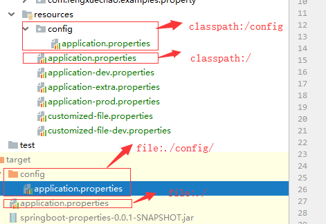
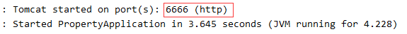
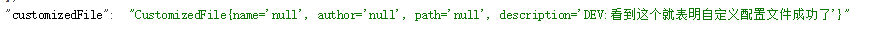

# SpringBoot配置文件的优先级

## 配置文件的优先级

application.properties 和 application.yml 文件按照优先级从大到小顺序排列在以下四个位置：

1. file:./config/ (当前项目路径config目录下);
2. file:./ (当前项目路径下);
3. classpath:/config/ (类路径config目录下);
4. classpath:/ (类路径config下).



源代码展示：

```java
public class ConfigFileApplicationListener
		implements EnvironmentPostProcessor, SmartApplicationListener, Ordered {
// Note the order is from least to most specific (last one wins)
private static final String DEFAULT_SEARCH_LOCATIONS = "classpath:/,classpath:/config/,file:./,file:./config/";

// 省略其它代码
}
```

以端口配置为例

- 在resources/config目录下配置文件设置端口为8888;
- 在resources/目录下配置文件设置端口为8080;
- 在类路径config目录下配置文件设置端口为6666;
- 在类路径下配置文件设置端口为5555;

运行结果：




## 自定义配置文件的绑定

1. CustomizedFile 类

    ```java
    /**
     * 自定义配置文件, 需要配合使用后@Configuration和@PropertySource("classpath:customized-file.properties")来指定
     * @author fengxuechao
     */
    @Configuration
    @ConfigurationProperties(prefix = "customizedFile")
    @PropertySource("classpath:customized-file-${spring.profiles.active}.properties")
    public class CustomizedFile {
        private String name;
        private String author;
        private String path;
        private String description;
        // 省略 setter/getter
    }
    ```
    
    看到 `${spring.profiles.active}`，聪明的你一定知道这是 spring boot多环境自定义配置文件的实现方式。
    生效的配置文件是 `${spring.profiles.active}` 所指定的配置文件，本文案例中生效的是 `customized-file-dev.properties`。
    接下来继续创建配置文件验证

2. customized-file.properties

    ```yaml
    customizedFile.name=自定义配置文件名
    customizedFile.author=作者名
    customizedFile.path=路径地址
    customizedFile.description=看到这个就表明自定义配置文件成功了
    ```

3. customized-file-dev.properties

    ```yaml
    customizedFile.description=DEV:看到这个就表明自定义配置文件成功了
    ```

运行结果：



结论：只有 `customized-file-dev.properties` 中配置的属性生效
